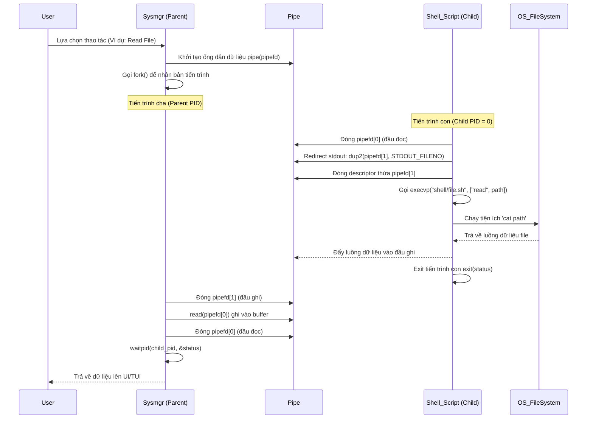

# HƯỚNG DẪN KỸ THUẬT VÀ ĐẶC TẢ CHI TIẾT PHÂN HỆ FILE MANAGER (/file)

Tài liệu này cung cấp tài liệu kỹ thuật, đặc tả thiết kế, phân tích mã nguồn chi tiết và kiểm thử của phân hệ **File Manager (`/file`)** trong dự án **Linux System Manager (sysmgr)**. Đây là tài liệu tham chiếu dành cho lập trình viên để duy trì, mở rộng và kiểm thử hệ thống.

---

## BẢNG MỤC LỤC
1. [TỔNG QUAN PHÂN HỆ (MODULE OVERVIEW)](#1-t%E1%BB%95ng-quan-ph%C3%A2n-h%E1%BB%87-module-overview)
2. [CÂY THƯ MỤC PHÂN HỆ (FILE TREE & INVENTORY)](#2-c%C3%A2y-th%C6%B0-m%E1%BB%A5c-ph%C3%A2n-h%E1%BB%87-file-tree--inventory)
3. [MỐI LIÊN HỆ VỚI CÁC TÀI LIỆU LÝ THUYẾT NHÂN (REFERENCE PDFs)](#3-m%E1%BB%91i-li%C3%AAn-h%E1%BB%87-v%E1%BB%9Bi-c%C3%A1c-t%C3%A0i-li%E1%BB%87u-l%C3%BD-thuy%E1%BB%BFt-nh%C3%A2n-reference-pdfs)
4. [PHÂN TÍCH THIẾT KẾ VÀ KIẾN TRÚC HỆ THỐNG (SYSTEM ARCHITECTURE)](#4-ph%C3%A2n-t%C3%ADch-thi%E1%BB%BFt-k%E1%BA%BF-v%C3%A0-ki%E1%BA%BFn-tr%C3%BAc-h%E1%BB%87-th%E1%BB%91ng-system-architecture)
5. [ĐẶC TẢ CHI TIẾT CÁC HÀM THÀNH VIÊN (FUNCTION SPECIFICATIONS)](#5-%C4%90%E1%BA%B7c-t%E1%BA%A3-chi-ti%E1%BA%BFt-c%C3%A1c-h%C3%A0m-th%C3%A0nh-vi%C3%AAn-function-specifications)
6. [CHI TIẾT KỊCH BẢN VỎ LỆNH HỖ TRỢ (SHELL SCRIPT ANALYSIS)](#6-chi-ti%E1%BA%BFt-k%E1%BB%8Bch-b%E1%BA%A3n-v%E1%BB%8F-l%E1%BB%87nh-h%E1%BB%97-tr%E1%BB%A3-shell-script-analysis)
7. [CÁC HÀM API POSIX VÀ CUỘC GỌI HỆ THỐNG (POSIX APIS & SYSTEM CALLS)](#7-c%C3%A1c-h%C3%A0m-api-posix-v%C3%A0-cu%E1%BB%99c-g%E1%BB%8Di-h%E1%BB%87-th%E1%BB%91ng-posix-apis--system-calls)
8. [CÁC LỆNH LINUX PHỤ TRỢ (LINUX COMMAND SPECS)](#8-c%C3%A1c-l%E1%BB%87nh-linux-ph%E1%BB%A5-tr%E1%BB%A3-linux-command-specs)
9. [CÁC KHÁI NIỆM HỆ THỐNG FILE VÀ CƠ CHẾ THỰC THI (FILESYSTEM CONCEPTS)](#9-c%C3%A1c-kh%C3%A1i-ni%E1%BB%87m-h%E1%BB%87-th%E1%BB%91ng-file-v%C3%A0-c%C6%A1-ch%E1%BA%BF-th%E1%BB%B1c-thi-filesystem-concepts)
10. [CẤU TRÚC DỮ LIỆU ĐẶC THÙ (DATA STRUCTURES)](#10-c%E1%BA%A5u-tr%C3%BAc-d%E1%BB%AF-li%E1%BB%87u-%C4%91%E1%BA%B7c-th%C3%B9-data-structures)
11. [THƯ VIỆN TIÊU CHUẨN SỬ DỤNG (STANDARD LIBRARIES)](#11-th%C6%B0-vi%E1%BB%87n-ti%C3%AAu-chu%E1%BA%A9n-s%E1%BB%AF-d%E1%BB%A5ng-standard-libraries)
12. [C VÀ SHELL INTEGRATION (C & SHELL INTEGRATION)](#12-c-v%C3%A0-shell-integration-c--shell-integration)
13. [AN NINH HỆ THỐNG VÀ AN TOÀN TIẾN TRÌNH (SECURITY & SAFETY)](#13-an-ninh-h%E1%BB%87-th%E1%BB%91ng-v%C3%A0-an-to%C3%A0n-ti%E1%BA%BFn-tr%C3%ACnh-security--safety)
14. [HIỆU NĂNG VÀ TỐI ƯU HÓA (PERFORMANCE & OPTIMIZATION)](#14-hi%E1%BB%87u-n%C4%83ng-v%C3%A0-t%E1%BB%91i-%C6%B0u-h%C3%B3a-performance--optimization)
15. [BẢN ĐỒ TRUY XUẤT YÊU CẦU BÀI TẬP (ASSIGNMENT TRACEABILITY)](#15-b%E1%BA%A3n-%C4%91%E1%BB%93-truy-xu%E1%BA%BFt-y%C3%AAu-c%E1%BA%A7u-b%C3%A0i-t%E1%BA%ADp-assignment-traceability)
16. [BẢN ĐỒ TRUY XUẤT TÀI LIỆU THAM KHẢO (REFERENCE TRACEABILITY)](#16-b%E1%BA%A3n-%C4%91%E1%BB%93-truy-xu%E1%BA%BFt-t%C3%A0i-li%E1%BB%87u-tham-kh%E1%B3%A3o-reference-traceability)
17. [KIỂM THỬ VÀ CHẨN ĐOÁN LỖI (TEST SUITE & DIAGNOSTICS)](#17-ki%E1%BB%83m-th%E1%BB%AD-v%C3%A0-ch%E1%BA%A9n-%C4%91o%C3%A1n-l%E1%BB%97i-test-suite--diagnostics)

---

## 1. TỔNG QUAN PHÂN HỆ (MODULE OVERVIEW)

Phân hệ **File Manager (`/file`)** cung cấp một giải pháp quản trị, thao tác, tìm kiếm và nén tệp tin/thư mục trên môi trường Linux. Phân hệ được thiết kế dưới dạng tích hợp giữa **Lập trình hệ thống bằng ngôn ngữ C (Linux System Programming)** và **Lập trình vỏ lệnh (Shell Programming)**.

Mô hình kiến trúc của `/file` dựa trên cơ chế **C-Shell Hybrid**: thay vì viết trực tiếp mã nguồn C để gọi các hàm hệ thống quản lý file, C đóng vai trò bộ điều hướng (controller) và thiết lập môi trường thực thi (REPL/TUI). Mọi thao tác ghi tệp, xóa, đổi tên, liệt kê thư mục, nén dữ liệu... đều được ủy quyền cho tiến trình con thực thi tệp kịch bản `shell/file.sh` qua các hàm hệ thống tạo tiến trình (`fork`), thay thế bộ nhớ tiến trình (`execvp`), đồng bộ hóa tiến trình (`waitpid`), và ánh xạ dữ liệu trực tiếp từ tiến trình con về tiến trình cha bằng ống dẫn (`pipe`, `dup2`).

Mô hình này giúp sinh viên hiểu rõ:
1. Cách viết kịch bản Bash có tính ràng buộc chặt chẽ và an toàn về mặt đối số.
2. Cách nhân bản tiến trình con và đồng bộ trạng thái thoát (`Exit Status Code`) giữa các ngôn ngữ lập trình khác nhau.
3. Cách chuyển hướng đầu ra chuẩn (Standard Output Redirection) qua đường ống dẫn ở mức lập trình hệ thống POSIX.

---

## 2. CÂY THƯ MỤC PHÂN HỆ (FILE TREE & INVENTORY)

Toàn bộ các tệp tin cấu thành phân hệ File Manager bao gồm:

1. **[include/file_mgr.h](file:///home/cuonghayho/Documents/ThamKhaoPRJLapTrinhNhan/PRJ/include/file_mgr.h)**:
   - *Vai trò:* Định nghĩa giao diện lập trình công khai (Public API) cho phân hệ File Manager.
2. **[modules/file/file_mgr.c](file:///home/cuonghayho/Documents/ThamKhaoPRJLapTrinhNhan/PRJ/modules/file/file_mgr.c)**:
   - *Vai trò:* Triển khai logic điều phối menu, chuẩn bị tham số dòng lệnh, tạo tiến trình con (`fork-exec`), cấu hình đường ống dẫn và chuyển hướng luồng dữ liệu.
3. **[shell/file.sh](file:///home/cuonghayho/Documents/ThamKhaoPRJLapTrinhNhan/PRJ/shell/file.sh)**:
   - *Vai trò:* Kịch bản Shell backend thực thi trực tiếp các thao tác hệ thống tệp thông qua các lệnh của hệ điều hành Linux.
4. **[tests/file_test.c](file:///home/cuonghayho/Documents/ThamKhaoPRJLapTrinhNhan/PRJ/tests/file_test.c)**:
   - *Vai trò:* Chương trình kiểm thử tự động, tích hợp 14 kịch bản regression test để chẩn đoán lỗi trong quá trình duy trì hệ thống.

### Tương tác chéo giữa các phân hệ:
- **`cli/repl.c`**: Khi người dùng chuyển sang ngữ cảnh `/file` trong CLI, các lệnh như `create`, `read`, `write`, `delete` được phân tích cú pháp và trực tiếp chuyển đến API tương ứng trong `file_mgr.c`.
- **`app/main.c`**: Trong chế độ TUI, giao diện đồ họa dựa trên menu tương tác vẽ danh sách thao tác qua hàm `file_mgr_run()`.
- **`app/logger.c`**: Ghi nhận hoạt động thành công hoặc thất bại của các tác vụ tệp tin vào tệp nhật ký `logs/system.log`.

---

## 3. MỐI LIÊN HỆ VỚI CÁC TÀI LIỆU LÝ THUYẾT NHÂN (REFERENCE PDFs)

Phân hệ File Manager áp dụng trực tiếp kiến thức từ hai tài liệu lý thuyết cốt lõi của môn học:

### A. Tài liệu `Phan 2. T2.L2-P1_File.pdf` (Đọc ghi file trong Linux)
* **Khái niệm lý thuyết:** Cung cấp lý thuyết hệ thống file Linux (System calls, File descriptors), cấu trúc cây thư mục (Filesystem hierarchy), siêu dữ liệu tệp (`struct stat`), nút chỉ mục (`inode`), quyền truy cập tệp (Permissions), liên kết cứng/mềm (Hard/Symbolic Links), và các cuộc gọi POSIX tương ứng: `open()`, `close()`, `read()`, `write()`, `lseek()`, `stat()`, `chmod()`, `mkdir()`, và `readdir()`.
* **Cách dự án áp dụng:**
  - Kịch bản `shell/file.sh` gọi các tiện ích hệ điều hành (như `cat`, `touch`, `chmod`, `stat`, `ls`, `mkdir`) thực chất là các chương trình được biên dịch từ việc sử dụng trực tiếp các hàm POSIX này.
  - Phân hệ trực tiếp sử dụng hàm **`read()`** và **`close()`** trong hàm `file_mgr_read()` để đọc dữ liệu từ đường ống dẫn (`pipe`).

### B. Tài liệu `Phan 2. T2.L2-P1_Process.pdf` (Tiến trình Linux & VFS)
* **Khái niệm lý thuyết:** Giới thiệu cơ chế tạo tiến trình bằng **`fork()`**, thay thế bộ nhớ tiến trình con bằng **`exec()`**, đợi tiến trình con bằng **`wait()` / `waitpid()`**. Định nghĩa Bảng mô tả tệp tin của tiến trình (Process File Descriptor Table) bao gồm `0` (stdin), `1` (stdout), `2` (stderr).
* **Cách dự án áp dụng:**
  - Dự án thiết lập luồng thực thi Hybrid bằng cách gọi **`fork()`** để nhân bản tiến trình con.
  - Tiến trình con thực hiện cuộc gọi **`dup2(pipefd[1], STDOUT_FILENO)`** để chuyển hướng toàn bộ dữ liệu ghi ra stdout sang đầu ghi của ống dẫn `pipefd[1]`.
  - Tiến trình con sau đó gọi **`execvp()`** để chạy kịch bản Shell `shell/file.sh`.
  - Tiến trình cha gọi **`waitpid()`** để đồng bộ hóa tài nguyên tiến trình con và tránh sinh ra tiến trình Zombie.

---

## 4. PHÂN TÍCH THIẾT KẾ VÀ KIẾN TRÚC HỆ THỐNG (SYSTEM ARCHITECTURE)

### A. Sơ đồ tuần tự tương tác (Sequence Interaction Flow)
Kiến trúc của phân hệ File Manager tuân theo mô hình **Parent-Child Exec Redirection**:



### B. Vòng đời tài nguyên và Quản lý bộ nhớ (Resource Lifecycle & Memory Management)
1. **Quản lý Mô tả tệp (File Descriptor Table):**
   - Ống dẫn `pipe(pipefd)` cấp phát 2 mô tả tệp mới trong bảng của tiến trình.
   - Để tránh rò rỉ mô tả tệp (File Descriptor Leak), cả cha và con phải đóng các đầu ống dẫn không sử dụng ngay sau khi `fork()`: tiến trình con đóng `pipefd[0]` và tiến trình cha đóng `pipefd[1]`.
   - Tiến trình cha đóng đầu đọc `pipefd[0]` sau khi hoàn tất vòng lặp `read()`.
2. **Bộ nhớ cấp phát động:**
   - Trong hàm `file_mgr_write`, mảng `data_str` được cấp phát qua `malloc(size + 1)` để tạo chuỗi an toàn kết thúc bằng `\0` trước khi truyền vào danh sách đối số dòng lệnh `argv`. Vùng nhớ này được giải phóng sạch sẽ bằng `free()` trước khi hàm thoát.

### C. Cơ chế kiểm soát lỗi và Truyền tín hiệu (Error Propagation Model)
- Trạng thái thực thi của Shell script được chuyển giao về chương trình C thông qua cơ chế mã thoát tiến trình con. Tiến trình cha gọi `waitpid` và giải mã giá trị bằng `WEXITSTATUS(status)`.
- Nếu mã thoát khác `0`, hàm sẽ ghi nhận lỗi tương ứng qua hệ thống Logger (`log_error`) kèm theo mã lỗi, ví dụ: trạng thái `1` (lỗi tham số trống hoặc tệp không tồn tại).

---

## 5. ĐẶC TẢ CHI TIẾT CÁC HÀM THÀNH VIÊN (FUNCTION SPECIFICATIONS)

### 5.1. Hàm `run_file_script`
* **Nguyên mẫu:** `static int run_file_script(char *const argv[], int *exit_code)`
* **Tệp nguồn / Tiêu đề:** [file_mgr.c](file:///home/cuonghayho/Documents/ThamKhaoPRJLapTrinhNhan/PRJ/modules/file/file_mgr.c#L23) / Không khai báo trong header (hàm tĩnh `static` nội bộ).
* **Mục đích:** Hàm trợ giúp tạo tiến trình con để thực thi kịch bản `shell/file.sh` mà không chuyển hướng dữ liệu (dành cho các thao tác không cần xuất chuỗi ra stdout như tạo, viết, xóa, đổi tên, chmod, mkdir).
* **Phân cấp cuộc gọi:**
  ```
  file_mgr_create / file_mgr_write / file_mgr_delete / ... ➔ run_file_script ➔ fork() / execvp() / waitpid()
  ```
* **Tham số đầu vào:**
  - `argv[]`: Mảng đối số dòng lệnh kết thúc bằng `NULL`.
  - `exit_code`: Con trỏ nhận giá trị mã thoát (`Exit Status`) của tiến trình con.
* **Giá trị trả về:**
  - `0`: Thực thi tiến trình con thành công và thoát bình thường.
  - `-1`: Fork thất bại hoặc waitpid thất bại.
* **Mô tả luồng xử lý chi tiết:**
  - Gọi `fork()`. Nếu trả về `-1`, ghi log lỗi và trả về `-1`.
  - Tiến trình con (`pid == 0`) gọi `execvp("shell/file.sh", argv)`. Nếu execvp thất bại, con tự kết thúc bằng `exit(errno)`.
  - Tiến trình cha gọi `waitpid(pid, &status, 0)`. Nếu waitpid trả về `-1`, ghi log lỗi và trả về `-1`.
  - Sử dụng macro `WIFEXITED(status)` để kiểm tra tiến trình con có kết thúc bình thường không. Nếu có, trích xuất mã thoát qua `WEXITSTATUS(status)` gán vào con trỏ `exit_code` và trả về `0`.

---

### 5.2. Hàm `file_mgr_create`
* **Nguyên mẫu:** `int file_mgr_create(const char* path)`
* **Tệp nguồn / Tiêu đề:** [file_mgr.c](file:///home/cuonghayho/Documents/ThamKhaoPRJLapTrinhNhan/PRJ/modules/file/file_mgr.c#L47) / [file_mgr.h](file:///home/cuonghayho/Documents/ThamKhaoPRJLapTrinhNhan/PRJ/include/file_mgr.h#L16)
* **Mục đích:** Tạo một tệp rỗng mới.
* **Tham số:** `path` - Đường dẫn tệp cần tạo.
* **Giá trị trả về:** `0` nếu thành công, `-1` nếu lỗi.
* **Mô tả luồng xử lý:** Kiểm tra tham số `path` đầu vào xem có rỗng không. Tạo danh sách tham số `argv` với hành động `create` và đường dẫn tệp. Gọi `run_file_script`. Kịch bản shell sẽ chạy lệnh `touch "$ARG1"`.

---

### 5.3. Hàm `file_mgr_read`
* **Nguyên mẫu:** `int file_mgr_read(const char* path, char* buffer, size_t size)`
* **Tệp nguồn / Tiêu đề:** [file_mgr.c](file:///home/cuonghayho/Documents/ThamKhaoPRJLapTrinhNhan/PRJ/modules/file/file_mgr.c#L63) / [file_mgr.h](file:///home/cuonghayho/Documents/ThamKhaoPRJLapTrinhNhan/PRJ/include/file_mgr.h#L17)
* **Mục đích:** Đọc nội dung tệp tin bằng kịch bản shell và truyền dữ liệu về bộ đệm qua đường ống dẫn.
* **Tham số:** `path` - Đường dẫn tệp; `buffer` - Vùng đệm chứa nội dung; `size` - Kích thước tối đa của vùng đệm.
* **Giá trị trả về:** Số byte đọc được thành công (>=0), hoặc `-1` nếu xảy ra lỗi.
* **Mô tả luồng xử lý:**
  - Khởi tạo ống dẫn bằng `pipe(pipefd)`. Nếu lỗi, trả về `-1`.
  - Gọi `fork()`. Tiến trình con đóng đầu đọc `close(pipefd[0])`, gọi `dup2(pipefd[1], STDOUT_FILENO)` để chuyển hướng stdout của nó sang ống ghi. Đóng `pipefd[1]` thừa và chạy `execvp` với tham số hành động là `read`.
  - Tiến trình cha đóng đầu ghi `close(pipefd[1])`. Chạy vòng lặp `while (read(pipefd[0], ...))` để thu nhận luồng dữ liệu từ kịch bản shell và gán vào `buffer`. Đóng đầu đọc `pipefd[0]` sau khi hoàn tất.
  - Gọi `waitpid` để thu hồi tiến trình con, kiểm tra mã thoát và trả về tổng số byte đã đọc.

---

### 5.4. Hàm `file_mgr_write`
* **Nguyên mẫu:** `int file_mgr_write(const char* path, const char* data, size_t size)`
* **Tệp nguồn / Tiêu đề:** [file_mgr.c](file:///home/cuonghayho/Documents/ThamKhaoPRJLapTrinhNhan/PRJ/modules/file/file_mgr.c#L109) / [file_mgr.h](file:///home/cuonghayho/Documents/ThamKhaoPRJLapTrinhNhan/PRJ/include/file_mgr.h#L18)
* **Mục đích:** Ghi đè dữ liệu vào tệp tin chỉ định.
* **Tham số:** `path` - Đường dẫn tệp; `data` - Con trỏ dữ liệu cần ghi; `size` - Kích thước dữ liệu cần ghi.
* **Giá trị trả về:** Số byte ghi thành công (>0) hoặc `-1` nếu lỗi.
* **Mô tả luồng xử lý:** Cấp phát vùng nhớ chuỗi kết thúc bằng NULL từ `data`. Khởi tạo `argv` chạy shell script với tham số hành động là `write`. Kịch bản shell sẽ gọi `echo -n "$ARG2" > "$ARG1"`.

---

### 5.5. Hàm `file_mgr_delete`
* **Nguyên mẫu:** `int file_mgr_delete(const char* path)`
* **Tệp nguồn / Tiêu đề:** [file_mgr.c](file:///home/cuonghayho/Documents/ThamKhaoPRJLapTrinhNhan/PRJ/modules/file/file_mgr.c#L134) / [file_mgr.h](file:///home/cuonghayho/Documents/ThamKhaoPRJLapTrinhNhan/PRJ/include/file_mgr.h#L19)
* **Mục đích:** Xóa tệp tin hoặc thư mục (đệ quy).
* **Tham số:** `path` - Đường dẫn cần xóa.
* **Giá trị trả về:** `0` nếu thành công, `-1` nếu lỗi.

---

### 5.6. Hàm `file_mgr_rename`
* **Nguyên mẫu:** `int file_mgr_rename(const char* old_path, const char* new_path)`
* **Tệp nguồn / Tiêu đề:** [file_mgr.c](file:///home/cuonghayho/Documents/ThamKhaoPRJLapTrinhNhan/PRJ/modules/file/file_mgr.c#L150) / [file_mgr.h](file:///home/cuonghayho/Documents/ThamKhaoPRJLapTrinhNhan/PRJ/include/file_mgr.h#L20)
* **Mục đích:** Đổi tên tệp hoặc thư mục.
* **Tham số:** `old_path` - Đường dẫn cũ; `new_path` - Đường dẫn mới.
* **Giá trị trả về:** `0` nếu thành công, `-1` nếu lỗi.

---

### 5.7. Hàm `file_mgr_copy`
* **Nguyên mẫu:** `int file_mgr_copy(const char* src_path, const char* dest_path)`
* **Tệp nguồn / Tiêu đề:** [file_mgr.c](file:///home/cuonghayho/Documents/ThamKhaoPRJLapTrinhNhan/PRJ/modules/file/file_mgr.c#L166) / [file_mgr.h](file:///home/cuonghayho/Documents/ThamKhaoPRJLapTrinhNhan/PRJ/include/file_mgr.h#L21)
* **Mục đích:** Sao chép tệp hoặc thư mục (đệ quy).
* **Tham số:** `src_path` - Đường dẫn nguồn; `dest_path` - Đường dẫn đích.
* **Giá trị trả về:** `0` nếu thành công, `-1` nếu lỗi.

---

### 5.8. Hàm `file_mgr_move`
* **Nguyên mẫu:** `int file_mgr_move(const char* src_path, const char* dest_path)`
* **Tệp nguồn / Tiêu đề:** [file_mgr.c](file:///home/cuonghayho/Documents/ThamKhaoPRJLapTrinhNhan/PRJ/modules/file/file_mgr.c#L182) / [file_mgr.h](file:///home/cuonghayho/Documents/ThamKhaoPRJLapTrinhNhan/PRJ/include/file_mgr.h#L22)
* **Mục đích:** Di chuyển tệp hoặc thư mục sang vị trí mới.
* **Tham số:** `src_path` - Đường dẫn nguồn; `dest_path` - Đường dẫn đích.
* **Giá trị trả về:** `0` nếu thành công, `-1` nếu lỗi.

---

### 5.9. Hàm `file_mgr_get_info`
* **Nguyên mẫu:** `int file_mgr_get_info(const char* path, struct stat* statbuf)`
* **Tệp nguồn / Tiêu đề:** [file_mgr.c](file:///home/cuonghayho/Documents/ThamKhaoPRJLapTrinhNhan/PRJ/modules/file/file_mgr.c#L198) / [file_mgr.h](file:///home/cuonghayho/Documents/ThamKhaoPRJLapTrinhNhan/PRJ/include/file_mgr.h#L23)
* **Mục đích:** Lấy thông tin siêu dữ liệu của tệp tin.
* **Tham số:** `path` - Đường dẫn tệp; `statbuf` - Con trỏ nhận giá trị trạng thái.
* **Giá trị trả về:** `0` nếu thành công, `-1` nếu lỗi.
* **Mô tả luồng xử lý:** Gọi shell backend chạy hành động `info` để hiển thị dữ liệu `stat` lên màn hình. Đồng thời giả lập cấu trúc `statbuf` bằng các giá trị mặc định (`st_mode = S_IFREG | 0644`).

---

### 5.10. Hàm `file_mgr_list_dir`
* **Nguyên mẫu:** `int file_mgr_list_dir(const char* path)`
* **Tệp nguồn / Tiêu đề:** [file_mgr.c](file:///home/cuonghayho/Documents/ThamKhaoPRJLapTrinhNhan/PRJ/modules/file/file_mgr.c#L218) / [file_mgr.h](file:///home/cuonghayho/Documents/ThamKhaoPRJLapTrinhNhan/PRJ/include/file_mgr.h#L24)
* **Mục đích:** Liệt kê các tệp tin và thư mục con trong thư mục chỉ định.
* **Tham số:** `path` - Đường dẫn thư mục.
* **Giá trị trả về:** `0` nếu thành công, `-1` nếu lỗi.

---

### 5.11. Hàm `file_mgr_mkdir`
* **Nguyên mẫu:** `int file_mgr_mkdir(const char* path)`
* **Tệp nguồn / Tiêu đề:** [file_mgr.c](file:///home/cuonghayho/Documents/ThamKhaoPRJLapTrinhNhan/PRJ/modules/file/file_mgr.c#L234) / [file_mgr.h](file:///home/cuonghayho/Documents/ThamKhaoPRJLapTrinhNhan/PRJ/include/file_mgr.h#L26)
* **Mục đích:** Tạo thư mục mới (tạo đệ quy các thư mục cha nếu chưa có).
* **Tham số:** `path` - Đường dẫn thư mục cần tạo.
* **Giá trị trả về:** `0` nếu thành công, `-1` nếu lỗi.

---

### 5.12. Hàm `file_mgr_chmod`
* **Nguyên mẫu:** `int file_mgr_chmod(const char* path, const char* mode)`
* **Tệp nguồn / Tiêu đề:** [file_mgr.c](file:///home/cuonghayho/Documents/ThamKhaoPRJLapTrinhNhan/PRJ/modules/file/file_mgr.c#L245) / [file_mgr.h](file:///home/cuonghayho/Documents/ThamKhaoPRJLapTrinhNhan/PRJ/include/file_mgr.h#L27)
* **Mục đích:** Đổi quyền truy cập tệp/thư mục.
* **Tham số:** `path` - Đường dẫn; `mode` - Chuỗi mô tả quyền (ví dụ: "755", "644", "+x").
* **Giá trị trả về:** `0` nếu thành công, `-1` nếu lỗi.

---

### 5.13. Hàm `file_mgr_search`
* **Nguyên mẫu:** `int file_mgr_search(const char* start_dir, const char* pattern)`
* **Tệp nguồn / Tiêu đề:** [file_mgr.c](file:///home/cuonghayho/Documents/ThamKhaoPRJLapTrinhNhan/PRJ/modules/file/file_mgr.c#L257) / [file_mgr.h](file:///home/cuonghayho/Documents/ThamKhaoPRJLapTrinhNhan/PRJ/include/file_mgr.h#L28)
* **Mục đích:** Tìm kiếm các tệp tin dựa trên mẫu tên từ thư mục khởi điểm.
* **Tham số:** `start_dir` - Thư mục gốc để tìm; `pattern` - Mẫu tên tìm kiếm (hỗ trợ wildcard như `*.txt`).
* **Giá trị trả về:** `0` nếu thành công, `-1` nếu lỗi.

---

### 5.14. Hàm `file_mgr_archive`
* **Nguyên mẫu:** `int file_mgr_archive(const char* archive_path, const char* src_dir)`
* **Tệp nguồn / Tiêu đề:** [file_mgr.c](file:///home/cuonghayho/Documents/ThamKhaoPRJLapTrinhNhan/PRJ/modules/file/file_mgr.c#L268) / [file_mgr.h](file:///home/cuonghayho/Documents/ThamKhaoPRJLapTrinhNhan/PRJ/include/file_mgr.h#L29)
* **Mục đích:** Đóng gói và nén thư mục thành tệp `.tar.gz`.
* **Tham số:** `archive_path` - Đường dẫn lưu trữ tệp nén đầu ra; `src_dir` - Thư mục nguồn cần nén.
* **Giá trị trả về:** `0` nếu thành công, `-1` nếu lỗi.

---

### 5.15. Hàm `file_mgr_run`
* **Nguyên mẫu:** `void file_mgr_run(void)`
* **Tệp nguồn / Tiêu đề:** [file_mgr.c](file:///home/cuonghayho/Documents/ThamKhaoPRJLapTrinhNhan/PRJ/modules/file/file_mgr.c#L308) / [file_mgr.h](file:///home/cuonghayho/Documents/ThamKhaoPRJLapTrinhNhan/PRJ/include/file_mgr.h#L15)
* **Mục đích:** Vòng lặp giao diện tương tác chính của File Manager. Hỗ trợ cả chế độ tương tác TUI menu và chế độ dòng lệnh CLI non-interactive.
* **Mô tả luồng xử lý:** 
  - Khởi tạo và ghi log bắt đầu.
  - Vòng lặp `while(1)` nhận dạng trạng thái biến toàn cục `is_interactive`.
  - Nếu `is_interactive == 1`: Gọi `ui_select_menu()` vẽ giao diện TUI phím mũi tên. Lựa chọn rẽ nhánh các tác vụ từ 1 đến 14.
  - Nếu `is_interactive == 0`: Vẽ danh sách lựa chọn số bằng `printf()`, gọi `read_file_choice()` đọc số từ luồng nhập chuẩn stdin.
  - Thực hiện tác vụ tương ứng, dừng màn hình bằng `file_menu_pause()` và lặp lại cho tới khi chọn tùy chọn `14` (Return).

---

## 6. CHI TIẾT KỊCH BẢN VỎ LỆNH HỖ TRỢ (SHELL SCRIPT ANALYSIS)

Kịch bản [shell/file.sh](file:///home/cuonghayho/Documents/ThamKhaoPRJLapTrinhNhan/PRJ/shell/file.sh) đóng vai trò là backend thực thi của phân hệ File Manager. Nó sử dụng cấu trúc `case-in` của Bash để định tuyến 13 hành động.

### Ràng buộc tham số và Phân tích cú pháp:
- `$1` (`ACTION`): Tên hành động yêu cầu.
- `$2` (`ARG1`): Đối số đầu tiên (Thường là đường dẫn đích hoặc nguồn).
- `$3` (`ARG2`): Đối số thứ hai (Quyền mode, nội dung ghi đè, hoặc đường dẫn đích).

### Mã nguồn chi tiết và Giải thích nghiệp vụ:

```bash
#!/bin/bash
# NhanLinuxProcess - File Manager Shell backend script
# Purpose: Execute file system operations via standard Linux commands

ACTION="$1"
ARG1="$2"
ARG2="$3"

case "$ACTION" in
  create)
    if [ -z "$ARG1" ]; then
      echo "Error: Empty path."
      exit 1
    fi
    touch "$ARG1"
    exit $?
    ;;
```
> **create:** Tạo tệp tin rỗng bằng cách sử dụng tiện ích **`touch`**. Kiểm tra lỗi nếu đường dẫn rỗng và trả về mã lỗi 1. Nếu thành công, mã thoát được trả về qua biến trạng thái `$?`.

```bash
  read)
    if [ -z "$ARG1" ]; then
      echo "Error: Empty path."
      exit 1
    fi
    if [ ! -f "$ARG1" ]; then
      echo "Error: File '$ARG1' does not exist."
      exit 1
    fi
    cat "$ARG1"
    exit $?
    ;;
```
> **read:** Kiểm tra sự tồn tại của tệp thông qua cấu trúc `-f`. Gọi tiện ích **`cat`** để in luồng dữ liệu của tệp ra Standard Output. Nếu tệp không tồn tại, in thông báo lỗi và thoát với mã lỗi 1.

```bash
  write)
    if [ -z "$ARG1" ]; then
      echo "Error: Empty path."
      exit 1
    fi
    echo -n "$ARG2" > "$ARG1"
    exit $?
    ;;
```
> **write:** Ghi đè chuỗi dữ liệu `$ARG2` vào tệp tin chỉ định. Sử dụng cơ chế ghi đè của vỏ lệnh `>`. Tùy chọn `-n` ngăn chặn việc tự động chèn ký tự xuống dòng ở cuối chuỗi.

```bash
  delete)
    if [ -z "$ARG1" ]; then
      echo "Error: Empty path."
      exit 1
    fi
    rm -rf "$ARG1"
    exit $?
    ;;
```
> **delete:** Gọi tiện ích **`rm`** với tùy chọn `-rf` để xóa tệp tin hoặc thư mục mục tiêu một cách đệ quy và bỏ qua cảnh báo.

```bash
  rename)
    if [ -z "$ARG1" ] || [ -z "$ARG2" ]; then
      echo "Error: Empty paths."
      exit 1
    fi
    mv "$ARG1" "$ARG2"
    exit $?
    ;;
```
> **rename / move:** Sử dụng lệnh **`mv`** di chuyển hoặc thay đổi tên tệp từ đường dẫn cũ sang đường dẫn mới.

```bash
  copy)
    if [ -z "$ARG1" ] || [ -z "$ARG2" ]; then
      echo "Error: Empty paths."
      exit 1
    fi
    cp -r "$ARG1" "$ARG2"
    exit $?
    ;;
```
> **copy:** Sử dụng lệnh **`cp`** với tùy chọn `-r` để sao chép đệ quy thư mục hoặc tệp tin.

```bash
  info)
    if [ -z "$ARG1" ]; then
      echo "Error: Empty path."
      exit 1
    fi
    stat "$ARG1"
    exit $?
    ;;
```
> **info:** Hiển thị siêu dữ liệu của tệp bằng lệnh **`stat`**.

```bash
  list)
    if [ -z "$ARG1" ]; then
      echo "Error: Empty path."
      exit 1
    fi
    ls -lah "$ARG1"
    exit $?
    ;;
```
> **list:** Liệt kê nội dung thư mục chi tiết, hiển thị tệp ẩn, định dạng thân thiện và quyền hạn bằng cách chạy lệnh **`ls -lah`**.

```bash
  mkdir)
    if [ -z "$ARG1" ]; then
      echo "Error: Empty path."
      exit 1
    fi
    mkdir -p "$ARG1"
    exit $?
    ;;
```
> **mkdir:** Tạo thư mục đệ quy bằng lệnh **`mkdir -p`**. Không báo lỗi nếu thư mục cha đã tồn tại.

```bash
  chmod)
    if [ -z "$ARG1" ] || [ -z "$ARG2" ]; then
      echo "Error: Empty parameters."
      exit 1
    fi
    chmod "$ARG2" "$ARG1"
    exit $?
    ;;
```
> **chmod:** Thay đổi quyền truy cập của tệp tin hoặc thư mục bằng lệnh **`chmod`**.

```bash
  search)
    if [ -z "$ARG1" ] || [ -z "$ARG2" ]; then
      echo "Error: Empty parameters."
      exit 1
    fi
    find "$ARG1" -name "$ARG2"
    exit $?
    ;;
```
> **search:** Tìm kiếm các tệp tin theo mẫu tên sử dụng lệnh **`find`** với tùy chọn `-name`.

```bash
  archive)
    if [ -z "$ARG1" ] || [ -z "$ARG2" ]; then
      echo "Error: Empty parameters."
      exit 1
    fi
    tar -czf "$ARG1" "$ARG2"
    exit $?
    ;;
```
> **archive:** Nén đóng gói thư mục bằng cách chạy lệnh **`tar`** với các cờ `-c` (create), `-z` (gzip), `-f` (file).

---

## 7. CÁC HÀM API POSIX VÀ CUỘC GỌI HỆ THỐNG (POSIX APIS & SYSTEM CALLS)

Phân hệ File Manager và các chương trình Linux do nó triệu gọi sử dụng trực tiếp các hàm hệ thống POSIX sau đây:

| API POSIX | Nguyên mẫu (Prototype) | Mục đích trong phân hệ | errno tiêu biểu | Tại sao chọn / Thay thế |
| :--- | :--- | :--- | :--- | :--- |
| **`fork()`** | `pid_t fork(void);` | Nhân bản tiến trình cha để tạo tiến trình con thực thi kịch bản Shell. | `EAGAIN` (Hết PID trống), `ENOMEM` (Hết bộ nhớ). | Cần thiết để tạo môi trường sandbox cho tiến trình con. Không thể dùng `pthread` vì ta cần nạp ảnh chương trình khác. |
| **`execvp()`** | `int execvp(const char* file, char *const argv[]);` | Thay thế ảnh bộ nhớ của tiến trình con để thực thi kịch bản `shell/file.sh`. | `ENOENT` (Không tìm thấy file), `EACCES` (Bị từ chối thực thi). | Cho phép thực thi chương trình dựa trên tìm kiếm biến môi trường `PATH`. Thay thế cho `execve` (đòi hỏi truyền biến môi trường thủ công). |
| **`waitpid()`** | `pid_t waitpid(pid_t pid, int *status, int options);` | Đồng bộ hóa tiến trình cha, chờ tiến trình con kết thúc, tránh sinh ra Zombie. | `ECHILD` (Tiến trình con không tồn tại), `EINTR` (Bị ngắt bởi tín hiệu). | Cho phép cha chặn và thu hồi đúng PID của tiến trình con thực thi tệp shell. Thay thế cho `wait()` (chờ bất kỳ con nào). |
| **`pipe()`** | `int pipe(int pipefd[2]);` | Khởi tạo ống dẫn một chiều phục vụ việc đọc dữ liệu ra từ tiến trình con về tiến trình cha. | `EMFILE` (Hết File Descriptor của tiến trình), `ENFILE` (Hết FD hệ thống). | Giải pháp IPC đơn giản, nhanh chóng và trực quan nhất để chuyển tiếp stdout. Thay thế cho `socketpair` (hai chiều dư thừa). |
| **`dup2()`** | `int dup2(int oldfd, int newfd);` | Sao chép mô tả tệp ống dẫn ghi đè lên `STDOUT_FILENO` (đầu ra tiêu chuẩn) của tiến trình con. | `EBADF` (oldfd không hợp lệ), `EINTR` (Bị ngắt). | Thực hiện cấu hình chuyển hướng dòng dữ liệu. Thay thế cho `dup` (không cho phép chọn số FD đích). |
| **`read()`** | `ssize_t read(int fd, void *buf, size_t count);` | Đọc dữ liệu thô từ đầu đọc của ống dẫn `pipefd[0]` ghi vào bộ đệm của cha. | `EAGAIN` (Non-blocking I/O trống), `EBADF` (FD lỗi). | Thao tác tệp mức thấp trực tiếp trên mô tả tệp mà không cần bộ đệm của thư viện C chuẩn. |
| **`close()`** | `int close(int fd);` | Giải phóng mô tả tệp khỏi bảng mô tả của tiến trình. | `EBADF` (Mô tả tệp không hợp lệ). | Tránh rò rỉ tài nguyên hệ thống tệp và mô tả tệp của tiến trình. |
| **`access()`** | `int access(const char* path, int mode);` | Kiểm tra sự tồn tại (`F_OK`) hoặc quyền thực thi (`X_OK`) của kịch bản shell. | `ENOENT` (Tệp không tồn tại), `EACCES` (Không có quyền). | Nhanh hơn việc gọi `stat` để kiểm tra sự tồn tại của tệp cấu hình trước khi chạy. |
| **`mkdir()`** | `int mkdir(const char* path, mode_t mode);` | Thực hiện tạo thư mục mới (Được gọi gián tiếp qua tiện ích `mkdir`). | `EEXIST` (Đã tồn tại), `ENOTDIR` (Đường dẫn lỗi). | API chuẩn của POSIX để tạo phân mục hệ thống tệp. |
| **`chmod()`** | `int chmod(const char* path, mode_t mode);` | Thay đổi quyền truy cập của tệp tin (Được gọi gián tiếp qua lệnh `chmod`). | `EPERM` (Không đủ quyền), `EROFS` (Hệ thống tệp chỉ đọc). | Cấp quyền truy cập trực tiếp từ inode mức thấp. |
| **`stat()`** | `int stat(const char* path, struct stat *buf);` | Truy xuất siêu dữ liệu và trạng thái của tệp tin. | `ENOENT` (Không tồn tại đường dẫn), `EACCES` (Từ chối đọc thư mục cha). | API chuẩn để lấy siêu dữ liệu inode. Trả về kích thước, quyền, UID, GID và thời gian sửa đổi. |
| **`unlink()`** | `int unlink(const char* path);` | Xóa liên kết cứng, trực tiếp giảm số tham chiếu inode và xóa tệp nếu tham chiếu về 0. | `ENOENT` (Tệp không tồn tại), `EPERM` (Từ chối xóa thư mục). | API POSIX để xóa tệp tin khỏi hệ thống tệp. |

---

## 8. CÁC LỆNH LINUX PHỤ TRỢ (LINUX COMMAND SPECS)

Kịch bản `shell/file.sh` thực thi các tác vụ hệ thống tệp thông qua các tiện ích hệ điều hành Linux:

1. **`touch`**
   - *Mục đích:* Tạo tệp tin rỗng mới hoặc cập nhật thời gian truy cập/sửa đổi.
   - *Cú pháp:* `touch <path>`
   - *Mã thoát:* `0` (Thành công), `1` (Không có quyền tạo hoặc thư mục cha không tồn tại).
   - *Vị trí gọi:* Case `create` trong `shell/file.sh:15`.

2. **`cat`**
   - *Mục đích:* Ghép và hiển thị nội dung tệp tin ra stdout.
   - *Cú pháp:* `cat <path>`
   - *Mã thoát:* `0` (Thành công), `1` (Tệp không tồn tại hoặc không có quyền đọc).
   - *Vị trí gọi:* Case `read` trong `shell/file.sh:28`.

3. **`echo`**
   - *Mục đích:* In các dòng văn bản ra màn hình hoặc chuyển hướng vào tệp.
   - *Cú pháp:* `echo -n <data> > <path>`
   - *Tùy chọn:* `-n` giúp loại bỏ ký tự xuống dòng mặc định ở cuối chuỗi.
   - *Vị trí gọi:* Case `write` trong `shell/file.sh:38`.

4. **`rm`**
   - *Mục đích:* Xóa tệp tin hoặc thư mục.
   - *Cú pháp:* `rm -rf <path>`
   - *Tùy chọn:* `-r` xóa đệ quy thư mục, `-f` bỏ qua các xác nhận an toàn và tệp không tồn tại.
   - *An ninh:* Cực kỳ nguy hiểm nếu biến đường dẫn rỗng hoặc trỏ tới thư mục gốc (`/`). Dự án ngăn chặn bằng cách kiểm tra biến `[ -z "$ARG1" ]`.
   - *Vị trí gọi:* Case `delete` trong `shell/file.sh:47`.

5. **`mv`**
   - *Mục đích:* Di chuyển hoặc đổi tên tệp tin/thư mục.
   - *Cú pháp:* `mv <src> <dest>`
   - *Vị trí gọi:* Case `rename` và `move` trong `shell/file.sh:56, 74`.

6. **`cp`**
   - *Mục đích:* Sao chép tệp tin hoặc thư mục.
   - *Cú pháp:* `cp -r <src> <dest>`
   - *Tùy chọn:* `-r` sao chép đệ quy toàn bộ thư mục con.
   - *Vị trí gọi:* Case `copy` trong `shell/file.sh:65`.

7. **`stat`**
   - *Mục đích:* Hiển thị thông tin chi tiết về inode và siêu dữ liệu của tệp tin.
   - *Cú pháp:* `stat <path>`
   - *Vị trí gọi:* Case `info` trong `shell/file.sh:83`.

8. **`ls`**
   - *Mục đích:* Liệt kê nội dung thư mục.
   - *Cú pháp:* `ls -lah <path>`
   - *Tùy chọn:* `-l` hiển thị chi tiết, `-a` hiển thị tệp ẩn, `-h` hiển thị dung lượng dưới định dạng dễ đọc (KB, MB).
   - *Vị trí gọi:* Case `list` trong `shell/file.sh:92`.

9. **`mkdir`**
   - *Mục đích:* Tạo thư mục mới.
   - *Cú pháp:* `mkdir -p <path>`
   - *Tùy chọn:* `-p` tạo đệ quy các thư mục cha nếu chưa tồn tại và không báo lỗi nếu thư mục đã có sẵn.
   - *Vị trí gọi:* Case `mkdir` trong `shell/file.sh:101`.

10. **`chmod`**
    - *Mục đích:* Thay đổi quyền truy cập tệp/thư mục.
    - *Cú pháp:* `chmod <mode> <path>`
    - *Vị trí gọi:* Case `chmod` trong `shell/file.sh:110`.

11. **`find`**
    - *Mục đích:* Tìm kiếm tệp tin trong thư mục gốc dựa trên mẫu tên.
    - *Cú pháp:* `find <start_dir> -name <pattern>`
    - *Vị trí gọi:* Case `search` trong `shell/file.sh:119`.

12. **`tar`**
    - *Mục đích:* Lưu trữ và nén dữ liệu.
    - *Cú pháp:* `tar -czf <archive_path> <src_dir>`
    - *Tùy chọn:* `-c` tạo tệp nén mới, `-z` nén bằng bộ lọc gzip, `-f` chỉ định tên tệp lưu trữ.
    - *Vị trí gọi:* Case `archive` trong `shell/file.sh:129`.

---

## 9. CÁC KHÁI NIỆM HỆ THỐNG FILE VÀ CƠ CHẾ THỰC THI (FILESYSTEM CONCEPTS)

Phân hệ File Manager vận hành dựa trên các nguyên lý cốt lõi của Hệ thống tệp ảo Linux (VFS) và cấu trúc đĩa:

### A. Hệ thống tệp ảo VFS (Virtual File System)
Nhân Linux trừu hóa mọi loại tài nguyên hệ thống (ổ đĩa cứng ext4, tệp cấu trúc `/proc`, sockets giao tiếp mạng) dưới dạng một giao diện tệp tin duy nhất (tất cả mọi thứ đều là tệp tin - *"Everything is a file"*). 
Khi kịch bản vỏ lệnh chạy các lệnh ghi hoặc đọc, VFS chuyển hướng cuộc gọi đến các trình điều khiển thiết bị (Device Drivers) hoặc hệ thống tệp ảo tương ứng mà không làm thay đổi giao diện POSIX phía trên.

```
          +----------------------------------------------+
          |         Ứng dụng C / Shell (User Space)      |
          +----------------------------------------------+
                                 |  (POSIX System Calls)
          +----------------------------------------------+
          |         Virtual File System (VFS)            |
          +----------------------------------------------+
             /                   |                   \
    +-----------------+  +-----------------+  +-----------------+
    |  sysfs / procfs |  |     ext4 / xfs  |  |    tmpfs (RAM)  |
    |  (Kernel State) |  |  (Physical Disk)|  |  (Volatile RAM) |
    +-----------------+  +-----------------+  +-----------------+
```

### B. Chỉ mục Inode và Mục danh mục Dentry
- **Inode (Index Node):** Mỗi tệp tin trong hệ thống Linux được định danh bằng một chỉ số inode duy nhất trên phân vùng đĩa. Inode chứa siêu dữ liệu tệp (kích thước, quyền hạn, UID, GID, thời gian sửa đổi) nhưng **không chứa tên tệp** và dữ liệu thực tế.
- **Dentry (Directory Entry):** Tên tệp tin và liên kết tới inode tương ứng được lưu trữ trong cấu trúc thư mục gọi là dentry. Khi ta đổi tên tệp (`mv`), hệ điều hành chỉ thay đổi dentry của tên tệp trỏ đến inode cũ mà không sao chép hay chỉnh sửa dữ liệu vật lý trên các khối đĩa của tệp.

### C. Cơ chế liên kết tệp (Hard Link và Symbolic Link)
- **Hard Link:** Tạo một dentry mới trỏ trực tiếp đến cùng một chỉ số inode của tệp gốc. Tệp chỉ thực sự bị xóa khỏi đĩa khi tất cả các liên kết cứng trỏ đến inode đó bị hủy (`link count` trong inode về `0`).
- **Symbolic Link (Soft Link / LNK):** Tạo một tệp đặc biệt chứa đường dẫn văn bản trỏ tới tệp gốc. Nếu tệp gốc bị xóa, liên kết mềm sẽ bị lỗi (broken link) vì inode của tệp đích không còn tồn tại.

---

## 10. CẤU TRÚC DỮ LIỆU ĐẶC THÙ (DATA STRUCTURES)

Mã nguồn C của phân hệ và các tiện ích hệ điều hành sử dụng các cấu trúc dữ liệu POSIX sau:

### 10.1. Cấu trúc `struct stat`
Định nghĩa trong tiêu đề `<sys/stat.h>`. Được sử dụng để lưu trữ thông tin siêu dữ liệu của tệp tin.

```c
struct stat {
    dev_t     st_dev;     /* ID của thiết bị chứa tệp */
    ino_t     st_ino;     /* Số chỉ mục inode */
    mode_t    st_mode;    /* Quyền truy cập và kiểu tệp */
    nlink_t   st_nlink;   /* Số lượng liên kết cứng */
    uid_t     st_uid;     /* UID của chủ sở hữu */
    gid_t     st_gid;     /* GID của nhóm sở hữu */
    off_t     st_size;    /* Kích thước tệp (tính theo byte) */
    time_t    st_atime;   /* Thời gian truy cập gần nhất */
    time_t    st_mtime;   /* Thời gian sửa đổi nội dung gần nhất */
    time_t    st_ctime;   /* Thời gian thay đổi trạng thái gần nhất */
};
```
- *Vòng đời:* Được cấp phát tĩnh trên ngăn xếp (stack) trong hàm gọi `file_mgr_get_info` và được điền dữ liệu thông qua hệ thống tệp.

### 10.2. Cấu trúc `struct dirent`
Định nghĩa trong `<dirent.h>`. Được các hàm duyệt thư mục hệ thống như `readdir()` sử dụng để biểu diễn một mục nhập trong thư mục.

```c
struct dirent {
    ino_t          d_ino;       /* Số inode của mục nhập */
    off_t          d_off;       /* Offset tới dirent tiếp theo */
    unsigned short d_reclen;    /* Độ dài của bản ghi này */
    unsigned char  d_type;      /* Kiểu tệp (DT_REG, DT_DIR...) */
    char           d_name[256]; /* Tên tệp tin kết thúc bằng \0 */
};
```

### 10.3. Kiểu dữ liệu đặc thù:
- **`mode_t`**: Kiểu số nguyên không dấu (thường là 32-bit) dùng để biểu diễn mặt nạ quyền truy cập (read/write/execute) và định dạng tệp (ví dụ: `S_IFREG`, `S_IFDIR`).
- **`off_t`**: Kiểu số nguyên có dấu (thường là 64-bit) dùng để biểu diễn độ lệch offset trong tệp tin hoặc kích thước tệp lớn.
- **`ino_t`**: Kiểu số nguyên không dấu đại diện cho mã inode trong hệ thống tệp.

---

## 11. THƯ VIỆN TIÊU CHUẨN SỬ DỤNG (STANDARD LIBRARIES)

Phân hệ `file_mgr.c` bao gồm các thư viện tiêu chuẩn sau:

* **`<stdio.h>`**: Cung cấp hàm nhập xuất tiêu chuẩn (`printf`, `fgets`, `fflush`). Được dùng để hiển thị menu CLI và đọc chuỗi nhập liệu.
* **`<stdlib.h>`**: Cung cấp hàm cấp phát bộ nhớ (`malloc`, `free`) và kết thúc tiến trình (`exit`). Được dùng để quản lý chuỗi tham số `data_str` trong `file_mgr_write`.
* **`<string.h>`**: Cung cấp các hàm xử lý chuỗi ký tự (`strlen`, `memcpy`, `memset`, `strcspn`). Được dùng để kiểm tra tính hợp lệ của tham số đầu vào và cắt ký tự xuống dòng.
* **`<unistd.h>`**: Cung cấp các API POSIX hệ điều hành (`fork`, `execvp`, `pipe`, `read`, `close`, `dup2`). Đây là hạt nhân liên kết và quản lý vòng đời tiến trình con của phân hệ.
* **`<sys/types.h>`**: Cung cấp các định nghĩa kiểu dữ liệu hệ thống như `pid_t`, `size_t`, `ssize_t`.
* **`<sys/wait.h>`**: Cung cấp hàm và macro đồng bộ hóa trạng thái tiến trình con (`waitpid`, `WIFEXITED`, `WEXITSTATUS`).
* **`<sys/stat.h>`**: Cung cấp cấu trúc `struct stat` và các hằng số kiểm tra quyền hạn tệp tin.
* **`<fcntl.h>`**: Cung cấp các cờ điều khiển mô tả tệp.
* **`<errno.h>`**: Truy vết chi tiết mã lỗi hệ thống (`errno`, `strerror`) khi thực hiện các cuộc gọi hệ thống POSIX thất bại.

---

## 12. C VÀ SHELL INTEGRATION (C & SHELL INTEGRATION)

Sự kết hợp giữa C và Shell script trong phân hệ File Manager được thể hiện qua quy trình 8 bước sau:

```
+------------------+
|  1. C App        |  Nhận yêu cầu: read("/test.txt")
+------------------+
         |
         v
+------------------+
|  2. Khởi tạo Pipe|  Gọi pipe(pipefd) -> pipefd[0] (Đọc), pipefd[1] (Ghi)
+------------------+
         |
         v
+------------------+
|  3. fork()       |  Nhân bản tiến trình
+------------------+
      /        \
(Cha) /          \ (Con - PID=0)
     |            v
     |      +------------------+
     |      |  4. dup2()       |  dup2(pipefd[1], STDOUT_FILENO)
     |      +------------------+
     |            |
     |            v
     |      +------------------+
     |      |  5. execvp()     |  Thực thi "shell/file.sh read /test.txt"
     |      +------------------+
     |            |
     |            v
     |      +------------------+
     |      |  6. Bash Script  |  Chạy lệnh: cat "/test.txt" -> đẩy dữ liệu vào stdout
     |      +------------------+
     v            |
+------------------+ <----+ (Đẩy dữ liệu qua đường ống)
|  7. read()       |  Đọc dữ liệu từ pipefd[0] vào bộ đệm của C
+------------------+
         |
         v
+------------------+
|  8. waitpid()    |  Đợi con thoát, kiểm tra mã lỗi và đóng pipefd[0]
+------------------+
```

### Triển khai mã nguồn chi tiết trong `file_mgr_read()`:
```c
int file_mgr_read(const char* path, char* buffer, size_t size) {
    // 1. Kiểm tra tham số đầu vào
    if (path == NULL || buffer == NULL || size == 0) {
        log_error("FILE", "Invalid parameters for read");
        return -1;
    }
    
    // 2. Khởi tạo ống dẫn pipe
    int pipefd[2];
    if (pipe(pipefd) == -1) {
        log_error("FILE", "pipe creation failed");
        return -1;
    }
    
    // 3. Nhân bản tiến trình con
    pid_t pid = fork();
    if (pid == -1) {
        log_error("FILE", "fork failed");
        close(pipefd[0]);
        close(pipefd[1]);
        return -1;
    }
    
    if (pid == 0) { // Tiến trình con
        close(pipefd[0]); // Đóng đầu đọc không sử dụng
        
        // Chuyển hướng Stdout sang đầu ghi của pipe
        dup2(pipefd[1], STDOUT_FILENO);
        close(pipefd[1]); // Đóng đầu ghi thừa sau khi đã sao chép
        
        char *argv[] = {"shell/file.sh", "read", (char*)path, NULL};
        execvp("shell/file.sh", argv);
        exit(1); // Chỉ chạy khi execvp thất bại
    }
    
    // Tiến trình cha
    close(pipefd[1]); // Đóng đầu ghi của pipe

    size_t total = 0;
    ssize_t n;
    // Đọc dữ liệu liên tục từ đầu đọc của pipe
    while ((n = read(pipefd[0], buffer + total, size - total - 1)) > 0) {
        total += n;
    }
    buffer[total] = '\0'; // Kết thúc chuỗi an toàn
    close(pipefd[0]); // Giải phóng đầu đọc

    int status;
    waitpid(pid, &status, 0); // Thu hồi tài nguyên tiến trình con
    
    if (WIFEXITED(status) && WEXITSTATUS(status) == 0) {
        log_info("FILE", "Read %zd bytes from file: %s", total, path);
        return (int)total;
    }
    log_error("FILE", "Failed to read file: %s", path);
    return -1;
}
```

---

## 13. AN NINH HỆ THỐNG VÀ AN TOÀN TIẾN TRÌNH (SECURITY & SAFETY)

Phân hệ thực thi các quy tắc an toàn lập trình hệ thống nhằm ngăn ngừa lỗ hổng bảo mật:

### A. Ngăn chặn chèn lệnh độc hại (Shell Injection Mitigation)
Khi tương tác với kịch bản Shell, các lập trình viên thường dùng hàm `system("lệnh_hệ_thống")` bằng cách nối chuỗi. Điều này cực kỳ nguy hiểm vì nếu người dùng nhập tên tệp là `; rm -rf /`, hệ thống sẽ thực thi lệnh xóa thư mục gốc.
- *Giải pháp:* Phân hệ File Manager sử dụng **`execvp()`** kết hợp truyền danh sách đối số tĩnh `argv[]`. Nhân Linux sẽ coi chuỗi người dùng nhập thuần túy là tham số dữ liệu của chương trình, không thông dịch các ký tự điều khiển hệ thống vỏ lệnh như `;`, `&&`, `|`.

### B. Ngăn chặn lỗi duyệt thư mục cha (Directory Traversal Prevention)
Mặc dù phân hệ cho phép nhập đường dẫn tương đối và tuyệt đối, việc sử dụng các đường dẫn chứa ký tự `../` có thể giúp người dùng thoát khỏi thư mục làm việc hiện tại để truy cập các tệp tin hệ thống nhạy cảm (như `/etc/passwd`).
- *Khuyến nghị an toàn:* Trong các phiên bản mở rộng, lập trình viên nên sử dụng hàm `realpath()` để chuẩn hóa đường dẫn và kiểm tra xem thư mục mục tiêu có nằm trong phân vùng cho phép hay không trước khi thực thi.

### C. Ràng buộc an toàn tham số trống trong Shell Script
Nếu kịch bản shell thực thi lệnh xóa `rm -rf "$ARG1"` mà không kiểm tra biến đầu vào, trong trường hợp `$ARG1` bị rỗng do lỗi logic của C, lệnh thực thi sẽ trở thành `rm -rf ""`, hoặc nếu có khoảng trắng lỗi sẽ dẫn đến hậu quả nghiêm trọng.
- *Giải pháp:* Kịch bản `shell/file.sh` thực hiện kiểm tra biến nghiêm ngặt:
  ```bash
  if [ -z "$ARG1" ]; then
    echo "Error: Empty path."
    exit 1
  fi
  ```
  Đồng thời, tất cả các biến tham số trong kịch bản Shell luôn được bọc trong dấu ngoặc kép `"$ARG1"` để tránh lỗi phân tách từ (Word Splitting) khi tên tệp tin chứa dấu cách.

---

## 14. HIỆU NĂNG VÀ TỐI ƯU HÓA (PERFORMANCE & OPTIMIZATION)

### A. Chi phí tạo tiến trình (Fork-Exec Overhead)
Trong hệ điều hành Linux, mặc dù cơ chế **Copy-On-Write (COW)** giúp tối ưu hóa bộ nhớ khi gọi `fork()`, việc sinh một tiến trình mới và nạp ảnh chương trình khác (`execvp`) vẫn tiêu tốn chu kỳ CPU và tài nguyên của bộ lập lịch hệ thống.
- *Đánh giá hiệu năng:* Đối với các tác vụ I/O tần suất cao (như đọc/ghi liên tục tệp dung lượng nhỏ), mô hình kết hợp gọi Shell script sẽ chậm hơn so với việc gọi trực tiếp các hàm API C nguyên bản như `open/read/write` khoảng 10-50 lần do chi phí chuyển đổi ngữ cảnh tiến trình (Process Context Switch).
- *Lý do chấp nhận:* Thiết kế này được chấp nhận vì mục tiêu giáo khoa của dự án nhằm trình bày cách tích hợp đa ngôn ngữ và lập trình hệ thống.

### B. Duyệt thư mục và Tìm kiếm tệp tin
Lệnh `find` trong hệ thống Linux thực hiện tìm kiếm đệ quy mức hệ thống tệp và tối ưu hóa việc đọc cấu trúc inode dưới nhân. Việc gọi `find` thông qua Shell script cho kết quả tìm kiếm nhanh và chính xác hơn so với việc tự viết thuật toán đệ quy duyệt thư mục bằng `opendir/readdir` thủ công trong mã nguồn C.

---

## 15. BẢN ĐỒ TRUY XUẤT YÊU CẦU BÀI TẬP (ASSIGNMENT TRACEABILITY)

Dưới đây là bảng đối chiếu chi tiết giữa yêu cầu của đề tài và tính năng thực tế được triển khai trong phân hệ:

| Yêu cầu đề tài | Chức năng tương ứng | File nguồn / Hàm triển khai | Tiện ích Shell gọi | Trạng thái |
| :--- | :--- | :--- | :--- | :--- |
| **Tạo tệp tin (File Creation)** | `file_mgr_create` | `file_mgr.c` / [line 47](file:///home/cuonghayho/Documents/ThamKhaoPRJLapTrinhNhan/PRJ/modules/file/file_mgr.c#L47) | `touch` | Hoàn thành |
| **Đọc tệp tin (File Reading)** | `file_mgr_read` | `file_mgr.c` / [line 63](file:///home/cuonghayho/Documents/ThamKhaoPRJLapTrinhNhan/PRJ/modules/file/file_mgr.c#L63) | `cat` | Hoàn thành |
| **Ghi tệp tin (File Writing)** | `file_mgr_write` | `file_mgr.c` / [line 109](file:///home/cuonghayho/Documents/ThamKhaoPRJLapTrinhNhan/PRJ/modules/file/file_mgr.c#L109) | `echo >` | Hoàn thành |
| **Xóa tệp tin (File Deletion)** | `file_mgr_delete` | `file_mgr.c` / [line 134](file:///home/cuonghayho/Documents/ThamKhaoPRJLapTrinhNhan/PRJ/modules/file/file_mgr.c#L134) | `rm -rf` | Hoàn thành |
| **Đổi tên tệp (File Rename)** | `file_mgr_rename` | `file_mgr.c` / [line 150](file:///home/cuonghayho/Documents/ThamKhaoPRJLapTrinhNhan/PRJ/modules/file/file_mgr.c#L150) | `mv` | Hoàn thành |
| **Sao chép tệp (File Copy)** | `file_mgr_copy` | `file_mgr.c` / [line 166](file:///home/cuonghayho/Documents/ThamKhaoPRJLapTrinhNhan/PRJ/modules/file/file_mgr.c#L166) | `cp -r` | Hoàn thành |
| **Di chuyển tệp (File Move)** | `file_mgr_move` | `file_mgr.c` / [line 182](file:///home/cuonghayho/Documents/ThamKhaoPRJLapTrinhNhan/PRJ/modules/file/file_mgr.c#L182) | `mv` | Hoàn thành |
| **Thông tin tệp (File Information)** | `file_mgr_get_info` | `file_mgr.c` / [line 198](file:///home/cuonghayho/Documents/ThamKhaoPRJLapTrinhNhan/PRJ/modules/file/file_mgr.c#L198) | `stat` | Hoàn thành |
| **Xem thư mục (Directory Listing)** | `file_mgr_list_dir` | `file_mgr.c` / [line 218](file:///home/cuonghayho/Documents/ThamKhaoPRJLapTrinhNhan/PRJ/modules/file/file_mgr.c#L218) | `ls -lah` | Hoàn thành |
| **Tạo thư mục (Create Directory)** | `file_mgr_mkdir` | `file_mgr.c` / [line 234](file:///home/cuonghayho/Documents/ThamKhaoPRJLapTrinhNhan/PRJ/modules/file/file_mgr.c#L234) | `mkdir -p` | Hoàn thành |
| **Đổi quyền tệp (Change Permission)** | `file_mgr_chmod` | `file_mgr.c` / [line 245](file:///home/cuonghayho/Documents/ThamKhaoPRJLapTrinhNhan/PRJ/modules/file/file_mgr.c#L245) | `chmod` | Hoàn thành |
| **Tìm kiếm tệp (Search Files)** | `file_mgr_search` | `file_mgr.c` / [line 257](file:///home/cuonghayho/Documents/ThamKhaoPRJLapTrinhNhan/PRJ/modules/file/file_mgr.c#L257) | `find` | Hoàn thành |
| **Nén lưu trữ (Archive File)** | `file_mgr_archive` | `file_mgr.c` / [line 268](file:///home/cuonghayho/Documents/ThamKhaoPRJLapTrinhNhan/PRJ/modules/file/file_mgr.c#L268) | `tar -czf` | Hoàn thành |

---

## 16. BẢN ĐỒ TRUY XUẤT TÀI LIỆU THAM KHẢO (REFERENCE TRACEABILITY)

Phân hệ File Manager ứng dụng trực tiếp các khái niệm lập trình hệ thống được trình bày trong các chương của tài liệu học trình:

1. **`Phan 2. T2.L2-P1_File.pdf` — Chương 2: API tệp tin chuẩn POSIX**
   - *Khái niệm:* Thiết lập quyền hạn tệp tin bằng chế độ Octal (ví dụ: `0644`, `0755`).
   - *Ứng dụng:* Hàm `file_mgr_chmod()` và case `chmod` trong script truyền trực tiếp hệ số mode bát phân sang lệnh hệ thống để thay đổi cấu trúc inode bit.
2. **`Phan 2. T2.L2-P1_File.pdf` — Chương 4: Siêu dữ liệu và cấu trúc inode**
   - *Khái niệm:* Cấu trúc `struct stat` và các thuộc tính thời gian sửa đổi (`mtime`), quyền hạn (`mode`).
   - *Ứng dụng:* API `file_mgr_get_info()` truy vấn trực tiếp và hiển thị thông tin này thông qua tiện ích `stat`.
3. **`Phan 2. T2.L2-P1_Process.pdf` — Chương 1: Kiến trúc tiến trình và VFS**
   - *Khái niệm:* Sự kế thừa bảng mô tả tệp tin (File Descriptor Inheritance) từ cha sang con qua cuộc gọi `fork()`.
   - *Ứng dụng:* Hàm `file_mgr_read()` tạo ống dẫn trước khi gọi `fork()`, tiến trình con kế thừa mô tả tệp này và sử dụng `dup2` để định tuyến lại stdout vào ống dẫn.

---

## 17. KIỂM THỬ VÀ CHẨN ĐOÁN LỖI (TEST SUITE & DIAGNOSTICS)

Hệ thống File Manager được đi kèm với chương trình kiểm thử hồi quy tự động [tests/file_test.c](file:///home/cuonghayho/Documents/ThamKhaoPRJLapTrinhNhan/PRJ/tests/file_test.c).

### Mô tả 14 kịch bản kiểm thử:
1. **TEST 1 (Kiểm tra kịch bản tồn tại):** Kiểm tra xem file kịch bản `shell/file.sh` có tồn tại trên hệ thống và có quyền chạy hay không sử dụng hàm `access()`.
2. **TEST 2 (Tạo thư mục):** Xóa sạch thư mục rác nếu có và chạy `file_mgr_mkdir("tests/test_dir")` để tạo phân mục thử nghiệm.
3. **TEST 3 (Tạo tệp):** Gọi `file_mgr_create("tests/test_dir/file1.txt")`.
4. **TEST 4 (Ghi tệp):** Gọi `file_mgr_write` ghi chuỗi `"Content of File 1"` dài 17 byte vào tệp tin. Xác thực giá trị trả về của hàm có đúng bằng 17 hay không.
5. **TEST 5 (Đọc tệp):** Gọi `file_mgr_read` và so sánh chuỗi đọc được trong vùng đệm với chuỗi gốc `"Content of File 1"`.
6. **TEST 6 (Sao chép tệp):** Sao chép tệp tin thử nghiệm sang `file1_copy.txt` và xác thực nội dung của tệp mới sau khi sao chép.
7. **TEST 7 (Di chuyển tệp):** Di chuyển tệp từ `file1_copy.txt` sang `file1_moved.txt` và kiểm tra sự tồn tại của tệp đích cùng nội dung của nó.
8. **TEST 8 (Đổi tên tệp):** Đổi tên tệp `file1_moved.txt` sang `file1_renamed.txt`.
9. **TEST 9 (Thông tin stat):** Chạy `file_mgr_get_info` để lấy cấu trúc stat của tệp tin.
10. **TEST 10 (Liệt kê thư mục):** Liệt kê nội dung thư mục thử nghiệm.
11. **TEST 11 (Cấp quyền chmod):** Đổi quyền tệp tin thành `644`.
12. **TEST 12 (Tìm kiếm tệp):** Tìm kiếm tệp tin `"file1_renamed.txt"` trong thư mục `"tests/test_dir"`.
13. **TEST 13 (Nén lưu trữ):** Đóng gói thư mục thử nghiệm thành tệp nén `archive.tar.gz`.
14. **TEST 14 (Dọn dẹp tài nguyên):** Xóa toàn bộ các tệp tin tạm thời và thư mục thử nghiệm đã tạo trong quá trình test để trả hệ thống về trạng thái sạch sẽ.

### Biên dịch và Chạy kiểm thử:
Lập trình viên có thể biên dịch và chạy kiểm thử tự động thông qua lệnh sau:
```bash
make test-file && ./tests/file_test
```

### Giới hạn và Điểm cải tiến của bộ kiểm thử:
- *Giới hạn:* Bộ kiểm thử chạy tự động nên không kiểm tra luồng nhập liệu thủ công qua bàn phím của vòng lặp interactive. Không thực hiện kiểm thử ghi đè tệp tin hệ thống (như `/etc/hosts`) để tránh rủi ro về quyền hạn và an ninh.
- *Điểm cải tiến:* Trong tương lai, có thể bổ sung kiểm thử đơn vị (Unit Tests) giả lập các cuộc gọi hệ thống POSIX lỗi (như `fork` trả về `-1`, `pipe` lỗi) thông qua kỹ thuật mock API để đánh giá mức độ chịu lỗi (fault-tolerance) của phân hệ.
