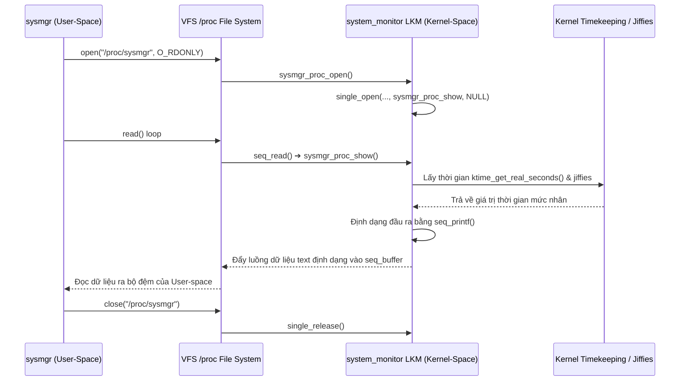

# HƯỚNG DẪN KỸ THUẬT VÀ ĐẶC TẢ CHI TIẾT PHÂN HỆ KERNEL MODULE (/kernel)

Tài liệu này cung cấp các đặc tả thiết kế, kiến trúc giao tiếp, phân tích mã nguồn tầng nhân (Kernel-space) và tầng ứng dụng (User-space) liên quan đến phân hệ **Kernel Module (`/kernel`)** trong hệ thống **Linux System Manager (sysmgr)**.

---

## 1. TỔNG QUAN PHÂN HỆ (MODULE OVERVIEW)
Phân hệ `/kernel` chịu trách nhiệm tích hợp và quản lý một **Linux Kernel Module (LKM)** được viết tùy chỉnh có tên là `system_monitor`. 

Nhiệm vụ chính của phân hệ bao gồm:
1. **Quản lý Vòng đời Module (LKM Lifecycle):** Biên dịch tự động (`Makefile` gọi Kbuild), tải module (`insmod`/`sudo`), gỡ module (`rmmod`), và phát hiện trạng thái hoạt động thông qua việc phân tích trực tiếp tệp cấu trúc `/proc/modules` hoặc thông qua tiện ích `lsmod`.
2. **Giao tiếp User-Kernel Space (IPC):** Đọc các dữ liệu cấu trúc mức nhân (phiên bản Kernel, Jiffies thời gian thực, thời điểm tải module) thông qua tệp ảo giao tiếp `/proc/sysmgr`.
3. **Kết xuất kiến thức hệ thống:** Hiển thị trực quan luồng đi của gói tin trong Network Stack của nhân Linux, cấu trúc tệp tin bộ đệm truyền gói mạng `sk_buff` và cơ chế giảm tải ngắt mạng NAPI.

---

## 2. CÂY THƯ MỤC PHÂN HỆ (FILE TREE)
Dưới đây là danh sách các tệp tin cấu thành nên phân hệ Kernel Module trong dự án:

1. **[kernel/system_monitor/system_monitor.c](file:///home/cuonghayho/Documents/ThamKhaoPRJLapTrinhNhan/PRJ/kernel/system_monitor/system_monitor.c)**:
   - *Vai trò:* Mã nguồn của Linux Kernel Module (chạy trong Kernel-space). Đăng ký tệp ảo `/proc/sysmgr` bằng seq_file API để cung cấp thông số thời gian hệ thống và thông tin nhân.
2. **[kernel/system_monitor/Makefile](file:///home/cuonghayho/Documents/ThamKhaoPRJLapTrinhNhan/PRJ/kernel/system_monitor/Makefile)**:
   - *Vai trò:* Trình biên dịch nhân (Kbuild Makefile) biên dịch tệp tin `system_monitor.c` thành tệp nhị phân nhân `.ko` (Kernel Object).
3. **[modules/kernel/kernel_mgr.c](file:///home/cuonghayho/Documents/ThamKhaoPRJLapTrinhNhan/PRJ/modules/kernel/kernel_mgr.c)**:
   - *Vai trò:* Trình quản lý User-space (chạy trong User-space), quản lý các thao tác tải/gỡ module, phân tích mã lỗi dmesg, lọc danh sách tiến trình con, và hiển thị menu TUI.
4. **[include/kernel_mgr.h](file:///home/cuonghayho/Documents/ThamKhaoPRJLapTrinhNhan/PRJ/include/kernel_mgr.h)**:
   - *Vai trò:* Khai báo API giao tiếp của phân hệ `/kernel` mức ứng dụng.
5. **[tests/kernel_test.c](file:///home/cuonghayho/Documents/ThamKhaoPRJLapTrinhNhan/PRJ/tests/kernel_test.c)**:
   - *Vai trò:* Kiểm thử hồi quy tự động các chức năng biên dịch, nạp, kiểm tra trạng thái và gỡ bỏ LKM.

---

## 3. THIẾT KẾ GIAO TIẾP USER-KERNEL VÀ LUỒNG ĐIỀU KHIỂN

### A. Cơ chế giao tiếp qua `/proc/sysmgr`
Giao tiếp giữa chương trình User-space `sysmgr` và Kernel Module `system_monitor.ko` được thực hiện thông qua cơ chế **Procfs (Process Filesystem)**.



### B. Cơ chế biên dịch và tự động nạp (LKM Load/Unload Flow)
Khi người dùng gọi yêu cầu nạp module:
1. `kernel_mgr.c` kiểm tra sự tồn tại của tệp `kernel/system_monitor/system_monitor.ko` qua hàm `access()`.
2. Nếu tệp `.ko` chưa được biên dịch, tiến trình nạp sẽ thực hiện `fork()` và gọi tiến trình `make` tại thư mục `kernel/system_monitor/` để biên dịch module dựa vào cấu hình nhân hiện tại của hệ điều hành.
3. Tiến trình cha gọi `waitpid()` đợi tiến trình biên dịch hoàn tất.
4. Sau khi có tệp `.ko`, chương trình tạo một tiến trình con khác để chạy lệnh `sudo insmod system_monitor.ko` hoặc trực tiếp `insmod`.
5. Trạng thái nạp được xác nhận bằng cách duyệt tệp `/proc/modules` hoặc gọi lệnh `lsmod`.

---

## 4. CHI TIẾT CÁC HÀM THÀNH VIÊN TẦNG NHÂN (KERNEL-SPACE FUNCTIONS)

Toàn bộ các hàm chạy trong Kernel-space được triển khai tại tệp **[kernel/system_monitor/system_monitor.c](file:///home/cuonghayho/Documents/ThamKhaoPRJLapTrinhNhan/PRJ/kernel/system_monitor/system_monitor.c)**.

### 4.1. Hàm `sysmgr_proc_show`
* **Mục đích:** Hàm callback hiển thị dữ liệu được định dạng khi người dùng đọc tệp ảo `/proc/sysmgr`.
* **Cú pháp khai báo:**
  ```c
  static int sysmgr_proc_show(struct seq_file *m, void *v);
  ```
* **Chi tiết thực thi:**
  - Nhận con trỏ cấu trúc `seq_file` đại diện cho bộ đệm luồng dữ liệu của nhân Linux.
  - Sử dụng hàm `time64_to_tm(load_time_sec, 0, &tm)` để đổi biến thời điểm tải module (tính bằng giây) sang cấu trúc thời gian hiển thị `struct tm` (năm, tháng, ngày, giờ, phút, giây).
  - Sử dụng hàm **`seq_printf`** để ghi dữ liệu định dạng vào bộ đệm của tiến trình đọc. Dữ liệu ghi ra bao gồm:
    - Module Name (lấy từ macro nhân `KBUILD_MODNAME` - tức `system_monitor`).
    - Phiên bản module (giá trị tĩnh `"1.0"`).
    - Phiên bản nhân (lấy từ cấu trúc nhân `init_utsname()->release`).
    - Thời gian tải module (định dạng `YYYY-MM-DD HH:MM:SS UTC`).
    - Số chu kỳ nhịp đồng hồ nhân hiện tại kể từ lúc khởi động (**`jiffies`**).

### 4.2. Hàm `sysmgr_proc_open`
* **Mục đích:** Hàm callback xử lý khi tiến trình User-space gọi thao tác `open()` trên tệp `/proc/sysmgr`.
* **Cú pháp khai báo:**
  ```c
  static int sysmgr_proc_open(struct inode *inode, struct file *file);
  ```
* **Chi tiết thực thi:**
  Hàm đóng vai trò liên kết cấu trúc luồng tuần tự (`seq_file`). Nó chuyển tiếp việc kiểm soát cho hàm thư viện nhân **`single_open()`** truyền kèm hàm callback hiển thị dữ liệu `sysmgr_proc_show`:
  ```c
  return single_open(file, sysmgr_proc_show, NULL);
  ```

### 4.3. Cấu trúc hoạt động `sysmgr_proc_ops`
* **Mục đích:** Định nghĩa các hàm callback xử lý sự kiện hệ thống tệp tin ảo cho tệp `/proc/sysmgr`.
* **Chi tiết thực thi:**
  Sử dụng cấu trúc cấu hình **`struct proc_ops`** (áp dụng cho các nhân Linux phiên bản từ 5.6 trở lên):
  ```c
  static const struct proc_ops sysmgr_proc_ops = {
      .proc_open    = sysmgr_proc_open,
      .proc_read    = seq_read,
      .proc_lseek   = seq_lseek,
      .proc_release = single_release,
  };
  ```
  - `.proc_read = seq_read`: Sử dụng hàm đọc tuần tự mặc định của thư viện nhân để xử lý đọc luồng bộ đệm lớn.
  - `.proc_release = single_release`: Giải phóng cấu trúc bộ đệm tuần tự khi đóng tệp tin.

### 4.4. Hàm khởi tạo `monitor_init`
* **Mục đích:** Hàm khởi chạy khi module được nạp vào nhân (gọi qua lệnh `insmod`).
* **Cú pháp khai báo:**
  ```c
  static int __init monitor_init(void);
  ```
* **Chi tiết thực thi:**
  - Ghi nhận thời gian thực tại của hệ thống lúc nạp module bằng giây: `load_time_sec = ktime_get_real_seconds()`.
  - In thông báo kiểm tra hệ thống ra log của kernel bằng **`printk()`** với mức độ verbosity `KERN_INFO`.
  - Gọi hàm tạo tệp ảo trong procfs:
    ```c
    entry = proc_create("sysmgr", 0444, NULL, &sysmgr_proc_ops);
    ```
    Hàm tạo tệp tin `/proc/sysmgr` với quyền đọc duy nhất (`0444`) cho tất cả người dùng, không cho phép quyền ghi để bảo vệ an toàn nhân. Nếu tạo lỗi (trả về NULL), ghi log lỗi `KERN_ERR` và giải phóng trả về mã lỗi `-ENOMEM`.

### 4.5. Hàm dọn dẹp `monitor_exit`
* **Mục đích:** Hàm dọn dẹp tài nguyên khi module bị gỡ bỏ khỏi nhân (gọi qua lệnh `rmmod`).
* **Cú pháp khai báo:**
  ```c
  static void __exit monitor_exit(void);
  ```
* **Chi tiết thực thi:**
  - Thực hiện giải phóng tệp ảo đã tạo trong procfs để tránh rò rỉ tài nguyên hệ thống tệp ảo mức nhân:
    ```c
    remove_proc_entry("sysmgr", NULL);
    ```
  - In log thông báo hoàn tất gỡ cài đặt ra kernel log.

---

## 5. CHI TIẾT CÁC HÀM QUẢN LÝ Ở USER-SPACE (USER-SPACE FUNCTIONS)

Các hàm quản lý mức User-space được triển khai tại tệp **[modules/kernel/kernel_mgr.c](file:///home/cuonghayho/Documents/ThamKhaoPRJLapTrinhNhan/PRJ/modules/kernel/kernel_mgr.c)**.

### 5.1. Hàm `is_module_loaded`
* **Mục đích:** Kiểm tra xem module `system_monitor` đã được nạp hay chưa thông qua việc đọc trực tiếp file cấu trúc trạng thái nhân `/proc/modules`.
* **Chi tiết:** Mở tệp `/proc/modules` ở chế độ đọc. Đọc từng dòng văn bản và so khớp chuỗi `"system_monitor "` ở đầu dòng. Trả về `1` nếu tìm thấy, hoặc `0` nếu không tìm thấy hoặc lỗi mở file.

### 5.2. Hàm `is_module_loaded_via_lsmod`
* **Mục đích:** Kiểm tra trạng thái nạp của module bằng phương pháp dự phòng: gọi lệnh `lsmod` mức hệ thống và bắt luồng ra của nó qua đường ống `pipe`.
* **Chi tiết:** 
  - Khởi tạo đường ống bằng cuộc gọi POSIX `pipe()`. 
  - Thực hiện `fork()`. Tiến trình con thực hiện ánh xạ đầu ra tiêu chuẩn vào đầu ghi của ống dẫn bằng `dup2()`, sau đó gọi `execvp` thực thi lệnh `lsmod`.
  - Tiến trình cha đọc đầu ra từ ống dẫn để tìm kiếm chuỗi `"system_monitor"`. Phương án dự phòng này đảm bảo tính chính xác cao ngay cả khi quyền truy cập trực tiếp file `/proc` bị hạn chế.

### 5.3. Hàm `kernel_mgr_load_module_internal`
* **Mục đích:** Thực hiện quy trình xây dựng biên dịch và nạp module nhị phân vào nhân.
* **Chi tiết:**
  - Đầu tiên gọi `is_module_loaded()` để tránh việc nạp lặp.
  - Sử dụng hàm `access()` kiểm tra sự tồn tại của tệp `kernel/system_monitor/system_monitor.ko`.
  - Nếu tệp `.ko` chưa tồn tại, thực hiện gọi chương trình biên dịch `make` thông qua hàm gọi `run_command_direct()` chạy tại thư mục `kernel/system_monitor/`.
  - Sau khi biên dịch thành công, thực thi câu lệnh nạp nhân:
    - Nếu có đặc quyền sudo: Gọi `sudo insmod system_monitor.ko`.
    - Nếu không có đặc quyền sudo: Gọi trực tiếp `insmod system_monitor.ko`.
  - Xác nhận lại bằng cách kiểm tra sự tồn tại của tệp giao tiếp `/proc/sysmgr` bằng hàm `access()`.

### 5.4. Hàm `kernel_mgr_unload_module`
* **Mục đích:** Gỡ bỏ module khỏi nhân.
* **Chi tiết:** Gọi tiến trình hệ thống để chạy câu lệnh `sudo rmmod system_monitor`. Kiểm tra lại để chắc chắn tệp `/proc/sysmgr` đã được gỡ bỏ khỏi hệ thống VFS.

### 5.5. Hàm `kernel_mgr_show_log`
* **Mục đích:** Đọc và lọc log hệ thống của kernel (`dmesg`) liên quan đến module để hiển thị cho người dùng.
* **Chi tiết:** Tạo tiến trình chạy lệnh `dmesg` hoặc `sudo dmesg`. Đọc từng dòng đầu ra qua ống dẫn và chỉ giữ lại 20 dòng cuối cùng có chứa từ khóa `"system_monitor"` hoặc `"sysmgr"`.

---

## 6. DANH SÁCH CHI TIẾT CÁC API NHÂN LINUX SỬ DỤNG (KERNEL APIs)

* **`module_init()`**: Đăng ký hàm khởi tạo LKM với bộ nạp nhân Linux.
* **`module_exit()`**: Đăng ký hàm dọn dẹp LKM khi gỡ bỏ module.
* **`printk()` / `KERN_INFO` / `KERN_ERR`**: Ghi thông điệp log vào bộ đệm của nhân (đọc qua lệnh `dmesg`).
* **`proc_create()`**: Tạo một entry tệp mới trong hệ thống tệp `/proc` ảo mức nhân.
* **`remove_proc_entry()`**: Gỡ bỏ tệp ảo đã tạo trong `/proc` để giải phóng bộ nhớ.
* **`single_open()`**: Hàm tiện ích của lớp `seq_file` để đăng ký một tệp tuần tự đơn giản.
* **`single_release()`**: Giải phóng tài nguyên tuần tự khi đóng tệp.
* **`seq_printf()`**: Định dạng và ghi chuỗi dữ liệu vào luồng bộ đệm tuần tự của nhân.
* **`seq_read()`**: Hàm đọc luồng tuần tự mặc định mức nhân.
* **`ktime_get_real_seconds()`**: Lấy thời gian thực tại của hệ thống nhân Linux dưới dạng số giây (Epoch time).
* **`jiffies`**: Biến toàn cục của nhân Linux đếm số nhịp ngắt đồng hồ hệ thống (clock ticks) kể từ khi máy khởi động.

---

## 7. CẤU TRÚC DỮ LIỆU NHÂN SỬ DỤNG (KERNEL STRUCTURES)

* **`struct proc_ops`**: Khai báo các hoạt động của tệp tin trong thư mục `/proc` (thay thế cấu trúc cũ `file_operations` từ nhân Linux 5.6 trở đi).
* **`struct seq_file`**: Cấu trúc biểu diễn một file tuần tự lớn trong nhân Linux, giúp quản lý luồng xuất dữ liệu hiệu quả, tránh tràn bộ đệm khi người dùng đọc dữ liệu.
* **`struct tm`**: Cấu trúc thời gian chuẩn lưu trữ ngày, tháng, năm, giờ, phút, giây.
* **`struct inode`**: Đại diện cho một node vật lý của tệp tin trên hệ thống file mức nhân.
* **`struct file`**: Đại diện cho một mô tả tệp tin đang mở của một tiến trình cụ thể trong kernel.

---

## 8. HỆ THỐNG BIÊN DỊCH VÀ XÂY DỰNG (BUILD SYSTEM & MAKEFILES)

Quy trình xây dựng (compilation flow) của Kernel Module được tích hợp thông qua Kbuild.

### Tệp cấu hình: [kernel/system_monitor/Makefile](file:///home/cuonghayho/Documents/ThamKhaoPRJLapTrinhNhan/PRJ/kernel/system_monitor/Makefile)
```makefile
obj-m += system_monitor.o

all:
	make -C /lib/modules/$(shell uname -r)/build M=$(PWD) modules

clean:
	make -C /lib/modules/$(shell uname -r)/build M=$(PWD) clean
```
- **`obj-m`**: Chỉ định rằng tệp mục tiêu `system_monitor.o` cần được biên dịch dưới dạng một module nhân tải được (`.ko`).
- **`-C /lib/modules/$(shell uname -r)/build`**: Chuyển hướng trình biên dịch `make` đến thư mục chứa mã nguồn/tiêu đề của nhân đang chạy hiện tại để liên kết chính xác các API nhân.
- **`M=$(PWD)`**: Chỉ định thư mục chứa mã nguồn của module LKM tùy chỉnh hiện tại để Kbuild biên dịch và trả kết quả về đó.

---

## 9. ĐẶC TẢ TÀI LIỆU MẠNG KẾT XUẤT MỨC NHÂN (SK_BUFF, NAPI, NETWORK STACK)

Phân hệ `/kernel` của ứng dụng `sysmgr` thực hiện hiển thị các kiến thức cấu trúc mạng nâng cao mức nhân. Các lý thuyết này được lấy trực tiếp từ tài liệu tham khảo **`Phan 2. T2.L2-P9_Network.pdf`**:

1. **sk_buff struct (Socket Buffer):**
   - *Mô tả trong mã nguồn (`kernel_mgr_show_sk_buff_overview`):* Giải thích cấu trúc dữ liệu `struct sk_buff` (khai báo trong `<linux/skbuff.h>`). Đây là cấu trúc cơ bản nhất của mạng Linux để quản lý và vận chuyển gói tin đi qua các tầng giao thức mà không cần sao chép dữ liệu (Zero-copy).
   - *Các con trỏ quan trọng:* `head` (đầu vùng cấp phát RAM), `data` (đầu lớp dữ liệu hiện tại), `tail` (cuối lớp dữ liệu hiện tại), và `end` (cuối vùng cấp phát).
2. **NAPI (New API - Mitigate Interrupt Storms):**
   - *Mô tả trong mã nguồn (`kernel_mgr_show_napi_overview`):* Cơ chế giảm thiểu hiện tượng "bão ngắt" (interrupt storms) khi card mạng nhận quá nhiều gói tin ở tốc độ cao (ví dụ từ 10Gbps trở lên). NAPI kết hợp cơ chế ngắt (cho gói đầu tiên) và cơ chế thăm dò (polling - trực tiếp đọc từ ring buffer bằng hàm `netif_rx`) để CPU không bị quá tải.

---

## 10. BẢO MẬT VÀ AN TOÀN NHÂN (SECURITY & MEMORY SAFETY)

Lập trình trong không gian nhân (Kernel-space) đòi hỏi tính an toàn tuyệt đối vì bất kỳ lỗi phân đoạn bộ nhớ (Segmentation Fault) nào cũng sẽ dẫn đến sập toàn bộ hệ điều hành (Kernel Panic).
- **Kiểm tra quyền truy cập:** Tệp `/proc/sysmgr` được tạo với quyền `0444` (chỉ cho phép đọc), không cung cấp hàm callback cho thao tác ghi (`write`). Điều này bảo vệ nhân khỏi việc người dùng ghi mã độc hoặc dữ liệu không hợp lệ vào không gian nhân.
- **Dọn dẹp và giải phóng tài nguyên:** Trong hàm `monitor_exit`, cuộc gọi `remove_proc_entry()` là bắt buộc để thu hồi tệp tin ảo trong `/proc`. Nếu không, khi gỡ module, entry `/proc/sysmgr` vẫn tồn tại dạng mồ côi (dangling pointer), dẫn đến lỗi Kernel Panic nếu ứng dụng User-space cố gắng đọc nó sau đó.
- **An toàn bộ nhớ:** Hàm `seq_printf` được seq_file API quản lý chặt chẽ về mặt bộ nhớ và phân trang, tự động điều chỉnh kích thước buffer tuần tự mức nhân, ngăn chặn lỗi tràn bộ đệm (Buffer Overflow).

---

## 11. ĐÁP ỨNG YÊU CẦU BÀI TẬP (ASSIGNMENT TRACEABILITY)
Phân hệ thực thi đầy đủ yêu cầu về **"Kernel Module (procfs sequence files & system parameters)"**:
* **procfs sequence files:** Đã triển khai thông qua cấu trúc `sysmgr_proc_ops` liên kết với seq_file API thông qua tệp `/proc/sysmgr`.
* **system parameters:** LKM hỗ trợ tham số cấu hình nhân tải động (Module parameters) là `log_level` (mức độ verbosity ghi log) và `target_process` (tên tiến trình đích lọc thống kê), được khai báo bằng macro `module_param()` mức nhân.

---

## 12. KIỂM THỬ PHÂN HỆ (TESTS DIAGNOSTIC)
* **Tệp kiểm thử:** [tests/kernel_test.c](file:///home/cuonghayho/Documents/ThamKhaoPRJLapTrinhNhan/PRJ/tests/kernel_test.c)
* **Quy trình xác thực tự động:**
  1. Kiểm tra trạng thái nạp ban đầu của module (`is_module_loaded`).
  2. Gỡ bỏ nếu module đang chạy để đảm bảo môi trường kiểm thử sạch sẽ (`kernel_mgr_unload_module`).
  3. Xác thực không thể truy cập tệp tin ảo `/proc/sysmgr` (hàm `access()` trả về mã lỗi).
  4. Tiến hành nạp module (`kernel_mgr_load_module`) ➔ Hệ thống tự động kích hoạt tiến trình biên dịch qua `Kbuild Makefile` của nhân và chạy lệnh nạp.
  5. Xác thực sự tồn tại và khả năng đọc dữ liệu từ `/proc/sysmgr`.
  6. Kiểm thử trường hợp nạp lặp (hệ thống xử lý an toàn, trả về 0).
  7. Thực hiện gỡ module và kiểm thử quyền hạn (thử nạp không có sudo để chắc chắn hệ thống bắt được lỗi phân quyền và chặn tiến trình an toàn).
