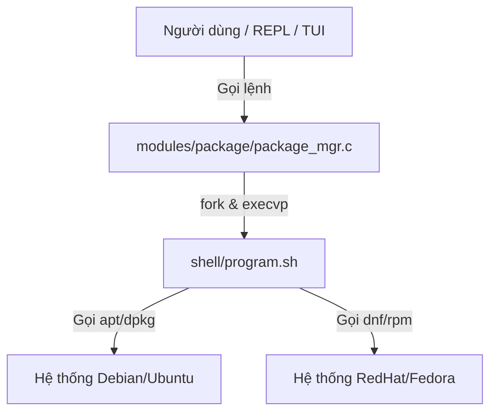

# HƯỚNG DẪN KỸ THUẬT VÀ ĐẶC TẢ CHI TIẾT PHÂN HỆ PACKAGE MANAGER (/package)

Tài liệu này cung cấp tài liệu kỹ thuật, đặc tả thiết kế, phân tích mã nguồn và hướng dẫn kiểm thử chi tiết cho phân hệ **Package Manager (`/package`)** trong hệ thống **Linux System Manager (sysmgr)**.

---

## 1. TỔNG QUAN PHÂN HỆ (MODULE OVERVIEW)
Phân hệ Package Manager chịu trách nhiệm quản lý vòng đời cài đặt phần mềm trên máy chủ. Điểm đặc trưng của phân hệ này là **mô hình thiết kế hướng Sandbox và Tự động hóa**:

1. **Wrapper đa nền tảng:** Tự động phát hiện trình quản lý gói của hệ điều hành gốc (`dpkg/apt` trên Debian/Ubuntu hoặc `rpm/dnf` trên RedHat/Fedora) để chạy lệnh cài đặt tương thích.
2. **Cơ chế nạp tự động (Setup Environment):** Cung cấp chức năng `/setup` tự động cấu hình các gói thiết yếu (`ping`, `iproute`, `curl`, `tmux`, `zip`, `unzip`, `chrony`, `gcc`, kernel headers) phục vụ cho một SSH GPU Docker container tối giản.
3. **An toàn kiểm thử (Safe Demo):** Cho phép chạy thử nghiệm quy trình đóng gói/cài đặt/gỡ bỏ khép kín trên một gói vô hại (như `hello`, `sl`, `figlet`) để tránh làm thay đổi trạng thái lâu dài của hệ thống.

---

## 2. CÂY THƯ MỤC PHÂN HỆ (FILE TREE)
Dưới đây là các tệp nguồn liên quan trực tiếp đến phân hệ Package Manager:

1. **[include/package_mgr.h](file:///home/cuonghayho/Documents/ThamKhaoPRJLapTrinhNhan/PRJ/include/package_mgr.h)**:
   - *Vai trò:* Tệp tiêu đề khai báo các giao diện APIs công khai cho REPL và TUI điều hướng.
2. **[modules/package/package_mgr.c](file:///home/cuonghayho/Documents/ThamKhaoPRJLapTrinhNhan/PRJ/modules/package/package_mgr.c)**:
   - *Vai trò:* Triển khai các hàm C Wrapper gọi tiến trình, xác thực trạng thái cài đặt qua lệnh nhân, phát hiện trình quản lý gói gốc và xử lý menu TUI.
3. **[shell/program.sh](file:///home/cuonghayho/Documents/ThamKhaoPRJLapTrinhNhan/PRJ/shell/program.sh)**:
   - *Vai trò:* Kịch bản Shell backend thực hiện các thao tác đóng gói mức thấp bằng cách tương tác với `apt`, `dpkg`, `dnf` hoặc `rpm`.
4. **[tests/package_test.c](file:///home/cuonghayho/Documents/ThamKhaoPRJLapTrinhNhan/PRJ/tests/package_test.c)**:
   - *Vai trò:* Mã nguồn kiểm thử hồi quy tự động các chức năng tìm kiếm, xem thông tin và kiểm tra trình phát hiện package manager.

---

## 3. MỐI LIÊN HỆ VỚI CÁC TÀI LIỆU LÝ THUYẾT NHÂN (REFERENCE PDFs)

Phân hệ Package Manager được xây dựng dựa trên sự liên kết giữa hai tài liệu lý thuyết:

### A. Tài liệu `Phan 2. T2.L2-P1_File.pdf` (Lập trình Đọc/Ghi file trong Linux)
* **Khái niệm tương thích:** Quản lý quyền truy cập tệp tin bằng hàm `access()` mức hệ thống để phát hiện các file thực thi trong `/usr/bin/`.
* **Cách dự án áp dụng:**
  - Hàm `package_mgr_detect` trong [package_mgr.c](file:///home/cuonghayho/Documents/ThamKhaoPRJLapTrinhNhan/PRJ/modules/package/package_mgr.c) sử dụng cuộc gọi hệ thống **`access()`** để kiểm tra quyền thực thi (`X_OK`) của các trình quản lý hệ thống:
    ```c
    if (access("/usr/bin/dpkg-query", X_OK) == 0) return "dpkg";
    if (access("/usr/bin/rpm", X_OK) == 0) return "rpm";
    ```
  - Kiểm tra xem kịch bản shell `shell/program.sh` có quyền chạy hay không trước khi nhân bản tiến trình.

### B. Tài liệu `Phan 2. T2.L2-P1_Process.pdf` (Kiểm soát tiến trình)
* **Khái niệm tương thích:** Nhân bản tiến trình (`fork()`), thay thế tiến trình (`execvp()`), đồng bộ hóa tiến trình con (`waitpid()`), trạng thái thoát (`exit code`) và chuyển hướng đầu ra tiêu chuẩn sang `/dev/null` để ẩn thông tin log lỗi.
* **Cách dự án áp dụng:**
  - Hàm `is_package_installed` tạo tiến trình con bằng `fork()` để chạy lệnh truy vấn gói (`dpkg-query` hoặc `rpm`). Để quá trình chạy ngầm này không làm bẩn màn hình hiển thị của người dùng, luồng Standard Output và Standard Error của tiến trình con được chuyển hướng vào tệp rác `/dev/null`:
    ```c
    int devnull = open("/dev/null", O_WRONLY);
    if (devnull != -1) {
        dup2(devnull, STDOUT_FILENO);
        dup2(devnull, STDERR_FILENO);
        close(devnull);
    }
    ```
  - Đây là ứng dụng thực tế trực tiếp của lý thuyết quản lý bảng mô tả tệp tin của tiến trình trong nhân Linux (Slide 8 của Process PDF).

---

## 4. PHÂN TÍCH THIẾT KẾ HỆ THỐNG (DESIGN ANALYSIS)

### A. Kiến trúc kết hợp C và Shell Script
Phân hệ sử dụng kiến trúc ghép nối ghép thông qua cuộc gọi hệ thống POSIX:



- **Truyền tham số an toàn:** Hàm `run_script` định nghĩa mảng tham số `argv` tường minh, truyền trực tiếp vào `execvp`. Việc này loại bỏ hoàn toàn nguy cơ tấn công chèn lệnh Shell (Shell Injection) so với hàm `system()`.
- **Đồng bộ hóa:** Tiến trình cha `sysmgr` sử dụng cuộc gọi `waitpid()` chặn luồng cho đến khi tiến trình con kết thúc. `WEXITSTATUS(status)` trích xuất mã lỗi hệ thống để lan truyền lỗi lên Logger và màn hình.

---

## 5. ĐẶC TẢ CHI TIẾT CÁC HÀM THÀNH VIÊN (FOR EVERY FUNCTION)

### 5.1. Hàm `package_mgr_detect`
* **Nguyên mẫu:** `const char* package_mgr_detect(void)`
* **Tệp nguồn / Header:** `package_mgr.c` / [include/package_mgr.h](file:///home/cuonghayho/Documents/ThamKhaoPRJLapTrinhNhan/PRJ/include/package_mgr.h)
* **Mục đích:** Tự động phát hiện trình quản lý gói của hệ điều hành Linux đang chạy.
* **Chi tiết thực thi:** Sử dụng hàm hệ thống `access(path, X_OK)` để kiểm tra sự tồn tại và quyền chạy của `/usr/bin/dpkg-query` hoặc `/usr/bin/rpm`. Trả về chuỗi đại diện `"dpkg"`, `"rpm"`, hoặc `NULL` nếu không được hỗ trợ.

### 5.2. Hàm `is_package_installed`
* **Nguyên mẫu:** `int is_package_installed(const char* pkg_name)`
* **Tệp nguồn / Header:** `package_mgr.c` / `package_mgr.h`
* **Mục đích:** Kiểm tra xem một gói phần mềm cụ thể đã được cài đặt trên hệ thống hay chưa.
* **Chi tiết thực thi:** 
  - Gọi `fork()`.
  - Tiến trình con chuyển hướng stdout/stderr sang `/dev/null` để ẩn log.
  - Sử dụng `execvp` gọi lệnh truy vấn tĩnh:
    - Nếu hệ thống là dpkg: `dpkg-query -W -f=\${Status} <pkg_name>`.
    - Nếu hệ thống là rpm: `rpm -q <pkg_name>`.
  - Tiến trình cha dùng `waitpid` để lấy trạng thái thoát. Nếu tiến trình con kết thúc với mã thoát `0` thì trả về `1` (đã cài đặt), ngược lại trả về `0` (chưa cài đặt hoặc lỗi).

### 5.3. Hàm `package_mgr_setup`
* **Nguyên mẫu:** `int package_mgr_setup(void)`
* **Tệp nguồn / Header:** `package_mgr.c` / `package_mgr.h`
* **Mục đích:** Tự động nạp toàn bộ cấu hình môi trường hệ thống cần thiết cho các GPU SSH Docker container tối giản.
* **Chi tiết thực thi:** Gọi `run_script` thực thi kịch bản shell với tham số `setup`.
  - *Kịch bản chạy thực tế:*
    - Trên Ubuntu/Debian (`apt`): Chạy `apt-get update` để tải danh sách gói mới nhất, sau đó cài đặt `iputils-ping`, `iproute2`, `curl`, `tmux`, `zip`, `unzip`, `chrony`, `build-essential`, và gói `linux-headers-$(uname -r)` tương thích với phiên bản nhân hiện tại.
    - Trên Fedora/RedHat (`dnf`): Cài đặt các gói tương thích là `iputils`, `iproute`, `curl`, `tmux`, `zip`, `unzip`, `chrony`, `make`, `gcc`, `kernel-devel`.

### 5.4. Hàm `package_mgr_demo`
* **Nguyên mẫu:** `int package_mgr_demo(void)`
* **Tệp nguồn / Header:** `package_mgr.c` / `package_mgr.h`
* **Mục đích:** Chạy thử nghiệm đóng gói an toàn (Safe Dry-run Demonstration).
* **Chi tiết thực thi:** Gọi `shell/program.sh demo`. Kịch bản shell sẽ tự động tìm kiếm một gói vô hại chưa được cài đặt (từ danh sách: `hello`, `sl`, `cowsay`, `figlet`, `tree`, `jq`), tải về cài đặt thử nghiệm, kiểm tra trạng thái cài đặt thành công, in thông tin gói, sau đó tự động gỡ bỏ sạch sẽ để khôi phục trạng thái nguyên vẹn của hệ thống.

---

## 6. ĐẶC TẢ CÁC LỆNH HỆ THỐNG LINUX ĐƯỢC GỌI MỨC THẤP

* **`dpkg-query -W`**: Truy vấn trạng thái cài đặt của gói trên Debian.
* **`apt-get install -y` / `dnf install -y`**: Tải và cài đặt gói tự động không chặn giao diện (non-interactive mode nhờ cờ `-y`).
* **`apt-cache show` / `dnf info`**: Tra cứu metadata của gói (phiên bản, kích thước, nhà phát triển, bản quyền).
* **`rpm -q`**: Truy vấn trạng thái cài đặt của gói trên RedHat/Fedora.
* **`sudo`**: Yêu cầu đặc quyền quản trị viên khi chạy lệnh cài đặt hoặc gỡ bỏ.

---

## 7. BẢO MẬT VÀ AN TOÀN TRONG QUẢN LÝ GÓI (SECURITY CONSIDERATIONS)

1. **Chặn cài đặt/gỡ bỏ các gói hệ thống cốt lõi:**
   Để tránh việc người dùng vô tình làm sập hệ thống (ví dụ: gỡ bỏ nhân kernel, hệ thống glibc, hoặc shell bash), kịch bản [shell/program.sh](file:///home/cuonghayho/Documents/ThamKhaoPRJLapTrinhNhan/PRJ/shell/program.sh) chứa bộ lọc chặn cứng (Blacklist) ở dòng 82 - 88 và 104 - 110:
   ```bash
   case "$PKG" in
     kernel*|glibc*|bash*|systemd*|gcc*|dnf*|rpm*|python*)
       echo "Error: Installation/Removal of critical system package is blocked."
       exit 1
       ;;
   esac
   ```
2. **Ngăn chặn tiêm lệnh (Command Injection):**
   Hệ thống tuyệt đối không ghép chuỗi lệnh để gọi hàm `system()`. Mọi lệnh gọi ngoài đều chạy qua cấu trúc mảng tham số của cuộc gọi hệ thống an toàn `execvp()`.

---

## 8. KIỂM THỬ PHÂN HỆ (TESTS)
* **Tệp kiểm thử:** [tests/package_test.c](file:///home/cuonghayho/Documents/ThamKhaoPRJLapTrinhNhan/PRJ/tests/package_test.c)
* **Quy trình xác thực tự động:**
  1. Xác thực sự tồn tại và quyền thực thi của `shell/program.sh` trên phân vùng hệ thống.
  2. Thực hiện tìm kiếm gói tin tĩnh (sử dụng gói mặc định `bash` có mặt trên mọi hệ thống Linux để đảm bảo bài test luôn thành công và không phá hủy dữ liệu).
  3. Truy vấn xem thông tin chi tiết gói `bash`.
  4. Truy vấn thử một gói không tồn tại (`nonexistent_package_12345`) để kiểm tra tính đúng đắn của cơ chế bắt lỗi.
  5. Kiểm tra tính năng tự động phát hiện trình quản lý gói nền.

---

## 9. VÍ DỤ SỬ DỤNG VÀ KẾT QUẢ ĐẦU RA MONG ĐỢI (EXAMPLES)

### 9.1. Tìm kiếm gói tin
```bash
sysmgr/package > search figlet
figlet 2.2.5
figlet-fonts 2.2.5
```

### 9.2. Cài đặt môi trường SSH Docker tự động
```bash
sysmgr/package > setup
========================================
Installing Essential System Packages
========================================
Running dnf install...
Installing packages: iputils iproute curl tmux zip unzip chrony make gcc kernel-devel...
...
System setup completed successfully.
```
*(Tự động phát hiện Fedora, chuyển tên gói sang `iputils` và `iproute` và biên dịch kernel-headers tương ứng)*.
