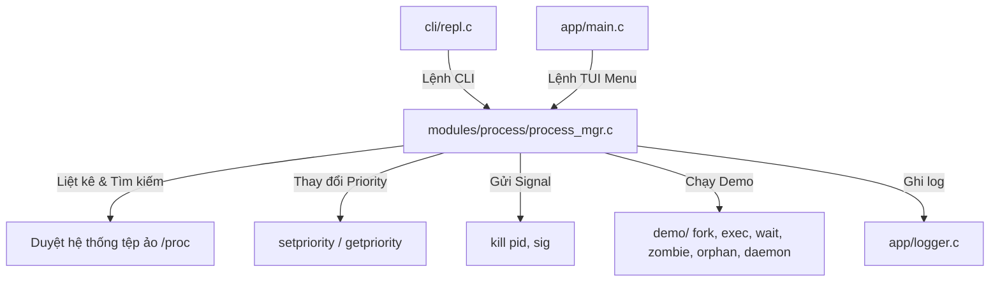

# HƯỚNG DẪN KỸ THUẬT VÀ ĐẶC TẢ CHI TIẾT PHÂN HỆ PROCESS MANAGER (/process)

Tài liệu này cung cấp tài liệu kỹ thuật, đặc tả thiết kế, phân tích mã nguồn chi tiết và kiểm thử của phân hệ **Process Manager (`/process`)** trong dự án **Linux System Manager (sysmgr)**. Đây là tài liệu tham chiếu dành cho lập trình viên để duy trì, mở rộng và kiểm thử hệ thống.

---

## BẢNG MỤC LỤC
1. [TỔNG QUAN PHÂN HỆ (MODULE OVERVIEW)](#1-tổng-quan-phân-hệ-module-overview)
2. [CÂY THƯ MỤC PHÂN HỆ (FILE TREE & INVENTORY)](#2-cây-thư-mục-phân-hệ-file-tree--inventory)
3. [MỐI LIÊN HỆ VỚI CÁC TÀI LIỆU LÝ THUYẾT NHÂN (REFERENCE PDFs)](#3-mối-liên-hệ-với-các-tài-liệu-lý-thuyết-nhân-reference-pdfs)
4. [PHÂN TÍCH THIẾT KẾ VÀ KIẾN TRÚC HỆ THỐNG (SYSTEM ARCHITECTURE)](#4-phân-tích-thiết-kế-và-kiến-trúc-hệ-thống-system-architecture)
5. [ĐẶC TẢ CHI TIẾT CÁC HÀM THÀNH VIÊN (FUNCTION SPECIFICATIONS)](#5-đặc-tả-chi-tiết-các-hàm-thành-viên-function-specifications)
6. [ĐẶC TẢ CHI TIẾT CÁC CHƯƠNG TRÌNH DEMO (DEMO WALKTHROUGHS)](#6-đặc-tả-chi-tiết-các-chương-trình-demo-demo-walkthroughs)
7. [CÁC HÀM API POSIX VÀ CUỘC GỌI HỆ THỐNG (POSIX APIS & SYSTEM CALLS)](#7-các-hàm-api-posix-và-cuộc-gọi-hệ-thống-posix-apis--system-calls)
8. [CÁC KHÁI NIỆM TIẾN TRÌNH VÀ CƠ CHẾ THỰC THI (PROCESS CONCEPTS)](#8-các-khái-niệm-tiến-trình-và-cơ-chế-thực-thi-process-concepts)
9. [CÁC LỆNH LINUX PHỤ TRỢ (LINUX COMMAND SPECS)](#9-các-lệnh-linux-phụ-trợ-linux-command-specs)
10. [CẤU TRÚC DỮ LIỆU ĐẶC THÙ (DATA STRUCTURES)](#10-cấu-trúc-dữ-liệu-đặc-thù-data-structures)
11. [THƯ VIỆN TIÊU CHUẨN SỬ DỤNG (STANDARD LIBRARIES)](#11-thư-viện-tiêu-chuẩn-sử-dụng-standard-libraries)
12. [AN NINH HỆ THỐNG VÀ AN TOÀN TIẾN TRÌNH (SECURITY & SAFETY)](#12-an-ninh-hệ-thống-và-an-toàn-tiến-trình-security--safety)
13. [HIỆU NĂNG VÀ TỐI ƯU HÓA (PERFORMANCE & OPTIMIZATION)](#13-hiệu-năng-và-tối-ưu-hóa-performance--optimization)
14. [BẢN ĐỒ TRUY XUẤT YÊU CẦU BÀI TẬP (ASSIGNMENT TRACEABILITY)](#14-bản-đồ-truy-xuất-yêu-cầu-bài-tập-assignment-traceability)
15. [BẢN ĐỒ TRUY XUẤT TÀI LIỆU THAM KHẢO (REFERENCE TRACEABILITY)](#15-bản-đồ-truy-xuất-tài-liệu-tham-khảo-reference-traceability)
16. [KIỂM THỬ VÀ CHẨN ĐOÁN LỖI (TEST SUITE & DIAGNOSTICS)](#16-kiểm-thử-và-chẩn-đoán-lỗi-test-suite--diagnostics)

---

## 1. TỔNG QUAN PHÂN HỆ (MODULE OVERVIEW)
Phân hệ **Process Manager (`/process`)** cung cấp một bộ công cụ giám sát, tìm kiếm, điều khiển tiến trình và các kịch bản giáo khoa trực quan minh họa vòng đời tiến trình trên hệ điều hành Linux. 

Điểm nổi bật của phân hệ này là tương tác trực tiếp với không gian nhân (Kernel space) thông qua việc phân tích thủ công các tệp tin cấu trúc trong hệ thống tệp ảo `/proc` (như `/proc/<PID>/stat` và `/proc/<PID>/status`) thay vì phụ thuộc vào các tiện ích hệ thống có sẵn như `ps` hay `pgrep`. Phân hệ này vừa đóng vai trò quản trị hệ thống vừa là phòng thí nghiệm lập trình hệ thống (System Programming Lab), thể hiện cách sử dụng các cuộc gọi hệ thống POSIX chuẩn để xử lý vòng đời của tiến trình từ lúc sinh ra (`fork`), thay đổi bộ nhớ (`exec`), đợi đồng bộ (`wait/waitpid`), quản lý trạng thái (`Zombie`, `Orphan`, `Daemon`), và giao tiếp qua tín hiệu (`Signal`).

---

## 2. CÂY THƯ MỤC PHÂN HỆ (FILE TREE & INVENTORY)
Toàn bộ các tệp tin cấu thành phân hệ Process Manager bao gồm:

1. **[include/process_mgr.h](file:///home/cuonghayho/Documents/ThamKhaoPRJLapTrinhNhan/PRJ/include/process_mgr.h)**:
   - *Vai trò:* Định nghĩa cấu trúc dữ liệu public `proc_info_t` và khai báo các API công khai phục vụ giao tiếp giữa phân hệ và REPL CLI/TUI.
2. **[modules/process/process_mgr_internal.h](file:///home/cuonghayho/Documents/ThamKhaoPRJLapTrinhNhan/PRJ/modules/process/process_mgr_internal.h)**:
   - *Vai trò:* Khai báo các nguyên mẫu hàm tĩnh nội bộ (helper) phục vụ phân tích cú pháp dữ liệu từ `/proc`.
3. **[modules/process/process_mgr.c](file:///home/cuonghayho/Documents/ThamKhaoPRJLapTrinhNhan/PRJ/modules/process/process_mgr.c)**:
   - *Vai trò:* Triển khai logic điều phối menu, liệt kê tiến trình, tìm kiếm tiến trình, gửi tín hiệu, thay đổi Nice value, và quản lý các luồng gọi demo.
4. **[modules/process/demo/process_demo.h](file:///home/cuonghayho/Documents/ThamKhaoPRJLapTrinhNhan/PRJ/modules/process/demo/process_demo.h)**:
   - *Vai trò:* Định nghĩa giao diện khởi chạy cho 6 chương trình demo vòng đời tiến trình.
5. **[modules/process/demo/fork_demo.c](file:///home/cuonghayho/Documents/ThamKhaoPRJLapTrinhNhan/PRJ/modules/process/demo/fork_demo.c)**:
   - *Vai trò:* Demo cơ chế nhân bản luồng điều khiển của `fork()`.
6. **[modules/process/demo/exec_demo.c](file:///home/cuonghayho/Documents/ThamKhaoPRJLapTrinhNhan/PRJ/modules/process/demo/exec_demo.c)**:
   - *Vai trò:* Demo việc thay thế ảnh bộ nhớ của tiến trình con thông qua `execvp()`.
7. **[modules/process/demo/wait_demo.c](file:///home/cuonghayho/Documents/ThamKhaoPRJLapTrinhNhan/PRJ/modules/process/demo/wait_demo.c)**:
   - *Vai trò:* Demo cơ chế chặn và đồng bộ hóa tiến trình cha - con thông qua `wait()`/`waitpid()`.
8. **[modules/process/demo/zombie_demo.c](file:///home/cuonghayho/Documents/ThamKhaoPRJLapTrinhNhan/PRJ/modules/process/demo/zombie_demo.c)**:
   - *Vai trò:* Demo việc tạo ra tiến trình Zombie bằng cách cho con thoát trước cha mà cha không gọi `wait()`, xác thực qua `/proc` và tiến hành giải phóng Zombie.
9. **[modules/process/demo/orphan_demo.c](file:///home/cuonghayho/Documents/ThamKhaoPRJLapTrinhNhan/PRJ/modules/process/demo/orphan_demo.c)**:
   - *Vai trò:* Demo tiến trình Orphan khi cha thoát trước, xác thực việc nhận nuôi (adoption) bởi tiến trình `init` (PID 1 hoặc systemd).
10. **[modules/process/demo/daemon_demo.c](file:///home/cuonghayho/Documents/ThamKhaoPRJLapTrinhNhan/PRJ/modules/process/demo/daemon_demo.c)**:
    - *Vai trò:* Demo đầy đủ quy trình khởi tạo tiến trình Daemon chuẩn hóa Unix qua cơ chế double-fork, setsid, umask, chdir, redirecting descriptors, ghi nhật ký nhịp tim (heartbeat log) và thu hồi tài nguyên sạch sẽ khi nhận SIGTERM.
11. **[modules/process/Makefile](file:///home/cuonghayho/Documents/ThamKhaoPRJLapTrinhNhan/PRJ/modules/process/Makefile)**:
    - *Vai trò:* Tập tin cấu hình biên dịch nội bộ phân hệ tạo ra các tệp tin đối tượng `.o`.
12. **[tests/process_test.c](file:///home/cuonghayho/Documents/ThamKhaoPRJLapTrinhNhan/PRJ/tests/process_test.c)**:
    - *Vai trò:* Chương trình kiểm thử tự động (integration & unit test) xác thực độ chính xác của các tính năng và demo tiến trình.

---

## 3. MỐI LIÊN HỆ VỚI CÁC TÀI LIỆU LÝ THUYẾT NHÂN (REFERENCE PDFs)
Phân hệ Process Manager áp dụng lý thuyết hệ điều hành và lập trình nhân từ các tài liệu tham chiếu chính thống:

### A. Tài liệu `Phan 2. T2.L2-P2_Signal.pdf` (Tín hiệu trong Linux)
* **Khái niệm áp dụng:** Cơ chế gửi tín hiệu điều khiển (`kill`), định nghĩa các tín hiệu chuẩn (`SIGTERM`, `SIGKILL`, `SIGSTOP`, `SIGCONT`), hành vi mặc định và các hàm thiết lập bộ lọc tín hiệu.
* **Cách dự án áp dụng:**
  - Sử dụng trực tiếp cuộc gọi hệ thống **`kill(pid, sig)`** trong hàm `process_mgr_send_signal` của [process_mgr.c](file:///home/cuonghayho/Documents/ThamKhaoPRJLapTrinhNhan/PRJ/modules/process/process_mgr.c#L381).
  - Tích hợp hàm **`signal()`** để bắt và xử lý tín hiệu `SIGTERM` trong tiến trình Daemon tại [daemon_demo.c](file:///home/cuonghayho/Documents/ThamKhaoPRJLapTrinhNhan/PRJ/modules/process/demo/daemon_demo.c#L201) giúp thu hồi tài nguyên và giải phóng PID file một cách an toàn.

### B. Tài liệu `Phan 2. T2.L2-P3_Semaphore.pdf` (Lập lịch và luồng)
* **Khái niệm áp dụng:** Lý thuyết về độ ưu tiên định thời CPU của tiến trình (Nice Value / Priority) trong bộ lập lịch Linux (Linux Scheduler).
* **Cách dự án áp dụng:**
  - Sử dụng các hàm hệ thống **`getpriority()`** và **`setpriority()`** trong hàm `process_mgr_set_priority` tại [process_mgr.c](file:///home/cuonghayho/Documents/ThamKhaoPRJLapTrinhNhan/PRJ/modules/process/process_mgr.c#L437) nhằm truy vấn và ghi đè hệ số Nice (nice value) từ `-20` đến `19` của tiến trình đích.

### C. Tài liệu `Phan 2. T2.L2-P1_Process.pdf` (Quản lý Tiến trình và VFS)
* **Khái niệm áp dụng:** Vòng đời tiến trình (sinh con qua `fork`, thay thế luồng qua `exec`, thu hồi qua `wait`/`waitpid`), các trạng thái tiến trình (Running, Sleeping, Zombie, Stopped), cấu trúc mô tả tiến trình `task_struct`, quan hệ Parent-Child, bảng mô tả tệp của tiến trình (File descriptor table).
* **Cách dự án áp dụng:**
  - Triển khai toàn bộ 6 kịch bản demo tại thư mục `modules/process/demo/` dựa trên lý thuyết vòng đời.
  - Sử dụng **`dup2()`** để chuyển hướng Standard Input, Output, Error vào `/dev/null` cho tiến trình Daemon tại [daemon_demo.c](file:///home/cuonghayho/Documents/ThamKhaoPRJLapTrinhNhan/PRJ/modules/process/demo/daemon_demo.c#L186).

### D. Tài liệu `Phan 2. T2.L2-P1_File.pdf` (Đọc ghi file và thư mục)
* **Khái niệm áp dụng:** Các hàm duyệt cấu trúc thư mục hệ thống như `opendir()`, `readdir()`, `closedir()` và các thao tác tệp tin mức thấp `open()`, `read()`, `close()`.
* **Cách dự án áp dụng:**
  - Hàm `process_mgr_list` duyệt thư mục `/proc` bằng **`opendir()`**, **`readdir()`** để lọc ra các PID số.
  - Hàm `parse_proc_stat` và `parse_proc_status_memory` sử dụng **`open()`**, **`read()`** trực tiếp trên `/proc/<PID>/stat` và `/proc/<PID>/status` để lấy siêu dữ liệu tiến trình.

---

## 4. PHÂN TÍCH THIẾT KẾ VÀ KIẾN TRÚC HỆ THỐNG (SYSTEM ARCHITECTURE)

### A. Kiến trúc và Luồng điều khiển (Architecture & Control Flow)
Kiến trúc của phân hệ Process Manager được thiết kế theo dạng mô đun hóa hướng sự kiện tương tác:



### B. Vòng đời tài nguyên và Bộ nhớ (Resource Lifecycle & Memory Flow)
1. **Duyệt thư mục `/proc`:**
   - Hàm `process_mgr_list` mở thư mục `/proc` bằng `opendir()`. Để tránh rò rỉ mô tả thư mục (Directory Descriptor Leak), tài nguyên `DIR*` luôn được đóng bằng `closedir()` ở cuối hàm trong mọi trường hợp (kể cả khi thành công hay gặp lỗi).
2. **Đọc tệp tin trạng thái tiến trình:**
   - Khi truy cập `/proc/<PID>/stat` và `/proc/<PID>/status`, hệ thống sử dụng các file descriptor tạm thời. Các file descriptor này được mở bằng `open` và đóng ngay lập tức bằng `close` sau khi đọc xong dữ liệu vào bộ đệm tĩnh của ngăn xếp (`stack buffer`), giảm thiểu tối đa hiện tượng rò rỉ File Descriptor.
3. **Mô tả tệp trong Daemon:**
   - Tiến trình Daemon đóng toàn bộ descriptor kế thừa từ cha: `STDIN_FILENO`, `STDOUT_FILENO`, và `STDERR_FILENO`. Sau đó ánh xạ lại chúng tới `/dev/null` để đảm bảo không làm gián đoạn thiết bị đầu ra đầu vào của terminal cha.

### C. Lan truyền lỗi và Bảo mật (Error Propagation & Security)
* **Lan truyền lỗi:** Khi cuộc gọi hệ thống thất bại (ví dụ: `kill()` trả về `-1`), lỗi không bị nuốt (swallowed) mà được bắt thông qua biến toàn cục `errno`. Chương trình ghi nhận chi tiết mã lỗi tương ứng (`ESRCH` - Tiến trình không tồn tại, `EPERM` - Không đủ quyền hạn) thông qua hệ thống Logger (`log_error`) và in thông báo phản hồi thân thiện với người dùng.
* **Bảo mật phân quyền:** Hệ điều hành Linux ngăn chặn người dùng thường tăng độ ưu tiên (giảm Nice value thành âm) hoặc gửi tín hiệu dừng/hủy tới các tiến trình thuộc sở hữu của người dùng khác (như `root`). Chương trình xử lý ngoại lệ `EPERM` một cách chính xác để hiển thị lỗi quyền hạn thay vì bị crash.

---

## 5. ĐẶC TẢ CHI TIẾT CÁC HÀM THÀNH VIÊN (FUNCTION SPECIFICATIONS)

### 5.1. Hàm `process_mgr_run`
* **Nguyên mẫu (Prototype):** `void process_mgr_run(void);`
* **Tệp nguồn / Tiêu đề:** [process_mgr.c](file:///home/cuonghayho/Documents/ThamKhaoPRJLapTrinhNhan/PRJ/modules/process/process_mgr.c#L63) / [process_mgr.h](file:///home/cuonghayho/Documents/ThamKhaoPRJLapTrinhNhan/PRJ/include/process_mgr.h#L23)
* **Mục đích:** Khởi chạy vòng lặp tương tác chính của Process Manager. Hỗ trợ cả giao diện menu TUI phím mũi tên (nếu `is_interactive` bật) và menu CLI truyền thống chọn số (nếu chạy non-interactive).
* **Phân cấp cuộc gọi:**
  ```
  process_mgr_run ➔ (process_mgr_list / process_mgr_search / process_mgr_send_signal / process_mgr_set_priority / fork_demo_run / ...)
  ```
* **Luồng xử lý chi tiết:**
  - Ghi nhận log khởi chạy thông qua `log_info`.
  - Khởi tạo vòng lặp vô hạn `while(1)`.
  - Nếu ở chế độ tương tác: Gọi `ui_select_menu` để vẽ menu và nhận lựa chọn từ người dùng (được ánh xạ từ `0` tới `12`).
  - Nếu ở chế độ CLI thường: In danh sách tùy chọn ra màn hình, nhận lựa chọn thông qua hàm helper `read_process_choice()`.
  - Dựa trên giá trị lựa chọn, thực hiện rẽ nhánh bằng cấu trúc `switch-case` tương ứng với 12 tác vụ.
  - Sau khi mỗi tác vụ kết thúc, gọi `process_menu_pause()` để dừng màn hình đợi người dùng bấm `ENTER`.
  - Thoát vòng lặp khi nhận lựa chọn thoát (Return), ghi log kết thúc.

### 5.2. Hàm `process_mgr_list`
* **Nguyên mẫu:** `int process_mgr_list(void);`
* **Tệp nguồn / Tiêu đề:** [process_mgr.c](file:///home/cuonghayho/Documents/ThamKhaoPRJLapTrinhNhan/PRJ/modules/process/process_mgr.c#L218) / [process_mgr.h](file:///home/cuonghayho/Documents/ThamKhaoPRJLapTrinhNhan/PRJ/include/process_mgr.h#L24)
* **Mục đích:** Liệt kê tất cả các tiến trình đang hoạt động trong hệ thống bằng cách quét thư mục `/proc`.
* **Luồng xử lý chi tiết:**
  - Gọi `opendir("/proc")` để mở thư mục `/proc`. Nếu trả về `NULL`, ghi log lỗi và trả về `-1`.
  - In tiêu đề bảng thông tin tiến trình bao gồm: `PID`, `PPID`, `State`, `Memory`, `Priority`, `Name/Command`.
  - Chạy vòng lặp `while` quét qua từng mục của thư mục bằng `readdir()`.
  - Chuyển tên thư mục mục tiêu sang số nguyên bằng `strtol()`. Nếu thư mục không phải là số (không phải thư mục tiến trình), bỏ qua.
  - Với mỗi PID hợp lệ, gọi hàm tĩnh nội bộ `parse_proc_stat(pid, &info)` để phân tích trạng thái.
  - Nếu thành công, gọi `get_proc_cmdline(pid, cmdline, ...)` để lấy dòng lệnh đầy đủ của tiến trình.
  - Hiển thị thông tin tiến trình lên màn hình stdout.
  - Tăng biến đếm tiến trình `count`.
  - Khi duyệt hết thư mục, gọi `closedir()` để giải phóng tài nguyên. Trả về tổng số lượng tiến trình tìm thấy.

### 5.3. Hàm `process_mgr_search`
* **Nguyên mẫu:** `int process_mgr_search(const char* query);`
* **Tệp nguồn / Tiêu đề:** [process_mgr.c](file:///home/cuonghayho/Documents/ThamKhaoPRJLapTrinhNhan/PRJ/modules/process/process_mgr.c#L271) / [process_mgr.h](file:///home/cuonghayho/Documents/ThamKhaoPRJLapTrinhNhan/PRJ/include/process_mgr.h#L25)
* **Mục đích:** Tìm kiếm tiến trình khớp với truy vấn người dùng (hỗ trợ tìm kiếm chính xác theo PID hoặc tìm kiếm không phân biệt chữ hoa chữ thường theo chuỗi tên/lệnh).
* **Luồng xử lý chi tiết:**
  - Kiểm tra tính hợp lệ của con trỏ truy vấn `query`. Nếu rỗng, báo lỗi và trả về `-1`.
  - Xác định xem chuỗi truy vấn có phải là số nguyên thuần túy (PID) hay không.
  - **Trường hợp truy vấn là PID:**
    - Chuyển chuỗi sang số nguyên `target_pid`.
    - Gọi `parse_proc_stat` cho PID đó. Nếu thành công, in thông tin chi tiết của tiến trình đơn lẻ đó (PID, PPID, State, Priority, Memory, Executable) và trả về `1`.
    - Nếu không tìm thấy, thông báo tiến trình không tồn tại và trả về `0`.
  - **Trường hợp truy vấn là chuỗi ký tự (Tên tiến trình):**
    - Mở `/proc` bằng `opendir()`.
    - Duyệt qua toàn bộ thư mục số tương tự như hàm `process_mgr_list`.
    - Đọc trạng thái tiến trình và gọi hàm `strcasestr` (tìm kiếm chuỗi con không phân biệt chữ hoa chữ thường) trên tên tiến trình ngắn (`info.name`) hoặc dòng lệnh đầy đủ (`cmdline`).
    - Nếu khớp, in thông tin tiến trình và tăng biến đếm `count`.
    - Đóng thư mục bằng `closedir()`. Trả về số lượng kết quả khớp.

### 5.4. Hàm `process_mgr_send_signal`
* **Nguyên mẫu:** `int process_mgr_send_signal(pid_t pid, int sig);`
* **Tệp nguồn / Tiêu đề:** [process_mgr.c](file:///home/cuonghayho/Documents/ThamKhaoPRJLapTrinhNhan/PRJ/modules/process/process_mgr.c#L381) / [process_mgr.h](file:///home/cuonghayho/Documents/ThamKhaoPRJLapTrinhNhan/PRJ/include/process_mgr.h#L26)
* **Mục đích:** Gửi một tín hiệu POSIX (như `SIGTERM`, `SIGKILL`, `SIGSTOP`, `SIGCONT`) tới tiến trình có PID tương ứng.
* **Luồng xử lý chi tiết:**
  - Thực hiện kiểm tra PID đầu vào. Nếu `pid <= 0`, coi là PID không hợp lệ, in thông báo lỗi và trả về `-1`.
  - Gọi cuộc gọi hệ thống **`kill(pid, sig)`**.
  - Nếu `kill()` trả về giá trị khác `0` (thất bại):
    - Kiểm tra `errno`: Nếu `ESRCH`, báo lỗi tiến trình không tồn tại; nếu `EPERM`, báo lỗi từ chối quyền hạn (Permission denied); nếu `EINVAL`, báo lỗi tín hiệu truyền vào không hợp lệ. Ghi nhận log lỗi mức độ ERROR và trả về `-1`.
  - Nếu `kill()` thành công (trả về `0`):
    - Ghi nhận log thông tin mức INFO và in thông báo gửi tín hiệu thành công lên màn hình. Trả về `0`.

### 5.5. Hàm `process_mgr_set_priority`
* **Nguyên mẫu:** `int process_mgr_set_priority(pid_t pid, int nice_val);`
* **Tệp nguồn / Tiêu đề:** [process_mgr.c](file:///home/cuonghayho/Documents/ThamKhaoPRJLapTrinhNhan/PRJ/modules/process/process_mgr.c#L437) / [process_mgr.h](file:///home/cuonghayho/Documents/ThamKhaoPRJLapTrinhNhan/PRJ/include/process_mgr.h#L27)
* **Mục đích:** Thiết lập lại giá trị Nice định thời (Nice value) của tiến trình mục tiêu.
* **Luồng xử lý chi tiết:**
  - Kiểm tra tính hợp lệ của PID. Nếu `pid <= 0`, báo lỗi và trả về `-1`.
  - Đặt biến toàn cục `errno = 0` trước khi gọi `getpriority()`. Điều này rất quan trọng vì `getpriority()` có thể trả về `-1` làm giá trị Nice hợp lệ. Việc đặt `errno = 0` giúp ta phân biệt giữa giá trị Nice hợp lệ `-1` và lỗi thực sự (khi `errno != 0`).
  - Gọi `getpriority(PRIO_PROCESS, pid)` để lấy giá trị Nice hiện tại. Nếu gặp lỗi, kiểm tra `errno` (`ESRCH` hoặc `EPERM`) để đưa ra thông báo phù hợp và trả về `-1`.
  - Gọi cuộc gọi hệ thống **`setpriority(PRIO_PROCESS, pid, nice_val)`** để thay đổi giá trị Nice.
  - Nếu thất bại (trả về khác `0`):
    - Bắt lỗi `errno`: Nếu `EPERM` hoặc `EACCES` (không có quyền cấu hình Nice âm nếu không là root hoặc vượt quá giới hạn tài nguyên), hiển thị lỗi phân quyền. Trả về `-1`.
  - Nếu thành công, in thông tin giá trị Nice cũ và mới, ghi log sự kiện và trả về `0`.

### 5.6. Hàm `parse_proc_stat`
* **Nguyên mẫu:** `static int parse_proc_stat(pid_t pid, proc_info_t* info);`
* **Tệp nguồn / Tiêu đề:** `process_mgr.c` / [process_mgr_internal.h](file:///home/cuonghayho/Documents/ThamKhaoPRJLapTrinhNhan/PRJ/modules/process/process_mgr_internal.h#L15)
* **Mục đích:** Hàm nội bộ đọc và phân tích cú pháp tệp `/proc/<PID>/stat` để điền thông tin vào cấu trúc `proc_info_t`.
* **Luồng xử lý chi tiết:**
  - Tạo chuỗi đường dẫn `/proc/%d/stat`.
  - Mở tệp tin bằng `open(path, O_RDONLY)`. Nếu thất bại (tiến trình đã thoát hoặc không có quyền đọc), trả về `-1`.
  - Đọc nội dung tệp vào vùng đệm tĩnh bằng `read()`. Đóng tệp ngay lập tức bằng `close()`.
  - Do tên tiến trình (comm) được bao quanh bởi dấu ngoặc đơn `(tên_tiến_trình)` và có thể chứa dấu cách, hàm sử dụng `strrchr(buf, ')')` để tìm vị trí kết thúc dấu ngoặc đơn và `strchr(buf, '(')` để tìm vị trí bắt đầu.
  - Sao chép tên tiến trình nằm giữa hai dấu ngoặc vào `info->name`.
  - Ký tự ngay sau dấu ngoặc đóng và dấu cách kế tiếp là trạng thái tiến trình (State, ví dụ: 'R', 'S', 'Z'). Gán giá trị này cho `info->state`.
  - Chạy hàm quét định dạng **`sscanf`** trên chuỗi dữ liệu sau trạng thái:
    ```c
    sscanf(p + 3, "%ld %*d %*d %*d %*d %*u %*u %*u %*u %*u %*u %*u %*u %*u %ld", &ppid_val, &priority_val);
    ```
    Trích xuất tham số PPID (trường số 1 tính từ sau State) và Priority (trường số 15 tính từ sau State). Điền các giá trị này vào `info->ppid` và `info->priority`.
  - Gọi hàm helper `parse_proc_status_memory(pid)` để lấy kích thước bộ nhớ RSS và gán vào `info->memory_size`. Trả về `0` nếu thành công.

### 5.7. Hàm `parse_proc_status_memory`
* **Nguyên mẫu:** `static unsigned long parse_proc_status_memory(pid_t pid);`
* **Tệp nguồn / Tiêu đề:** `process_mgr.c` / [process_mgr_internal.h](file:///home/cuonghayho/Documents/ThamKhaoPRJLapTrinhNhan/PRJ/modules/process/process_mgr_internal.h#L16)
* **Mục đích:** Truy vấn bộ nhớ Resident Set Size (RSS) thực tế đang sử dụng của tiến trình từ tệp `/proc/<PID>/status`.
* **Luồng xử lý chi tiết:**
  - Mở tệp `/proc/%d/status` bằng `open()`. Nếu thất bại, trả về `0`.
  - Đọc nội dung tệp bằng `read()` và đóng tệp bằng `close()`.
  - Sử dụng hàm `strstr(buf, "VmRSS:")` để tìm chuỗi chứa thông tin bộ nhớ vật lý RSS.
  - Nếu tìm thấy, gọi `sscanf(p + 6, "%lu", &rss_val)` để đọc kích thước bộ nhớ dưới dạng kilobyte (kB).
  - Trả về giá trị đã chuyển đổi sang byte (`rss_val * 1024`). Nếu không tìm thấy trường `VmRSS:`, trả về `0`.

### 5.8. Hàm `get_proc_cmdline`
* **Nguyên mẫu:** `static void get_proc_cmdline(pid_t pid, char* cmd_out, size_t max_len);`
* **Tệp nguồn / Tiêu đề:** `process_mgr.c` / [process_mgr_internal.h](file:///home/cuonghayho/Documents/ThamKhaoPRJLapTrinhNhan/PRJ/modules/process/process_mgr_internal.h#L17)
* **Mục đích:** Đọc dòng lệnh đầy đủ (arguments) của tiến trình từ `/proc/<PID>/cmdline`.
* **Luồng xử lý chi tiết:**
  - Mở `/proc/%d/cmdline`.
  - Đọc nội dung tệp bằng `read()`. Định dạng của `cmdline` trong nhân Linux là các tham số dòng lệnh được phân tách bằng ký tự Null (`\0`).
  - Chạy vòng lặp thay thế tất cả ký tự `\0` thành khoảng trắng ` ` (ngoại trừ ký tự cuối cùng) để tạo thành chuỗi dòng lệnh hoàn chỉnh dễ đọc.
  - Sao chép an toàn chuỗi kết quả vào `cmd_out` bằng `strncpy` và đảm bảo kết thúc bằng `\0`.

---

## 6. ĐẶC TẢ CHI TIẾT CÁC CHƯƠNG TRÌNH DEMO (DEMO WALKTHROUGHS)

### 6.1. Demo Fork (`fork_demo.c`)
Minh họa cơ chế hoạt động cốt lõi của hàm hệ thống `fork()` và sự phân tách luồng chạy của tiến trình cha và con.

* **Kiến trúc luồng thực thi:**
```
     Tiến trình cha (Parent)
               |
            fork()
               |
         +-----+-----+
         |           |
    Cha nhận     Con nhận
   PID của con     PID = 0
         |           |
     Đợi con      Sleep(2)
   bằng waitpid()    |
         |         Exit(0)
         v           v
    Cha tiếp tục  Con bị thu hồi
     và kết thúc
```
* **Chi tiết mã nguồn:**
  - Gọi `fork()`.
  - **Nhánh tiến trình con (`pid == 0`):** In thông tin PID của mình, PPID (đây chính là PID của cha). Sau đó đi vào trạng thái ngủ bằng `sleep(2)`. Kết thúc bằng `exit(0)`.
  - **Nhánh tiến trình cha (`pid > 0`):** In thông tin PID của mình, PPID và giá trị trả về của hàm `fork()` (PID của tiến trình con). Sau đó, gọi `waitpid(pid, &status, 0)` để chặn luồng thực thi của cha cho đến khi con kết thúc, tránh việc tạo ra tiến trình Zombie. Giải phóng tài nguyên con và in thông báo kết thúc bình thường.

### 6.2. Demo Exec (`exec_demo.c`)
Minh họa cách thay thế hoàn toàn bộ nhớ của tiến trình hiện tại bằng một chương trình thực thi mới.

* **Chi tiết mã nguồn:**
  - Tiến trình cha thực hiện `fork()` tạo tiến trình con.
  - **Nhánh tiến trình con (`pid == 0`):** Thiết lập mảng đối số thực thi: `char* args[] = {"ls", "-l", "tests", NULL};`. Gọi hàm hệ thống **`execvp(args[0], args)`**. Cuộc gọi này nạp nhị phân `/bin/ls` đè lên không gian bộ nhớ của con. Do đó, các dòng mã lệnh C phía sau `execvp()` trong chương trình nguồn sẽ không bao giờ được thực thi trừ khi `execvp` thất bại. Nếu thất bại, tiến trình con in lỗi bằng `perror` và gọi `exit(EXIT_FAILURE)`.
  - **Nhánh tiến trình cha (`pid > 0`):** Gọi `waitpid(pid, &status, 0)` để chờ con hoàn tất việc hiển thị danh sách file của lệnh `ls` và thu hồi trạng thái thoát.

### 6.3. Demo Wait (`wait_demo.c`)
Minh họa cơ chế chặn định thời của tiến trình cha để chờ trạng thái thay đổi của con và thu thập mã thoát.

* **Chi tiết mã nguồn:**
  - Tiến trình cha `fork()` ra con.
  - **Nhánh tiến trình con (`pid == 0`):** Ngủ trong `3` giây mô phỏng tác vụ nặng, sau đó kết thúc bằng cách trả về mã thoát đặc biệt: `exit(42)`.
  - **Nhánh tiến trình cha (`pid > 0`):** Gọi hàm chặn **`wait(&status)`**. Hàm này chặn cha hoàn toàn. Khi con thoát sau 3 giây, cha được đánh thức, nhận được PID của con vừa thoát.
  - Cha sử dụng macro `WIFEXITED(status)` để kiểm tra con có thoát bình thường hay không, và sử dụng `WEXITSTATUS(status)` để trích xuất mã thoát `42` của con.

### 6.4. Demo Zombie (`zombie_demo.c`)
Minh họa cơ chế hình thành tiến trình Zombie (trạng thái `Z`) và quy trình dọn dẹp (reaping) để khôi phục tài nguyên bảng tiến trình.

* **Chi tiết mã nguồn:**
  - Tiến trình cha `fork()` sinh con.
  - **Tiến trình con (`pid == 0`):** Thoát lập tức bằng `exit(42)`. Lúc này con đã giải phóng bộ nhớ RAM nhưng thông tin mô tả tiến trình vẫn được lưu trong Process Table của Kernel vì cha chưa gọi `wait()`.
  - **Tiến trình cha (`pid > 0`):** Không gọi `wait()`, đi vào giấc ngủ `sleep(3)`.
  - Trong thời gian cha ngủ, chương trình gọi hàm helper `parse_proc_status` để mở và phân tích tệp `/proc/<Child_PID>/status`. Kết quả đọc được cho thấy trường `State:` có giá trị là `Z (zombie)`, chứng minh sự tồn tại của tiến trình Zombie.
  - Cha kết thúc ngủ và gọi cuộc gọi giải phóng: `waitpid(child_pid, &status, 0)`.
  - Ngay sau đó, chương trình đọc lại tệp `/proc/<Child_PID>/status`. Tệp này lúc này không còn tồn tại, chứng tỏ tiến trình Zombie đã được dọn dẹp sạch sẽ khỏi hệ thống.

### 6.5. Demo Orphan (`orphan_demo.c`)
Minh họa hiện tượng tiến trình con mồ côi khi cha kết thúc trước và cơ chế tự động nhận nuôi (adoption) của tiến trình `init`/`systemd`.

* **Chi tiết mã nguồn:**
  - Để tránh làm sập chương trình chính `sysmgr`, demo thực hiện cấu trúc 3 thế hệ tiến trình:
    ```
    Tiến trình chạy Test (Grandparent)
                   |
                fork()
                   |
            Tiến trình Cha (Parent)
                   |
                fork()
                   |
            Tiến trình Con (Child)
    ```
  - Tiến trình Cha tạo ra tiến trình Con, sau đó Cha lập tức thoát bằng `exit(0)`.
  - Tiến trình Con ngủ trong `4` giây. Khi Cha thoát, Con trở thành tiến trình mồ côi (Orphan).
  - Sau khi thức dậy, Con gọi `getppid()` để kiểm tra PID của cha mới. PPID lúc này đã thay đổi từ PID của Cha ban đầu sang PID của tiến trình hệ thống (thường là `1` - init, hoặc PID của `systemd-user-services` trong môi trường Linux hiện đại). Chương trình in thông báo xác nhận việc nhận nuôi thành công.
  - Tiến trình chạy Test (Grandparent) dùng `waitpid` để thu hồi tiến trình Cha, và ngủ `6` giây để đợi Con in kết quả trước khi thu dọn toàn bộ.

### 6.6. Demo Daemon (`daemon_demo.c`)
Minh họa quy trình chuẩn hóa các bước tạo một tiến trình chạy ngầm (Daemon Process) trong hệ điều hành Unix/Linux.

* **Các bước khởi tạo Daemon trong mã nguồn:**
  1. **First Fork & Parent Exit:** Tạo tiến trình con chạy ngầm và ngắt liên kết với shell điều khiển hiện tại.
  2. **Create New Session (`setsid()`):** Tiến trình con trở thành Session Leader của một session mới và Process Group Leader của một nhóm mới, mất hoàn toàn kiểm soát của terminal cũ.
  3. **Second Fork & Parent Exit:** Đảm bảo Daemon không thể mở lại terminal kiểm soát (Controlling Terminal) vì nó không còn là Session Leader nữa.
  4. **Set Umask (`umask(0)`):** Đặt quyền tạo file mặc định của tiến trình về 0 để Daemon có thể tạo file với bất kỳ quyền hạn nào mong muốn.
  5. **Change Directory (`chdir("/")`):** Di chuyển thư mục làm việc về thư mục gốc `/` để tránh việc Daemon giữ khóa (lock) trên các phân vùng đĩa gắn ngoài (mounted drives), khiến hệ thống không thể unmount phân vùng đó khi cần.
  6. **Close File Descriptors:** Chạy vòng lặp đóng các file descriptor thừa kế: `close(0)`, `close(1)`, `close(2)`.
  7. **Redirect Standard Streams to `/dev/null`:** Áp dụng `open("/dev/null", O_RDWR)` liên tục để gán lại các mô tả tệp chuẩn `0`, `1`, `2` về thiết bị rỗng của Linux.
  8. **Ghi nhận tiến trình:** Ghi thông tin PID của Daemon vào tệp `logs/daemon.pid`.
  9. **Heartbeat Loop & Signal Handling:** Tiến trình chạy vòng lặp vô hạn ghi nhịp tim kèm timestamp vào file log `logs/daemon_demo.log` mỗi 2 giây. Khi nhận được tín hiệu `SIGTERM` gửi từ ngoài, biến cờ `keep_running` chuyển về `0`, Daemon ghi log thoát sạch sẽ, xóa file PID và tự chấm dứt chương trình.

---

## 7. CÁC HÀM API POSIX VÀ CUỘC GỌI HỆ THỐNG (POSIX APIS & SYSTEM CALLS)

Phân hệ sử dụng các API hệ thống POSIX chuẩn để quản lý tiến trình:

| Cuộc gọi hệ thống | Nguyên mẫu | Mục đích sử dụng | Vị trí trong mã nguồn |
| :--- | :--- | :--- | :--- |
| **`fork`** | `pid_t fork(void);` | Nhân bản tiến trình đang chạy tạo tiến trình con. | [fork_demo.c:79](file:///home/cuonghayho/Documents/ThamKhaoPRJLapTrinhNhan/PRJ/modules/process/demo/fork_demo.c#L79) |
| **`execvp`** | `int execvp(const char *file, char *const argv[]);` | Thay thế ảnh bộ nhớ của tiến trình hiện tại bằng file thực thi mới. | [exec_demo.c:94](file:///home/cuonghayho/Documents/ThamKhaoPRJLapTrinhNhan/PRJ/modules/process/demo/exec_demo.c#L94) |
| **`wait`** | `pid_t wait(int *status);` | Chặn tiến trình cha cho đến khi bất kỳ tiến trình con nào kết thúc. | [wait_demo.c:105](file:///home/cuonghayho/Documents/ThamKhaoPRJLapTrinhNhan/PRJ/modules/process/demo/wait_demo.c#L105) |
| **`waitpid`** | `pid_t waitpid(pid_t pid, int *status, int options);` | Chờ đợi trạng thái thay đổi của một tiến trình con cụ thể. | [zombie_demo.c:143](file:///home/cuonghayho/Documents/ThamKhaoPRJLapTrinhNhan/PRJ/modules/process/demo/zombie_demo.c#L143) |
| **`kill`** | `int kill(pid_t pid, int sig);` | Gửi tín hiệu điều khiển/kết liễu tới tiến trình đích. | [process_mgr.c:400](file:///home/cuonghayho/Documents/ThamKhaoPRJLapTrinhNhan/PRJ/modules/process/process_mgr.c#L400) |
| **`getpid`** | `pid_t getpid(void);` | Lấy định danh PID của tiến trình hiện tại. | [fork_demo.c:74](file:///home/cuonghayho/Documents/ThamKhaoPRJLapTrinhNhan/PRJ/modules/process/demo/fork_demo.c#L74) |
| **`getppid`** | `pid_t getppid(void);` | Lấy định danh PID của tiến trình cha. | [orphan_demo.c:58](file:///home/cuonghayho/Documents/ThamKhaoPRJLapTrinhNhan/PRJ/modules/process/demo/orphan_demo.c#L58) |
| **`setsid`** | `pid_t setsid(void);` | Tạo một session mới cho tiến trình hiện tại. | [daemon_demo.c:147](file:///home/cuonghayho/Documents/ThamKhaoPRJLapTrinhNhan/PRJ/modules/process/demo/daemon_demo.c#L147) |
| **`getpriority`** | `int getpriority(int which, id_t who);` | Lấy độ ưu tiên Nice của tiến trình. | [process_mgr.c:460](file:///home/cuonghayho/Documents/ThamKhaoPRJLapTrinhNhan/PRJ/modules/process/process_mgr.c#L460) |
| **`setpriority`** | `int setpriority(int which, id_t who, int prio);` | Thiết lập độ ưu tiên Nice của tiến trình. | [process_mgr.c:487](file:///home/cuonghayho/Documents/ThamKhaoPRJLapTrinhNhan/PRJ/modules/process/process_mgr.c#L487) |
| **`umask`** | `mode_t umask(mode_t mask);` | Cấu hình mặt nạ quyền tạo file của tiến trình. | [daemon_demo.c:174](file:///home/cuonghayho/Documents/ThamKhaoPRJLapTrinhNhan/PRJ/modules/process/demo/daemon_demo.c#L174) |
| **`chdir`** | `int chdir(const char *path);` | Thay đổi thư mục làm việc hiện thời của tiến trình. | [daemon_demo.c:177](file:///home/cuonghayho/Documents/ThamKhaoPRJLapTrinhNhan/PRJ/modules/process/demo/daemon_demo.c#L177) |

### Chi tiết các lỗi hệ thống thường gặp (Errno):
- **`ESRCH` (No such process):** Xảy ra khi gọi `kill()` hoặc `setpriority()` tới PID không tồn tại trong hệ thống.
- **`EPERM` (Permission denied):** Xảy ra khi cố gắng gửi tín hiệu tới tiến trình của người dùng khác, hoặc nâng Nice trị âm (giảm số Nice để tăng độ ưu tiên) mà không có đặc quyền root.
- **`EINVAL` (Invalid argument):** Giá trị tín hiệu truyền vào không nằm trong dải hỗ trợ của Linux hoặc giá trị Nice nằm ngoài dải `[-20, 19]`.

---

## 8. CÁC KHÁI NIỆM TIẾN TRÌNH VÀ CƠ CHẾ THỰC THI (PROCESS CONCEPTS)
Dưới đây là đặc tả kỹ thuật cách dự án triển khai thực tế các khái niệm hệ điều hành Linux:

### 8.1. Trạng thái Tiến trình (Process States)
Mã nguồn đọc trực tiếp ký tự đại diện trạng thái từ cột thứ 3 của `/proc/<PID>/stat` và hiển thị cụ thể:
*   `R (Running)`: Tiến trình đang thực thi hoặc nằm trong hàng đợi sẵn sàng (run queue) của CPU.
*   `S (Interruptible Sleep)`: Tiến trình đang ngủ, đợi một sự kiện hoặc tài nguyên hệ thống (ví dụ: đợi I/O hoặc cuộc gọi `sleep`). Trạng thái này có thể bị đánh thức bởi tín hiệu (Signal).
*   `D (Uninterruptible Sleep)`: Tiến trình đang ngủ sâu, thường là đợi I/O phần cứng trực tiếp từ thiết bị. Không thể bị ngắt bởi tín hiệu.
*   `T (Stopped)`: Tiến trình đang bị dừng, thường do nhận được tín hiệu dừng như `SIGSTOP`.
*   `Z (Zombie)`: Tiến trình đã kết thúc nhưng vẫn giữ chỗ trong bảng tiến trình của kernel để chờ cha gọi `wait()`.

### 8.2. Nice Value & Scheduling Priority
Trong nhân Linux, độ ưu tiên định thời thực tế (Priority) nằm trong dải từ `0` đến `139` (trong đó `0-99` dành cho các tác vụ thời gian thực, `100-139` dành cho các tác vụ thông thường). 
Giá trị Nice value (từ `-20` đến `19`) ánh xạ trực tiếp vào thang Priority thông thường này theo công thức:
$$\text{Priority} = 20 + \text{Nice}$$
*   Nice trị càng **thấp** (ví dụ `-20`): Tiến trình có độ ưu tiên càng **cao**, được CPU cấp phát nhiều time-slice hơn.
*   Nice trị càng **cao** (ví dụ `19`): Tiến trình có độ ưu tiên càng **thấp**, nhường tài nguyên cho các tiến trình khác chạy trước.

---

## 9. CÁC LỆNH LINUX PHỤ TRỢ (LINUX COMMAND SPECS)
Các lệnh quản trị tiến trình Linux được tham chiếu lý thuyết và cách thay thế bằng mã C của dự án:
- **`ps`**: Lệnh liệt kê tiến trình. Phân hệ tự triển khai tính năng tương đương thông qua việc mở và đọc `/proc` ở hàm `process_mgr_list`.
- **`kill`**: Gửi tín hiệu tới tiến trình. Phân hệ gọi trực tiếp API POSIX `kill(pid, sig)` ở hàm `process_mgr_send_signal`.
- **`renice` / `nice`**: Điều chỉnh độ ưu tiên. Phân hệ gọi `setpriority()` ở hàm `process_mgr_set_priority`.
- **`pstree`**: Hiển thị cây quan hệ tiến trình. Được phản ánh thông qua cấu trúc dữ liệu PPID và các demo Orphan/Daemon.

---

## 10. CẤU TRÚC DỮ LIỆU ĐẶC THÙ (DATA STRUCTURES)

### 10.1. Cấu trúc `proc_info_t`
Được định nghĩa trong [include/process_mgr.h](file:///home/cuonghayho/Documents/ThamKhaoPRJLapTrinhNhan/PRJ/include/process_mgr.h#L14) làm cấu trúc trao đổi thông tin chính giữa nhân và người dùng:
```c
typedef struct {
    pid_t pid;                  /* ID tiến trình */
    pid_t ppid;                 /* ID tiến trình cha */
    char name[256];             /* Tên lệnh ngắn (comm) */
    char state;                 /* Ký tự trạng thái tiến trình */
    long priority;              /* Giá trị priority của nhân */
    unsigned long memory_size;  /* Bộ nhớ vật lý RSS (tính bằng byte) */
} proc_info_t;
```

### 10.2. Kiểu dữ liệu `pid_t`
Định nghĩa trong `<sys/types.h>`, là kiểu số nguyên có dấu (thường là `int` 32-bit) dùng để định danh duy nhất cho tiến trình trong hệ thống.

### 10.3. Cấu trúc `dirent`
Sử dụng trong duyệt thư mục `/proc` thông qua hàm `readdir()`:
```c
struct dirent {
    ino_t          d_ino;       /* Số inode */
    off_t          d_off;       /* Offset thư mục */
    unsigned short d_reclen;    /* Độ dài của bản ghi này */
    unsigned char  d_type;      /* Kiểu tệp tin (DT_DIR cho thư mục) */
    char           d_name[256]; /* Tên tệp tin/thư mục con */
};
```

---

## 11. THƯ VIỆN TIÊU CHUẨN SỬ DỤNG (STANDARD LIBRARIES)
Các thư viện C chuẩn được triệu gọi và vai trò của chúng trong phân hệ:

*   **`<unistd.h>`**: Cung cấp giao diện cuộc gọi hệ thống POSIX: `fork`, `execvp`, `getpid`, `getppid`, `sleep`, `close`, `read`.
*   **`<sys/wait.h>`**: Cung cấp nguyên mẫu hàm quản lý tiến trình con `wait()`, `waitpid()` và các macro kiểm tra mã lỗi thoát `WIFEXITED`, `WEXITSTATUS`, `WIFSIGNALED`, `WTERMSIG`.
*   **`<sys/resource.h>`**: Cung cấp hàm `getpriority()` và `setpriority()` để làm việc với Nice value.
*   **`<signal.h>`**: Cung cấp hàm `kill()`, các hằng số định danh tín hiệu `SIGTERM`, `SIGKILL`, `SIGSTOP`, `SIGCONT`.
*   **`<dirent.h>`**: Cung cấp các thao tác duyệt thư mục hệ thống để truy xuất `/proc`.
*   **`<fcntl.h>`**: Cung cấp hằng số quyền truy cập tệp tin `O_RDONLY`, `O_WRONLY`, `O_CREAT` phục vụ đọc `/proc` và ghi file PID.

---

## 12. AN NÌNH HỆ THỐNG VÀ AN TOÀN TIẾN TRÌNH (SECURITY & SAFETY)
Hệ thống giám sát tiến trình tuân thủ nghiêm ngặt các nguyên tắc an toàn thông tin hệ thống:

1.  **Chống chèn mã độc (Shell Injection Prevention):**
    - Phân hệ sử dụng hàm **`execvp()`** truyền tham số rời rạc qua mảng con trỏ `argv` kết thúc bằng `NULL` thay vì gọi hàm `system()`. Điều này loại bỏ hoàn toàn nguy cơ người dùng chèn các chuỗi lệnh độc hại (như chèn dấu `; rm -rf /`) vào tham số đầu vào.
2.  **Ngăn chặn tiến trình Zombie (Zombie Mitigation):**
    - Toàn bộ các luồng tạo tiến trình con (`fork`) trong các hàm demo đều được ghép cặp đồng bộ chặt chẽ với hàm chờ **`waitpid()`** hoặc **`wait()`** ở tiến trình cha. Cơ chế này đảm bảo mọi tiến trình con sau khi hoàn tất nhiệm vụ đều được thu hồi mã lỗi và giải phóng vùng nhớ mô tả khỏi bảng tiến trình hệ thống, ngăn chặn tràn bảng PID của hệ điều hành.
3.  **Hạn chế quyền hạn tối thiểu (Privilege Boundary):**
    - Khi người dùng yêu cầu giảm Nice value xuống âm (tức là tăng độ ưu tiên), hệ thống sẽ gửi yêu cầu trực tiếp tới nhân. Nếu chương trình không được chạy dưới quyền `root` (hoặc không có năng lực `CAP_SYS_NICE`), nhân Linux sẽ từ chối và trả về lỗi `EPERM`. Chương trình hiển thị lỗi rõ ràng thay vì cố gắng phá vỡ cơ chế bảo mật của nhân.

---

## 13. HIỆU NĂNG VÀ TỐI ƯU HÓA (PERFORMANCE & OPTIMIZATION)
Các biện pháp tối ưu hóa hiệu năng được áp dụng trong mã nguồn:

*   **Đọc tệp mức thấp trực tiếp:**
    - Thay vì sử dụng các thư viện vào ra cấp cao như `fopen()` hay `fscanf()` (có cơ chế buffer nội bộ phức tạp gây hao phí tài nguyên CPU), mã nguồn sử dụng các cuộc gọi hệ thống trực tiếp **`open()`**, **`read()`**, **`close()`** với bộ đệm tĩnh cố định kích thước (`stack-allocated buffers`). Thiết kế này tối ưu hóa tốc độ đọc thông tin từ hệ thống file ảo `/proc` vốn nằm trực tiếp trên bộ nhớ RAM của nhân.
*   **Hạn chế cấp phát động (Zero Dynamic Memory Allocation):**
    - Quá trình phân tích cú pháp thông tin tiến trình thực hiện hoàn toàn trên các mảng tĩnh nội bộ của hàm. Việc này loại bỏ hoàn toàn chi phí hệ thống cho việc tìm kiếm vùng nhớ tự do của hàm `malloc()` và tránh được các nguy cơ rò rỉ bộ nhớ (Memory Leak) trong các vòng lặp quét hàng trăm tiến trình cùng lúc.

---

## 14. BẢN ĐỒ TRUY XUẤT YÊU CẦU BÀI TẬP (ASSIGNMENT TRACEABILITY)

| Mã yêu cầu bài tập | Nội dung yêu cầu | Trạng thái | Minh chứng trong mã nguồn |
| :--- | :--- | :--- | :--- |
| **REQ-PROC-01** | Liệt kê danh sách tiến trình đang hoạt động hiển thị PID, PPID, Trạng thái, Bộ nhớ RSS, Priority, Tên lệnh. | **Hoàn thành** | Hàm `process_mgr_list` tại [process_mgr.c:218](file:///home/cuonghayho/Documents/ThamKhaoPRJLapTrinhNhan/PRJ/modules/process/process_mgr.c#L218). |
| **REQ-PROC-02** | Tìm kiếm tiến trình theo tên hoặc PID không phân biệt chữ hoa chữ thường. | **Hoàn thành** | Hàm `process_mgr_search` tại [process_mgr.c:271](file:///home/cuonghayho/Documents/ThamKhaoPRJLapTrinhNhan/PRJ/modules/process/process_mgr.c#L271). |
| **REQ-PROC-03** | Cho phép gửi tín hiệu dừng/hủy tới PID cụ thể, xử lý lỗi phân quyền và tiến trình không tồn tại. | **Hoàn thành** | Hàm `process_mgr_send_signal` tại [process_mgr.c:381](file:///home/cuonghayho/Documents/ThamKhaoPRJLapTrinhNhan/PRJ/modules/process/process_mgr.c#L381). |
| **REQ-PROC-04** | Thay đổi hệ số lập lịch Nice của tiến trình từ `-20` tới `19`. | **Hoàn thành** | Hàm `process_mgr_set_priority` tại [process_mgr.c:437](file:///home/cuonghayho/Documents/ThamKhaoPRJLapTrinhNhan/PRJ/modules/process/process_mgr.c#L437). |
| **REQ-PROC-05** | Tạo phòng thí nghiệm minh họa 6 kịch bản vòng đời tiến trình chuẩn hệ điều hành. | **Hoàn thành** | Các tệp mã nguồn tương ứng trong thư mục `modules/process/demo/`. |

---

## 15. BẢN ĐỒ TRUY XUẤT TÀI LIỆU THAM KHẢO (REFERENCE TRACEABILITY)

*   **`Phan 2. T2.L2-P2_Signal.pdf` ➔ Chương 2 (Hàm gửi tín hiệu):**
    - Ứng dụng hàm **`kill(pid, sig)`** để gửi tín hiệu tới tiến trình mục tiêu. Dự án áp dụng tại [process_mgr.c:400](file:///home/cuonghayho/Documents/ThamKhaoPRJLapTrinhNhan/PRJ/modules/process/process_mgr.c#L400).
*   **`Phan 2. T2.L2-P3_Semaphore.pdf` ➔ Chương 1 (Bộ lập lịch và Nice value):**
    - Ứng dụng API **`setpriority()`** và **`getpriority()`** để điều khiển Nice của tiến trình. Dự án áp dụng tại [process_mgr.c:460-487](file:///home/cuonghayho/Documents/ThamKhaoPRJLapTrinhNhan/PRJ/modules/process/process_mgr.c#L460).
*   **`Phan 2. T2.L2-P1_Process.pdf` ➔ Chương 2 (Cơ chế đồng bộ hóa cha con):**
    - Ứng dụng hàm **`waitpid(pid, &status, options)`** để chặn tiến trình cha chờ con thoát và nhận mã thoát của con. Áp dụng tại [fork_demo.c:122](file:///home/cuonghayho/Documents/ThamKhaoPRJLapTrinhNhan/PRJ/modules/process/demo/fork_demo.c#L122) và [zombie_demo.c:143](file:///home/cuonghayho/Documents/ThamKhaoPRJLapTrinhNhan/PRJ/modules/process/demo/zombie_demo.c#L143).
*   **`Phan 2. T2.L2-P1_File.pdf` ➔ Chương 2 (Duyệt thư mục):**
    - Ứng dụng **`readdir`** và cấu trúc **`struct dirent`** để lướt qua thư mục `/proc` tìm kiếm thông tin động của nhân Linux. Áp dụng tại [process_mgr.c:235](file:///home/cuonghayho/Documents/ThamKhaoPRJLapTrinhNhan/PRJ/modules/process/process_mgr.c#L235).

---

## 16. KIỂM THỬ VÀ CHẨN ĐOÁN LỖI (TEST SUITE & DIAGNOSTICS)
Để xác thực chất lượng mã nguồn và độ ổn định của phân hệ, chương trình kiểm thử tích hợp được cung cấp tại [tests/process_test.c](file:///home/cuonghayho/Documents/ThamKhaoPRJLapTrinhNhan/PRJ/tests/process_test.c).

### A. Quy trình chạy kiểm thử:
Biên dịch bộ kiểm thử từ thư mục gốc của dự án:
```bash
make test-process
```
Chạy chương trình kiểm thử tự động:
```bash
./tests/process_test
```

### B. Các kịch bản kiểm thử tự động được thực thi:
1.  **Kiểm thử liệt kê tiến trình:** Gọi `process_mgr_list()` và in ra màn hình để xác nhận cấu trúc bảng và định dạng thông tin chính xác.
2.  **Kiểm thử tìm kiếm tiến trình:**
    - Tìm kiếm theo tên tiến trình hiện tại `process_test` (xác thực tìm kiếm chuỗi con thành công).
    - Tìm kiếm theo PID của chính nó (xác thực tìm kiếm chính xác theo ID tiến trình).
3.  **Kiểm thử điều khiển tiến trình con:**
    - Tiến trình cha `fork()` tạo một tiến trình con chạy ngầm ngủ tuần hoàn.
    - Gọi `process_mgr_set_priority` tăng Nice lên `+5` (giảm độ ưu tiên), kiểm tra kết quả thành công.
    - Gọi `process_mgr_set_priority` giảm Nice xuống `-5` (yêu cầu tăng độ ưu tiên), kiểm tra việc trả về mã lỗi do thiếu quyền root.
    - Gửi tín hiệu dừng tiến trình con bằng `SIGSTOP`.
    - Gửi tín hiệu tiếp tục tiến trình con bằng `SIGCONT`.
    - Gửi tín hiệu kết liễu tiến trình con bằng `SIGTERM`.
    - Gọi `waitpid` để thu hồi trạng thái con kết thúc an toàn.
4.  **Kiểm thử lỗi ngoại lệ (Error Handling Validation):**
    - Truyền PID âm `-999` vào hàm gửi tín hiệu, kiểm tra phản hồi lỗi thích hợp.
    - Truyền PID cực lớn không tồn tại `999999` vào hàm gửi tín hiệu, kiểm tra phản hồi lỗi `ESRCH`.
    - Thử thay đổi Nice cho PID không tồn tại, xác nhận hệ thống báo lỗi chính xác.
5.  **Kiểm thử tích hợp các chương trình Demo:** Khởi chạy tuần tự các chương trình demo `fork_demo_run`, `exec_demo_run`, `wait_demo_run`, `zombie_demo_run`, `orphan_demo_run`, và `daemon_demo_run` để xác thực toàn bộ vòng đời tiến trình đều diễn ra đúng lý thuyết nhân Linux.
