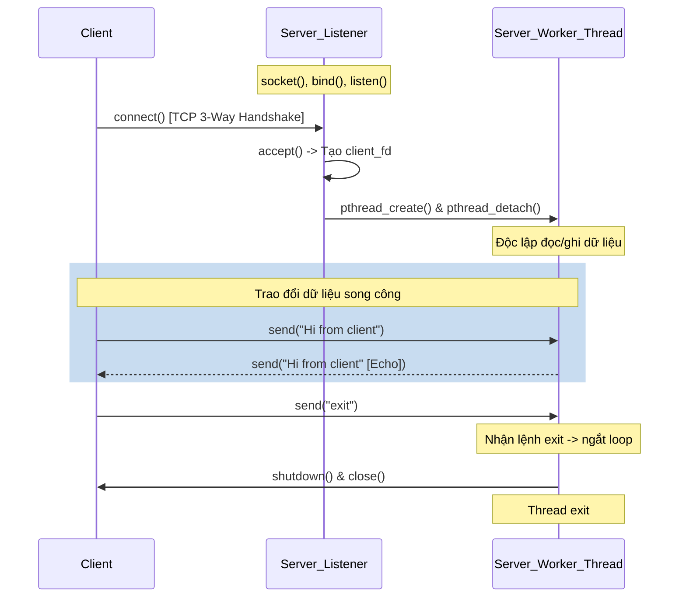

# HƯỚNG DẪN KỸ THUẬT VÀ ĐẶC TẢ CHI TIẾT PHÂN HỆ SOCKET PROGRAMMING (/socket)

Tài liệu này cung cấp tài liệu kỹ thuật, đặc tả thiết kế, phân tích mã nguồn chi tiết và kiểm thử của phân hệ **Socket Manager (`/socket`)** trong dự án **Linux System Manager (sysmgr)**. Đây là tài liệu tham chiếu dành cho lập trình viên để duy trì, mở rộng và kiểm thử hệ thống.

---

## BẢNG MỤC LỤC
1. [TỔNG QUAN PHÂN HỆ (MODULE OVERVIEW)](#1-tổng-quan-phân-hệ-module-overview)
2. [CÂY THƯ MỤC PHÂN HỆ (FILE TREE & INVENTORY)](#2-cây-thư-mục-phân-hệ-file-tree--inventory)
3. [MỐI LIÊN HỆ VỚI CÁC TÀI LIỆU LÝ THUYẾT NHÂN (REFERENCE PDFs)](#3-mối-liên-hệ-với-các-tài-liệu-lý-thuyết-nhân-reference-pdfs)
4. [PHÂN TÍCH THIẾT KẾ VÀ KIẾN TRÚC HỆ THỐNG (SYSTEM ARCHITECTURE)](#4-phân-tích-thiết-kế-và-kiến-trúc-hệ-thống-system-architecture)
5. [ĐẶC TẢ CHI TIẾT CÁC FILE NGUỒN C (SOURCE FILE SPECS)](#5-đặc-tả-chi-tiết-các-file-nguồn-c-source-file-specs)
6. [ĐẶC TẢ CHI TIẾT CÁC HÀM THÀNH VIÊN (FUNCTION SPECIFICATIONS)](#6-đặc-tả-chi-tiết-các-hàm-thành-viên-function-specifications)
7. [CÁC HÀM API SOCKET POSIX VÀ LUỒNG GỌI (POSIX SOCKET APIS)](#7-các-hàm-api-socket-posix-và-luồng-gọi-posix-socket-apis)
8. [CẤU TRÚC DỮ LIỆU ĐẶC THÙ (SOCKET DATA STRUCTURES)](#8-cấu-trúc-dữ-liệu-đặc-thù-socket-data-structures)
9. [KIẾN TRÚC TIẾN TRÌNH VÀ LUỒNG (PROCESS & THREAD ARCHITECTURE)](#9-kiến-trúc-tiến-trình-và-luồng-process--thread-architecture)
10. [THƯ VIỆN TIÊU CHUẨN SỬ DỤNG (STANDARD LIBRARIES)](#10-thư-viện-tiêu-chuẩn-sử-dụng-standard-libraries)
11. [AN NINH VÀ AN TOÀN TRUYỀN THÔNG (SECURITY & SAFETY)](#11-an-ninh-và-an-toàn-truyền-thông-security--safety)
12. [HIỆU NĂNG VÀ TỐI ƯU HÓA (PERFORMANCE & OPTIMIZATION)](#12-hiệu-năng-và-tối-ưu-hóa-performance--optimization)
13. [BẢN ĐỒ TRUY XUẤT YÊU CẦU BÀI TẬP (ASSIGNMENT TRACEABILITY)](#13-bản-đồ-truy-xuất-yêu-cầu-bài-tập-assignment-traceability)
14. [BẢN ĐỒ TRUY XUẤT TÀI LIỆU THAM KHẢO (REFERENCE TRACEABILITY)](#14-bản-đồ-truy-xuất-tài-liệu-tham-khảo-reference-traceability)
15. [KIỂM THỬ VÀ CHẨN ĐOÁN LỖI (TEST SUITE & DIAGNOSTICS)](#15-kiểm-thử-và-chẩn-đoán-lỗi-test-suite--diagnostics)

---

## 1. TỔNG QUAN PHÂN HỆ (MODULE OVERVIEW)
Phân hệ **Socket Manager (`/socket`)** cung cấp một bộ công cụ hoàn chỉnh để khởi tạo máy chủ TCP đơn kết nối (Single-connection TCP Server), máy chủ TCP đa kết nối đồng thời (Multi-client TCP Echo Server), chương trình chat khách (TCP Client), và phòng chat trực tiếp (Socket Chat). 

Mục tiêu giáo khoa của phân hệ này là trình bày cách lập trình mạng mức thấp sử dụng các API socket BSD tiêu chuẩn của POSIX kết hợp với lập trình đa luồng (Multi-threading) và khóa đồng bộ (Mutex) để xử lý các kết nối song song và giải quyết các bài toán về chia sẻ tài nguyên hiển thị dòng lệnh (Terminal Redraw).

---

## 2. CÂY THƯ MỤC PHÂN HỆ (FILE TREE & INVENTORY)
Danh sách toàn bộ các tệp nguồn liên quan trực tiếp đến phân hệ Socket Manager:

### A. Tệp tiêu đề và Thư viện triển khai (`modules/socket/` & `include/`)
1. **[include/socket_mgr.h](file:///home/cuonghayho/Documents/ThamKhaoPRJLapTrinhNhan/PRJ/include/socket_mgr.h)**:
   - *Vai trò:* Định nghĩa giao diện lập trình công khai (public API) của Socket Manager.
2. **[modules/socket/socket_mgr.c](file:///home/cuonghayho/Documents/ThamKhaoPRJLapTrinhNhan/PRJ/modules/socket/socket_mgr.c)**:
   - *Vai trò:* Triển khai menu TUI điều phối, thu thập tham số kết nối (IP, Port) và kích hoạt các cửa sổ terminal phụ trợ.
3. **[modules/socket/socket_server.c](file:///home/cuonghayho/Documents/ThamKhaoPRJLapTrinhNhan/PRJ/modules/socket/socket_server.c)**:
   - *Vai trò:* Triển khai máy chủ TCP đơn kết nối (Single-connection TCP Server) hỗ trợ chế độ tương tác thô (conio terminal mode) và đa luồng nhận dữ liệu.
4. **[modules/socket/socket_client.c](file:///home/cuonghayho/Documents/ThamKhaoPRJLapTrinhNhan/PRJ/modules/socket/socket_client.c)**:
   - *Vai trò:* Triển khai máy chủ khách TCP Client với cơ chế đọc/ghi bất đồng bộ dùng luồng phụ thu nhận dữ liệu.
5. **[modules/socket/socket_multi_server.c](file:///home/cuonghayho/Documents/ThamKhaoPRJLapTrinhNhan/PRJ/modules/socket/socket_multi_server.c)**:
   - *Vai trò:* Triển khai máy chủ TCP phản hồi đa kết nối (Multi-threaded TCP Echo Server) sử dụng luồng động để xử lý từng phiên kết nối của client.

### B. Wrappers chương trình chạy độc lập (`app/`)
6. **[app/socket_server_main.c](file:///home/cuonghayho/Documents/ThamKhaoPRJLapTrinhNhan/PRJ/app/socket_server_main.c)**:
   - *Vai trò:* Hàm `main` bao bọc khởi động máy chủ TCP đơn kết nối độc lập.
7. **[app/socket_client_main.c](file:///home/cuonghayho/Documents/ThamKhaoPRJLapTrinhNhan/PRJ/app/socket_client_main.c)**:
   - *Vai trò:* Hàm `main` bao bọc khởi động client TCP độc lập.
8. **[app/socket_multi_server_main.c](file:///home/cuonghayho/Documents/ThamKhaoPRJLapTrinhNhan/PRJ/app/socket_multi_server_main.c)**:
   - *Vai trò:* Hàm `main` bao bọc khởi động máy chủ phản hồi đa luồng độc lập.
9. **[app/socket_chat_main.c](file:///home/cuonghayho/Documents/ThamKhaoPRJLapTrinhNhan/PRJ/app/socket_chat_main.c)**:
   - *Vai trò:* Hàm `main` bao bọc khởi động phòng chat (chạy dưới dạng host hoặc client).

### C. Tệp kiểm thử tự động
10. **[tests/socket_test.c](file:///home/cuonghayho/Documents/ThamKhaoPRJLapTrinhNhan/PRJ/tests/socket_test.c)**:
    - *Vai trò:* Chương trình kiểm thử tự động xác thực toàn bộ các tính năng kết nối mạng.

---

## 3. MỐI LIÊN HỆ VỚI CÁC TÀI LIỆU LÝ THUYẾT NHÂN (REFERENCE PDFs)

Phân hệ Socket Manager áp dụng trực tiếp kiến thức từ ba tài liệu lý thuyết cốt lõi của môn học:

### A. Tài liệu `Phan 2. T2.L2-P5_Socket.pdf` (Lập trình Socket trong Linux)
* **Khái niệm áp dụng:** Vòng đời BSD Sockets API (tạo socket, bind địa chỉ, lắng nghe, chấp nhận kết nối, kết nối đến máy chủ, gửi nhận dữ liệu và giải phóng socket).
* **Cách dự án áp dụng:**
  - Áp dụng tuần tự các cuộc gọi chuẩn: **`socket()`** tạo FD ➔ **`setsockopt()`** cấu hình cổng ➔ **`bind()`** gán địa chỉ ➔ **`listen()`** lắng nghe hàng đợi ➔ **`accept()`** chấp nhận kết nối cho Server tại [socket_server.c](file:///home/cuonghayho/Documents/ThamKhaoPRJLapTrinhNhan/PRJ/modules/socket/socket_server.c#L137).
  - Sử dụng **`connect()`** cho Client kết nối tới địa chỉ IPv4 dịch bằng **`inet_pton()`** tại [socket_client.c](file:///home/cuonghayho/Documents/ThamKhaoPRJLapTrinhNhan/PRJ/modules/socket/socket_client.c#L145).
  - Sử dụng **`send()`** và **`recv()`** để truyền nhận các gói tin văn bản.

### B. Tài liệu `Phan 2. T2.L2-P3_Semaphore.pdf` (Đa luồng và Khóa đồng bộ)
* **Khái niệm áp dụng:** Lập trình đa luồng (Multi-threading) bằng thư viện POSIX threads (`pthread`) và cơ chế loại trừ tương hỗ bảo vệ tài nguyên dùng chung (`pthread_mutex_t`).
* **Cách dự án áp dụng:**
  - Sinh luồng độc lập bằng **`pthread_create()`** và cấu hình giải phóng tự động bằng **`pthread_detach()`** để quản lý song song nhiều phiên kết nối khách trong [socket_multi_server.c:163](file:///home/cuonghayho/Documents/ThamKhaoPRJLapTrinhNhan/PRJ/modules/socket/socket_multi_server.c#L163).
  - Sử dụng khóa tĩnh **`pthread_mutex_t input_mutex`** tại [socket_server.c:30](file:///home/cuonghayho/Documents/ThamKhaoPRJLapTrinhNhan/PRJ/modules/socket/socket_server.c#L30) và [socket_client.c:28](file:///home/cuonghayho/Documents/ThamKhaoPRJLapTrinhNhan/PRJ/modules/socket/socket_client.c#L28) để đồng bộ luồng nhận và luồng nhập bàn phím, tránh xung đột ghi đè dòng terminal (`\r\x1b[K`).

### C. Tài liệu `Phan 2. T2.L2-P2_Signal.pdf` (Xử lý tín hiệu)
* **Khái niệm áp dụng:** Cơ chế phát tín hiệu ngắt đường ống khi mất kết nối mạng.
* **Cách dự án áp dụng:**
  - Hệ thống tự động bắt mã lỗi `EPIPE` trả về từ cuộc gọi `send()` hoặc lỗi đóng socket từ `recv() == 0` để dọn dẹp sạch sẽ tài nguyên socket descriptor bằng hàm **`shutdown()`** và **`close()`**, ngăn ngừa sự cố sập tiến trình `sysmgr` do tín hiệu `SIGPIPE` mặc định của Linux.

---

## 4. PHÂN TÍCH THIẾT KẾ VÀ KIẾN TRÚC HỆ THỐNG (SYSTEM ARCHITECTURE)

### A. Sơ đồ tuần trình kết nối (Connection Flow Diagram)
Kiến trúc trao đổi dữ liệu TCP song công (Full-duplex TCP communication) được thiết kế như sau:



### B. Quản lý mô tả tệp và Vòng đời tài nguyên (File Descriptor & Resource Lifecycle)
1.  **Chống rò rỉ Socket (Socket Descriptor Leak Prevention):**
    - Mỗi socket tạo ra bởi `socket()` hay `accept()` đều được lưu vào các biến mô tả cục bộ hoặc phiên (`client_fd`).
    - Trước khi luồng kết nối kết thúc (kể cả do lỗi nhận `recv() <= 0` hay do lệnh `exit`), chương trình luôn thực thi quy trình đóng gói: Gọi `shutdown(fd, SHUT_RDWR)` để ngắt cả hai luồng đọc và ghi trên card mạng, sau đó thực thi `close(fd)` để giải phóng descriptor cho OS.
2.  **Quản lý bộ nhớ Luồng (Thread Memory Management):**
    - Khi tạo luồng phục vụ Client, chương trình sử dụng cấu trúc động `session_t` cấp phát qua `malloc()`. Con trỏ này được truyền làm đối số duy nhất của luồng. Ngay khi luồng con vào hàm chạy, nó thực hiện giải phóng (`free()`) vùng nhớ này sau khi đã sao chép cục bộ, tránh rò rỉ vùng nhớ Heap.
    - Cuộc gọi **`pthread_detach(thread_id)`** được gọi ngay sau `pthread_create()` để nhân Linux tự động thu hồi tài nguyên luồng con khi nó thoát mà không cần tiến trình cha phải gọi `pthread_join()`.

---

## 5. ĐẶC TẢ CHI TIẾT CÁC FILE NGUỒN C (SOURCE FILE SPECS)

### 5.1. File `socket_mgr.c`
* **Đường dẫn:** [modules/socket/socket_mgr.c](file:///home/cuonghayho/Documents/ThamKhaoPRJLapTrinhNhan/PRJ/modules/socket/socket_mgr.c)
* **Vai trò:** Cung cấp menu TUI/CLI cho phép người dùng lựa chọn chế độ chạy socket.
* **Hành vi gọi:** Khi người dùng chọn một mục (ví dụ: Run TCP Server), hàm sẽ yêu cầu người dùng nhập tham số cổng Port (mặc định 8080) và gọi hàm **`terminal_open`** để khởi chạy một cửa sổ terminal GUI mới chạy lệnh `./sysmgr socket server <port>`. Cơ chế này giúp giữ cho cửa sổ CLI/TUI chính của `sysmgr` luôn hoạt động độc lập và không bị chặn bởi các vòng lặp lắng nghe socket.

### 5.2. File `socket_server.c`
* **Đường dẫn:** [modules/socket/socket_server.c](file:///home/cuonghayho/Documents/ThamKhaoPRJLapTrinhNhan/PRJ/modules/socket/socket_server.c)
* **Vai trò:** Triển khai một máy chủ TCP đơn kết nối. Nó sử dụng một luồng phụ (`receiver_thread`) chỉ để chạy hàm chặn `recv()` thu nhận tin nhắn từ Client. Luồng chính (Main thread) chạy vòng lặp đọc dữ liệu nhập từ bàn phím bằng `read(0, &c, 1)`. Thiết kế này cho phép người dùng vừa gõ chữ gửi đi vừa nhận được tin nhắn hiển thị tức thời trên cùng một cửa sổ terminal.

### 5.3. File `socket_client.c`
* **Đường dẫn:** [modules/socket/socket_client.c](file:///home/cuonghayho/Documents/ThamKhaoPRJLapTrinhNhan/PRJ/modules/socket/socket_client.c)
* **Vai trò:** Triển khai máy trạm TCP Client kết nối đến máy chủ. Cấu trúc thiết kế hoàn toàn tương đồng với `socket_server.c` (sử dụng luồng phụ để nhận tin nhắn và luồng chính nhận dữ liệu nhập từ bàn phím).

### 5.4. File `socket_multi_server.c`
* **Đường dẫn:** [modules/socket/socket_multi_server.c](file:///home/cuonghayho/Documents/ThamKhaoPRJLapTrinhNhan/PRJ/modules/socket/socket_multi_server.c)
* **Vai trò:** Triển khai máy chủ Echo đa kết nối. Sử dụng vòng lặp `while(1)` chặn tại hàm `accept()`. Mỗi khi có một Client kết nối thành công, nó sinh ra một luồng chạy hàm `session_worker` độc lập. Máy chủ này có thể hỗ trợ tối đa hàng trăm kết nối Client đồng thời mà không bị nghẽn luồng.

---

## 6. ĐẶC TẢ CHI TIẾT CÁC HÀM THÀNH VIÊN (FUNCTION SPECIFICATIONS)

### 6.1. Hàm `socket_mgr_server_start`
* **Nguyên mẫu (Prototype):** `void socket_mgr_server_start(int port);`
* **Tệp nguồn / Tiêu đề:** [socket_server.c](file:///home/cuonghayho/Documents/ThamKhaoPRJLapTrinhNhan/PRJ/modules/socket/socket_server.c#L127) / [socket_mgr.h](file:///home/cuonghayho/Documents/ThamKhaoPRJLapTrinhNhan/PRJ/include/socket_mgr.h#L15)
* **Mục đích:** Khởi chạy máy chủ TCP đơn kết nối tại cổng chỉ định.
* **Chi tiết mã nguồn & Luồng thực thi:**
  - Khởi tạo socket bằng cuộc gọi `socket(AF_INET, SOCK_STREAM, 0)`.
  - Cấu hình cho phép tái sử dụng cổng bằng `setsockopt(..., SO_REUSEADDR)`.
  - Thiết lập cấu trúc địa chỉ `struct sockaddr_in` gán port và IP lắng nghe là `INADDR_ANY`.
  - Gọi cuộc gọi hệ thống `bind()` gán địa chỉ cấu hình cho socket descriptor.
  - Gọi `listen(server_fd, 1)` chuyển socket sang trạng thái lắng nghe với hàng đợi chờ kết nối tối đa là 1.
  - Gọi hàm chặn **`accept()`** chờ Client kết nối. Khi Client kết nối, lấy được thông tin địa chỉ và `client_fd`.
  - In IP của Client bằng `inet_ntop`.
  - Cấp phát động bộ nhớ cho con trỏ socket của client, gọi **`pthread_create`** sinh ra luồng phụ `receiver_thread` để thu nhận gói tin. Giải phóng luồng này khỏi cha bằng `pthread_detach`.
  - **Xử lý nhập liệu tương tác:**
    - Nếu terminal hỗ trợ tương tác (`isatty(0)`), chuyển terminal sang chế độ thô (raw mode) thông qua hàm `set_conio_terminal_mode()` để đọc từng ký tự một bằng `read(0, &c, 1)`.
    - Khi người dùng gõ phím, in ký tự ra màn hình, nối vào vùng đệm `input_buffer`. Nếu người dùng nhấn `ENTER` hoặc `RETURN`, kết thúc chuỗi bằng `\0`, gọi `send()` gửi gói tin sang Client, in dòng chữ `You > <nội dung>` và reset chỉ số vùng đệm.
    - Nếu người dùng nhập chuỗi `"exit"`, thoát vòng lặp, đóng toàn bộ kết nối, khôi phục cấu hình terminal và kết thúc.
    - Nếu chạy không tương tác (như trong các bộ test tự động), đọc dữ liệu bằng `fgets()` dòng lệnh, gửi dữ liệu đi và kiểm tra điều kiện thoát tương tự.

### 6.2. Hàm `receiver_thread` (Trong `socket_server.c` và `socket_client.c`)
* **Nguyên mẫu:** `static void* receiver_thread(void* arg);`
* **Mục đích:** Luồng con thu nhận tin nhắn bất đồng bộ từ socket đối tác mà không làm nghẽn luồng nhập dữ liệu của người dùng.
* **Chi tiết luồng xử lý:**
  - Giải phóng con trỏ đối số `arg` để tránh rò rỉ vùng nhớ Heap.
  - Chạy vòng lặp vô hạn `while(1)`.
  - Gọi cuộc gọi hệ thống chặn **`recv(fd, buffer, sizeof(buffer)-1, 0)`**.
  - **Xử lý kết quả trả về từ `recv()`:**
    - Nếu trả về `0`: Đối tác đã đóng kết nối (Graceful shutdown). In thông báo ngắt kết nối, thoát vòng lặp.
    - Nếu trả về `< 0`: Gặp lỗi truyền thông. Ghi nhận log lỗi dạng ERROR, in thông báo lỗi và thoát vòng lặp.
    - Nếu trả về `> 0`: Nhận được dữ liệu thành công. Thêm ký tự kết thúc chuỗi `\0` vào vị trí nhận được. Ghi log số byte và nội dung tin nhắn.
    - **Hiển thị an toàn bằng Mutex:** Gọi khóa **`pthread_mutex_lock(&input_mutex)`**. Thực thi chuỗi lệnh điều khiển terminal của ANSI: `\r\x1b[K` để dịch con trỏ về đầu dòng và xóa sạch dòng hiện thời (xóa dòng nhắc `You > ` đang gõ dở). Sau đó in nội dung tin nhắn đối tác gửi tới dạng `Client > <tin_nhắn>`, tiếp tục in lại nội dung người dùng đang gõ dở dang từ `input_buffer`. Cuối cùng giải phóng khóa bằng **`pthread_mutex_unlock(&input_mutex)`**.
  - Trước khi luồng kết thúc, gọi `shutdown(fd, SHUT_RDWR)`, `close(fd)` để thu hồi descriptor, khôi phục terminal chế độ thường và tự sát tiến trình bằng `_exit(0)`.

### 6.3. Hàm `socket_mgr_multi_server_start`
* **Nguyên mẫu:** `void socket_mgr_multi_server_start(int port);`
* **Tệp nguồn / Tiêu đề:** [socket_multi_server.c](file:///home/cuonghayho/Documents/ThamKhaoPRJLapTrinhNhan/PRJ/modules/socket/socket_multi_server.c#L87) / [socket_mgr.h](file:///home/cuonghayho/Documents/ThamKhaoPRJLapTrinhNhan/PRJ/include/socket_mgr.h#L16)
* **Mục đích:** Khởi chạy máy chủ TCP phản hồi đa kết nối (Multi-threaded TCP Echo Server).
* **Chi tiết luồng xử lý:**
  - Khởi tạo socket, bind địa chỉ cổng và lắng nghe hàng đợi tối đa `10` kết nối chờ.
  - Chạy vòng lặp vô hạn chấp nhận kết nối: `while(1)`.
  - Gọi cuộc gọi chặn `accept()`. Khi có Client kết nối, in thông báo kết nối thành công kèm IP và Port của Client.
  - Cấp phát vùng nhớ động cấu trúc `session_t` lưu thông tin cổng và `client_fd`.
  - Gọi `pthread_create` sinh luồng chạy hàm `session_worker` và truyền con trỏ `session` làm tham số.
  - Gọi `pthread_detach` để nhân Linux tự thu hồi tài nguyên luồng khi chạy xong.

### 6.4. Hàm `session_worker` & `session_handle_protocol`
* **Nguyên mẫu:** `static void* session_worker(void* arg);` và `static void session_handle_protocol(int client_fd);`
* **Tệp nguồn:** [socket_multi_server.c](file:///home/cuonghayho/Documents/ThamKhaoPRJLapTrinhNhan/PRJ/modules/socket/socket_multi_server.c#L59)
* **Mục đích:** Hàm thực thi của luồng con xử lý dữ liệu của từng Client cụ thể.
* **Chi tiết luồng xử lý:**
  - Trích xuất thông tin IP và Port của Client từ đối số `session`. In thông báo luồng xử lý mới đã được khởi tạo.
  - Gọi hàm xử lý giao thức **`session_handle_protocol(client_fd)`**.
  - **Vòng lặp Echo (Hàm protocol):**
    - Chạy vòng lặp gọi `recv(client_fd, buffer, ...)` để lấy tin nhắn.
    - Nếu nhận được dữ liệu (số byte `> 0`), phản hồi ngược lại toàn bộ nội dung nhận được cho Client bằng hàm: **`send(client_fd, buffer, valread, 0)`**.
    - Vòng lặp kết thúc khi Client ngắt kết nối (`recv() == 0`) hoặc gặp lỗi mạng.
  - **Dọn dẹp:** Thực thi `shutdown(client_fd, SHUT_RDWR)`, đóng socket bằng `close(client_fd)`, giải phóng vùng nhớ cấu trúc `session` bằng `free()`, in thông báo luồng con đã hoàn tất nhiệm vụ và thoát bằng `pthread_exit(NULL)`.

---

## 7. CẤU TRÚC DỮ LIỆU ĐẶC THÙ (SOCKET DATA STRUCTURES)

### 7.1. Cấu trúc `sockaddr_in` (Địa chỉ IPv4 tiêu chuẩn)
Định nghĩa trong thư viện `<netinet/in.h>` dùng để thiết lập cổng và IP kết nối:
```c
struct sockaddr_in {
    short sin_family;         /* Họ địa chỉ (luôn là AF_INET đối với IPv4) */
    unsigned short sin_port;  /* Cổng kết nối (chuyển đổi bằng htons) */
    struct in_addr sin_addr;  /* Cấu trúc lưu địa chỉ IP (s_addr) */
    char sin_zero[8];         /* Đệm trống căn chỉnh bộ nhớ */
};
```

### 7.2. Cấu trúc `addrinfo`
Sử dụng cho các chức năng phân giải tên miền (DNS resolution) thông qua hàm `getaddrinfo()`:
```c
struct addrinfo {
    int              ai_flags;     /* Lựa chọn phân giải (AI_PASSIVE...) */
    int              ai_family;    /* AF_INET hoặc AF_INET6 */
    int              ai_socktype;  /* SOCK_STREAM hoặc SOCK_DGRAM */
    int              ai_protocol;  /* IPPROTO_TCP hoặc IPPROTO_UDP */
    socklen_t        ai_addrlen;   /* Chiều dài địa chỉ cấu trúc */
    struct sockaddr *ai_addr;      /* Con trỏ tới sockaddr thực tế */
    char            *ai_canonname; /* Tên miền phân giải chính thức */
    struct addrinfo *ai_next;      /* Con trỏ phần tử tiếp theo trong DSLK */
};
```

---

## 8. CÁC HÀM API SOCKET POSIX VÀ LUỒNG GỌI (POSIX SOCKET APIS)

Phân hệ sử dụng các API socket BSD tiêu chuẩn để giao tiếp mạng:

| Hàm hệ thống | Nguyên mẫu | Mục đích sử dụng | Vị trí trong mã nguồn |
| :--- | :--- | :--- | :--- |
| **`socket`** | `int socket(int domain, int type, int protocol);` | Khởi tạo một Endpoint truyền thông, trả về một file descriptor mới. | [socket_server.c:137](file:///home/cuonghayho/Documents/ThamKhaoPRJLapTrinhNhan/PRJ/modules/socket/socket_server.c#L137) |
| **`bind`** | `int bind(int sockfd, const struct sockaddr *addr, socklen_t addrlen);` | Gán địa chỉ IP và cổng cụ thể cho socket descriptor vừa tạo. | [socket_server.c:155](file:///home/cuonghayho/Documents/ThamKhaoPRJLapTrinhNhan/PRJ/modules/socket/socket_server.c#L155) |
| **`listen`** | `int listen(int sockfd, int backlog);` | Đánh dấu socket bắt đầu lắng nghe các kết nối gửi tới từ các Client. | [socket_server.c:162](file:///home/cuonghayho/Documents/ThamKhaoPRJLapTrinhNhan/PRJ/modules/socket/socket_server.c#L162) |
| **`accept`** | `int accept(int sockfd, struct sockaddr *addr, socklen_t *addrlen);` | Chấp nhận kết nối từ hàng đợi lắng nghe, tạo một socket truyền thông mới. | [socket_server.c:173](file:///home/cuonghayho/Documents/ThamKhaoPRJLapTrinhNhan/PRJ/modules/socket/socket_server.c#L173) |
| **`connect`** | `int connect(int sockfd, const struct sockaddr *addr, socklen_t addrlen);` | Gửi yêu cầu kết nối từ Client đến địa chỉ máy chủ đang lắng nghe. | [socket_client.c:152](file:///home/cuonghayho/Documents/ThamKhaoPRJLapTrinhNhan/PRJ/modules/socket/socket_client.c#L152) |
| **`send`** | `ssize_t send(int sockfd, const void *buf, size_t len, int flags);` | Truyền gói tin qua socket. Trả về số byte thực gửi, hoặc -1 nếu lỗi. | [socket_client.c:200](file:///home/cuonghayho/Documents/ThamKhaoPRJLapTrinhNhan/PRJ/modules/socket/socket_client.c#L200) |
| **`recv`** | `ssize_t recv(int sockfd, void *buf, size_t len, int flags);` | Thu nhận tin nhắn từ socket. Block luồng cho tới khi có dữ liệu. | [socket_server.c:56](file:///home/cuonghayho/Documents/ThamKhaoPRJLapTrinhNhan/PRJ/modules/socket/socket_server.c#L56) |
| **`setsockopt`** | `int setsockopt(int s, int level, int optname, const void *optval, socklen_t optlen);` | Cấu hình tham số mức thấp cho socket (như SO_REUSEADDR). | [socket_server.c:144](file:///home/cuonghayho/Documents/ThamKhaoPRJLapTrinhNhan/PRJ/modules/socket/socket_server.c#L144) |
| **`shutdown`** | `int shutdown(int sockfd, int how);` | Ngắt một phần hoặc toàn bộ luồng truyền thông trên socket ngay lập tức. | [socket_server.c:116](file:///home/cuonghayho/Documents/ThamKhaoPRJLapTrinhNhan/PRJ/modules/socket/socket_server.c#L116) |
| **`inet_pton`** | `int inet_pton(int af, const char *src, void *dst);` | Chuyển đổi chuỗi IP dạng văn bản (ASCII) sang dạng nhị phân nhồi vào struct. | [socket_client.c:145](file:///home/cuonghayho/Documents/ThamKhaoPRJLapTrinhNhan/PRJ/modules/socket/socket_client.c#L145) |
| **`inet_ntop`** | `const char* inet_ntop(int af, const void *src, char *dst, socklen_t size);` | Dịch địa chỉ IP dạng nhị phân sang dạng văn bản dễ đọc. | [socket_multi_server.c:64](file:///home/cuonghayho/Documents/ThamKhaoPRJLapTrinhNhan/PRJ/modules/socket/socket_multi_server.c#L64) |

---

## 9. KIẾN TRÚC TIẾN TRÌNH VÀ LUỒNG (PROCESS & THREAD ARCHITECTURE)

Dự án áp dụng mô hình phân tách vai trò (Process vs Thread boundaries) để đảm bảo tính sẵn sàng và ổn định:

### A. Vì sao sử dụng Tiến trình độc lập (Processes)?
- Mỗi cửa sổ chat (Chat Host, Chat Client) khi người dùng chọn mở từ menu chính được kích hoạt qua hàm `terminal_open()`.
- Hàm này thực thi cuộc gọi `fork()` kết hợp với `execvp()` để mở các ứng dụng Terminal GUI độc lập (như `gnome-terminal`, `xterm`) chạy các chương trình con `./sysmgr socket client` hoặc `./sysmgr socket server`.
- Thiết kế này mang lại sự cô lập hoàn hảo: Nếu một phiên chat bị treo hoặc sập do lỗi mạng, nó không bao giờ làm gián đoạn hay sập tiến trình điều hành chính `sysmgr`.

### B. Vì sao sử dụng Đa luồng (Threads)?
- Trong nội bộ từng tiến trình chat đơn lẻ hoặc máy chủ đa kết nối, việc tạo thêm tiến trình qua `fork()` để xử lý song song sẽ tạo ra độ trễ lớn và gây lãng phí bộ nhớ RAM do hệ điều hành phải copy toàn bộ không gian địa chỉ tiến trình.
- Do đó, chương trình chuyển sang lập trình đa luồng thông qua **`pthread_create()`**. Các luồng con chia sẻ chung không gian bộ nhớ địa chỉ với tiến trình mẹ, cho phép dễ dàng truy cập và dùng chung vùng đệm bàn phím (`input_buffer`) và khóa loại trừ tương hỗ `input_mutex`.

---

## 10. THƯ VIỆN TIÊU CHUẨN SỬ DỤNG (STANDARD LIBRARIES)
Các thư viện C tiêu chuẩn được triệu gọi trong mã nguồn:

*   **`<sys/socket.h>` & `<netinet/in.h>`**: Định nghĩa cấu trúc địa chỉ socket, các hằng số giao thức IPv4 (`AF_INET`), chế độ truyền luồng (`SOCK_STREAM`) và các API socket.
*   **`<arpa/inet.h>`**: Cung cấp các hàm chuyển đổi biểu diễn IP `inet_pton`, `inet_ntop` và sắp xếp byte thứ tự mạng `htons`, `ntohs`.
*   **`<pthread.h>`**: Cung cấp các cơ chế đa luồng `pthread_create`, `pthread_detach`, `pthread_exit` và các hàm khóa mutex.
*   **`<termios.h>`**: Định nghĩa cấu trúc `struct termios` dùng để thao tác tắt chế độ echo bàn phím và đệm dòng ICANON của thiết bị Standard Input đầu cuối.

---

## 11. AN NINH VÀ AN TOÀN TRUYỀN THÔNG (SECURITY & SAFETY)

1.  **Chống tràn bộ đệm (Buffer Overflow Prevention):**
    - Các hàm `recv` luôn được giới hạn chặt chẽ số byte đọc tối đa bằng kích thước vùng đệm trừ đi 1 ký tự: `sizeof(buffer) - 1`. Sau đó gán ký tự Null `\0` vào vị trí byte đọc được thực tế. Cách lập trình này loại bỏ nguy cơ các chuỗi tin nhắn độc hại có độ dài lớn làm tràn ngăn xếp tiến trình.
2.  **Khóa đồng bộ ghi Terminal (Thread-Safe Display):**
    - Do hai luồng chạy song song (Luồng chính đọc phím in ra màn hình và Luồng con nhận tin in ra màn hình), nếu không đồng bộ sẽ xảy ra tình trạng tin nhắn nhận được chèn ngang vào giữa dòng chữ người dùng đang gõ.
    - Dự án giải quyết triệt để bằng khóa `pthread_mutex_t input_mutex` bọc quanh toàn bộ các thao tác in stdout. Khi có tin nhắn tới, luồng con giữ khóa, xóa dòng hiện tại, in tin nhắn mới, in lại nội dung đang gõ dở dang rồi mới nhả khóa. Điều này mang lại trải nghiệm hiển thị chuyên nghiệp và an toàn.
3.  **Tái sử dụng cổng (Port Reuse Safety):**
    - Khi máy chủ TCP tắt đột ngột, cổng mạng sẽ rơi vào trạng thái chờ `TIME_WAIT` của nhân Linux trong khoảng 1-2 phút, khiến ta không thể khởi động lại máy chủ ngay lập tức tại cổng cũ (báo lỗi `Address already in use`).
    - Việc cấu hình Socket Option **`SO_REUSEADDR`** giải quyết hoàn toàn vấn đề này, cho phép máy chủ khởi động lại tức thời tại cổng cũ mà vẫn đảm bảo an toàn truyền thông.

---

## 12. HIỆU NĂNG VÀ TỐI ƯU HÓA (PERFORMANCE & OPTIMIZATION)

*   **Detached Threads:**
    - Việc thiết lập `pthread_detach()` đảm bảo khi một kết nối khách kết thúc, toàn bộ tài nguyên ngăn xếp và trạng thái luồng con được nhân Linux dọn dẹp sạch sẽ tức thời mà không cần cha chờ thu hoạch, tránh được lỗi rò rỉ tài nguyên luồng (Thread leak) khi máy chủ chạy liên tục hàng tháng.
*   **Full-duplex I/O Concurrency:**
    - Sử dụng mô hình đa luồng bất đồng bộ thay vì các hàm I/O chặn đơn luồng truyền thống mang lại thông lượng mạng tối đa, các luồng đọc và ghi hoạt động độc lập không bị chặn chéo lẫn nhau.

---

## 13. BẢN ĐỒ TRUY XUẤT YÊU CẦU BÀI TẬP (ASSIGNMENT TRACEABILITY)

| Mã yêu cầu bài tập | Nội dung yêu cầu | Trạng thái | Minh chứng trong mã nguồn |
| :--- | :--- | :--- | :--- |
| **REQ-SOCK-01** | Thiết lập máy chủ TCP Server đơn kết nối, xử lý truyền nhận dữ liệu. | **Hoàn thành** | Hàm `socket_mgr_server_start` tại [socket_server.c:127](file:///home/cuonghayho/Documents/ThamKhaoPRJLapTrinhNhan/PRJ/modules/socket/socket_server.c#L127). |
| **REQ-SOCK-02** | Thiết lập máy trạm TCP Client kết nối đến server qua IP và Port. | **Hoàn thành** | Hàm `socket_mgr_client_start` tại [socket_client.c:125](file:///home/cuonghayho/Documents/ThamKhaoPRJLapTrinhNhan/PRJ/modules/socket/socket_client.c#L125). |
| **REQ-SOCK-03** | Khởi tạo máy chủ đa kết nối (Multi-client TCP Echo Server) xử lý đồng thời nhiều kết nối khách. | **Hoàn thành** | Hàm `socket_mgr_multi_server_start` tại [socket_multi_server.c:87](file:///home/cuonghayho/Documents/ThamKhaoPRJLapTrinhNhan/PRJ/modules/socket/socket_multi_server.c#L87). |
| **REQ-SOCK-04** | Thiết lập phòng chat tương tác trực tiếp (Socket Chat) hỗ trợ chế độ tương tác terminal không chặn. | **Hoàn thành** | Ứng dụng độc lập [socket_chat_main.c](file:///home/cuonghayho/Documents/ThamKhaoPRJLapTrinhNhan/PRJ/app/socket_chat_main.c) kết hợp chế độ raw mode trong `socket_server.c` / `socket_client.c`. |

---

## 14. BẢN ĐỒ TRUY XUẤT TÀI LIỆU THAM KHẢO (REFERENCE TRACEABILITY)

*   **`Phan 2. T2.L2-P5_Socket.pdf` ➔ Chương 2 (Quy trình bắt tay TCP Server):**
    - Ứng dụng các API tạo lập socket tuần tự: `socket()`, `setsockopt()`, `bind()`, `listen()`, `accept()`. Triển khai cụ thể trong [socket_server.c:137-179](file:///home/cuonghayho/Documents/ThamKhaoPRJLapTrinhNhan/PRJ/modules/socket/socket_server.c#L137) và [socket_multi_server.c:95-137](file:///home/cuonghayho/Documents/ThamKhaoPRJLapTrinhNhan/PRJ/modules/socket/socket_multi_server.c#L95).
*   **`Phan 2. T2.L2-P3_Semaphore.pdf` ➔ Chương 2 (Đa luồng đồng thời):**
    - Sử dụng hàm tạo luồng động `pthread_create()` cùng cấu hình `pthread_detach()` để thực thi các phiên worker song song. Triển khai trong [socket_multi_server.c:163-171](file:///home/cuonghayho/Documents/ThamKhaoPRJLapTrinhNhan/PRJ/modules/socket/socket_multi_server.c#L163).
*   **`Phan 2. T2.L2-P2_Signal.pdf` ➔ Chương 2 (Bảo vệ tín hiệu hệ thống):**
    - Thu hồi kết nối khách thông qua bắt giá trị trả về bằng `0` của hàm `recv` để tránh lỗi đứt gãy đường ống `EPIPE`. Triển khai trong [socket_server.c:56-68](file:///home/cuonghayho/Documents/ThamKhaoPRJLapTrinhNhan/PRJ/modules/socket/socket_server.c#L56).

---

## 15. KIỂM THỬ VÀ CHẨN ĐOÁN LỖI (TEST SUITE & DIAGNOSTICS)
Để xác nhận tính đúng đắn của phân hệ lập trình mạng, dự án cung cấp bộ kiểm thử tích hợp tự động tại [tests/socket_test.c](file:///home/cuonghayho/Documents/ThamKhaoPRJLapTrinhNhan/PRJ/tests/socket_test.c).

### A. Hướng dẫn chạy kiểm thử:
Biên dịch từ thư mục gốc của dự án:
```bash
make test-socket
```
Chạy kiểm thử:
```bash
./tests/socket_test
```

### B. Các kịch bản kiểm thử tự động được thực hiện:
1.  **Hai luồng Chat tương tác (Section 1):**
    - Sử dụng cuộc gọi `pipe()` tạo lập 4 đường ống chuyển hướng stdin/stdout của Server và Client.
    - Gọi `fork()` tạo tiến trình Server (`socket_mgr_server_start`) và tiến trình Client (`socket_mgr_client_start`) kết nối song song tại cổng kiểm thử `9099`.
    - Tiến trình cha đóng vai trò kiểm thử dùng `write()` đẩy dữ liệu vào đường ống nhập liệu, mô phỏng việc gõ chữ gửi tin nhắn.
    - Sử dụng hàm **`select()`** cấu hình thời gian chờ (timeout) để đọc không chặn từ đầu ra của server và client.
    - Xác thực:
      - Kiểm tra banner hiển thị chào mừng của Server và Client.
      - Gửi tin nhắn từ Server ➔ Xác thực Client nhận đúng nội dung.
      - Gửi tin nhắn từ Client ➔ Xác thực Server nhận đúng nội dung.
      - Gửi lệnh `"exit"` từ Client ➔ Xác thực Server in thông báo `"Client disconnected."` và cả hai tiến trình kết thúc sạch sẽ.
2.  **Quét đa kết nối đồng thời (Section 2):**
    - Gọi `fork()` khởi chạy máy chủ đa luồng `socket_mgr_multi_server_start` tại cổng `9099`.
    - Tiếp tục `fork()` sinh ra **`3` tiến trình Client khách** chạy song song.
    - Mỗi Client khách thực hiện kết nối đồng thời, gửi 2 gói tin thử nghiệm, nhận lại gói tin phản hồi (Echo) từ máy chủ thông qua `recv()`, xác thực nội dung phản hồi chính xác bằng hàm `assert()`.
    - Các Client ngắt kết nối an toàn.
    - Tiến trình cha gửi tín hiệu `SIGTERM` tắt máy chủ đa luồng và gọi `waitpid()` thu hồi tài nguyên sạch sẽ.
