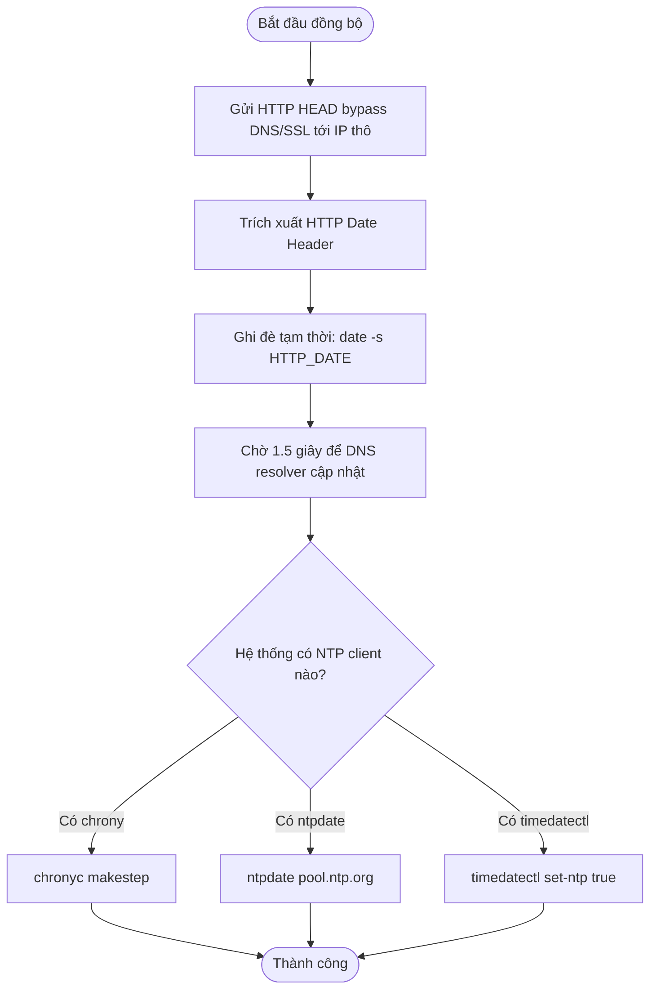

# HƯỚNG DẪN KỸ THUẬT VÀ ĐẶC TẢ CHI TIẾT PHÂN HỆ TIME MANAGER (/time)

Tài liệu này cung cấp tài liệu kỹ thuật, đặc tả thiết kế, phân tích mã nguồn chi tiết và kiểm thử của phân hệ **Time Manager (`/time`)** trong dự án **Linux System Manager (sysmgr)**. Đây là tài liệu tham chiếu dành cho lập trình viên để duy trì, mở rộng và kiểm thử hệ thống.

---

## BẢNG MỤC LỤC
1. [TỔNG QUAN PHÂN HỆ (MODULE OVERVIEW)](#1-tổng-quan-phân-hệ-module-overview)
2. [CÂY THƯ MỤC PHÂN HỆ (FILE TREE & INVENTORY)](#2-cây-thư-mục-phân-hệ-file-tree--inventory)
3. [MỐI LIÊN HỆ VỚI CÁC TÀI LIỆU LÝ THUYẾT NHÂN (REFERENCE PDFs)](#3-mối-liên-hệ-với-các-tài-liệu-lý-thuyết-nhân-reference-pdfs)
4. [PHÂN TÍCH THIẾT KẾ VÀ KIẾN TRÚC HỆ THỐNG (SYSTEM ARCHITECTURE)](#4-phân-tích-thiết-kế-và-kiến-trúc-hệ-thống-system-architecture)
5. [PHÂN TÍCH CHI TIẾT CÁC KỊCH BẢN BASH (SHELL SCRIPT ANALYSIS)](#5-phân-tích-chi-tiết-các-kịch-bản-bash-shell-script-analysis)
6. [ĐẶC TẢ CHI TIẾT CÁC HÀM TRONG C (C FUNCTION SPECIFICATIONS)](#6-đặc-tả-chi-tiết-các-hàm-trong-c-c-function-specifications)
7. [CÁC HÀM API THỜI GIAN POSIX (POSIX TIME APIS)](#7-các-hàm-api-thời-gian-posix-posix-time-apis)
8. [CẤU TRÚC DỮ LIỆU ĐẶC THÙ (TIME DATA STRUCTURES)](#8-cấu-trúc-dữ-liệu-đặc-thù-time-data-structures)
9. [CÁC LỆNH LINUX PHỤ TRỢ (LINUX COMMAND SPECS)](#9-các-lệnh-linux-phụ-trợ-linux-command-specs)
10. [TÍCH HỢP GIỮA C VÀ SHELL SCRIPT (C & SHELL INTEGRATION)](#10-tích-hợp-giữa-c-và-shell-script-c--shell-integration)
11. [THƯ VIỆN TIÊU CHUẨN SỬ DỤNG (STANDARD LIBRARIES)](#11-thư-viện-tiêu-chuẩn-sử-dụng-standard-libraries)
12. [AN NINH VÀ PHÂN QUYỀN HỆ THỐNG (SECURITY & SAFETY)](#12-an-ninh-và-phân-qu quyền-hệ-thống-security--safety)
13. [HIỆU NĂNG VÀ TỐI ƯU HÓA (PERFORMANCE & OPTIMIZATION)](#13-hiệu-năng-và-tối-ưu-hóa-performance--optimization)
14. [BẢN ĐỒ TRUY XUẤT YÊU CẦU BÀI TẬP (ASSIGNMENT TRACEABILITY)](#14-bản-đồ-truy-xuất-yêu-cầu-bài-tập-assignment-traceability)
15. [BẢN ĐỒ TRUY XUẤT TÀI LIỆU THAM KHẢO (REFERENCE TRACEABILITY)](#15-bản-đồ-truy-xuất-tài-liệu-tham-khảo-reference-traceability)
16. [KIỂM THỬ VÀ CHẨN ĐOÁN LỖI (TEST SUITE & DIAGNOSTICS)](#16-kiểm-thử-và-chẩn-đoán-lỗi-test-suite--diagnostics)

---

## 1. TỔNG QUAN PHÂN HỆ (MODULE OVERVIEW)
Phân hệ **Time Manager (`/time`)** cung cấp các công cụ cấu hình thời gian hệ thống (System clock), múi giờ (Time zone) và các cơ chế đồng bộ hóa thời gian tự động qua Internet. 

Để giải quyết một bài toán phổ biến trong thực tế khi đồng hồ của hệ điều hành bị lệch lùi sâu về quá khứ (ví dụ năm 2004 do hết pin CMOS), gây sập cơ chế xác thực bảo mật DNSSEC và ngăn cản việc thiết lập kết nối SSL/TLS với các máy chủ NTP chuẩn, phân hệ này tích hợp kịch bản đồng bộ tự phục hồi **Auto-recovery Time Synchronization**. Hệ thống sẽ tự truy vấn thời gian gần đúng thô qua IP (HTTP Date header) mà không cần phân giải DNSSEC/SSL, ghi đè tạm thời đồng hồ hệ thống, và sau đó kích hoạt các dịch vụ NTP chuẩn (`chronyd`/`ntpdate`) để đồng bộ thời gian chính xác cao.

---

## 2. CÂY THƯ MỤC PHÂN HỆ (FILE TREE & INVENTORY)
Toàn bộ các tệp tin cấu thành phân hệ Time Manager bao gồm:

1. **[modules/shell/shell_mgr.c](file:///home/cuonghayho/Documents/ThamKhaoPRJLapTrinhNhan/PRJ/modules/shell/shell_mgr.c)**:
   - *Vai trò:* Triển khai hàm C wrapper `shell_mgr_time_execute` để phân tích dòng lệnh từ REPL và thực thi các cuộc gọi shell/POSIX tương ứng.
2. **[shell/time.sh](file:///home/cuonghayho/Documents/ThamKhaoPRJLapTrinhNhan/PRJ/shell/time.sh)**:
   - *Vai trò:* Kịch bản shell cung cấp menu lựa chọn xem thời gian, múi giờ, cấu hình thủ công (Apply vs Learning mode) và kích hoạt đồng bộ tự động.
3. **[shell/autosync.sh](file:///home/cuonghayho/Documents/ThamKhaoPRJLapTrinhNhan/PRJ/shell/autosync.sh)**:
   - *Vai trò:* Kịch bản core đồng bộ thời gian tự phục hồi vượt qua DNSSEC/NTP chicken-and-egg problem qua giao thức HTTP Date header.
4. **[cli/repl.c](file:///home/cuonghayho/Documents/ThamKhaoPRJLapTrinhNhan/PRJ/cli/repl.c)**:
   - *Vai trò:* Định tuyến lệnh nhập vào từ CLI REPL (ví dụ: `time show`, `time sync`) tới hàm C `shell_mgr_time_execute`.
5. **[tests/shell_test.c](file:///home/cuonghayho/Documents/ThamKhaoPRJLapTrinhNhan/PRJ/tests/shell_test.c)**:
   - *Vai trò:* Xác thực quyền truy cập và sự tồn tại của tệp kịch bản `shell/time.sh`.

---

## 3. MỐI LIÊN HỆ VỚI CÁC TÀI LIỆU LÝ THUYẾT NHÂN (REFERENCE PDFs)

Phân hệ Time Manager áp dụng kiến thức hệ thống từ tài liệu tham chiếu:

### A. Tài liệu `Phan 2. T2.L2-P8_Device.pdf` (Quản lý Thiết bị và Bộ hẹn giờ)
* **Khái niệm áp dụng:** Khái niệm bộ đếm thời gian phần cứng (Real Time Clock - RTC), cấu trúc xung nhịp hệ thống (System clock) và ngắt thời gian định kỳ của Kernel Linux.
* **Cách dự án áp dụng:**
  - Ứng dụng gián tiếp nguyên lý ghi nhận thời gian phần cứng qua các cuộc gọi đồng bộ đồng hồ hệ thống của Kernel (System Clock) với đồng hồ phần cứng RTC (thông qua lệnh `hwclock` hoặc các cuộc gọi hệ thống mức nhân tương ứng trong daemon định thời `chronyd`).

---

## 4. PHÂN TÍCH THIẾT KẾ VÀ KIẾN TRÚC HỆ THỐNG (SYSTEM ARCHITECTURE)

### A. Quy trình Đồng bộ tự phục hồi (Auto-recovery Time Sync Workflow)
Cơ chế tự phục hồi giải quyết bài toán DNSSEC/NTP được mô tả qua sơ đồ dưới đây:



### B. Vòng đời tài nguyên và Bộ nhớ (Resource & FD Lifecycle)
- **Đọc Timezone:** Khi hệ thống không hỗ trợ `timedatectl`, chương trình mở file đặc biệt `/etc/timezone` bằng `open()`, đọc nội dung vào bộ đệm tĩnh của ngăn xếp (`stack buffer`) và gọi `close()` giải phóng descriptor tức thời.
- **Tiến trình con gọi Script:** Mỗi khi chạy lệnh đồng bộ, ứng dụng C `fork()` ra con nạp kịch bản `shell/autosync.sh`. Tiến trình con tự giải phóng toàn bộ tài nguyên khi kết thúc qua hàm `exit()`.

---

## 5. PHÂN TÍCH CHI TIẾT CÁC KỊCH BẢN BASH (SHELL SCRIPT ANALYSIS)

### 5.1. Kịch bản `shell/time.sh`
*   **Mục đích:** Cung cấp giao diện menu tương tác dòng lệnh thô cấu hình thời gian.
*   **Các hàm thành viên:**
    - `showCurrentTime()`: In ra thời gian hiện tại của hệ điều hành thông qua lệnh `date`.
    - `showTimeZone()`: Nếu tìm thấy lệnh `timedatectl`, thực thi `timedatectl | grep "Time zone"`; ngược lại, đọc file `/etc/timezone` hoặc chạy `date +%Z`.
    - `validate_datetime()`: Nhận chuỗi ngày giờ `$1` và so khớp với biểu thức chính quy: `^[0-9]{4}-[0-9]{2}-[0-9]{2}\ [0-9]{2}:[0-9]{2}:[0-9]{2}$`. Trả về `0` nếu đúng định dạng YYYY-MM-DD HH:MM:SS, ngược lại trả về `1`.
    - `setTimeManually()`: Cung cấp menu con:
      - *1. Learning Mode:* Nhập chuỗi ngày giờ, kiểm tra định dạng và hiển thị câu lệnh tương đương (`date -s`) và POSIX API tương ứng (`clock_settime()`) mà không thay đổi cấu hình thực tế.
      - *2. Apply System Time:* Nhập ngày giờ, xác thực định dạng và thực thi lệnh phân quyền quản trị: `sudo date -s "$datetime"`.
    - **Tích hợp:** Lựa chọn `4` trong menu chính thực thi kịch bản `shell/autosync.sh` nằm cùng thư mục thông qua cú pháp: `"$(dirname "$0")/autosync.sh"`.

### 5.2. Kịch bản `shell/autosync.sh`
*   **Mục đích:** Đồng bộ thời gian tự động vượt rào cản DNSSEC.
*   **Cơ chế hoạt động:**
    - Gửi yêu cầu HTTP HEAD tới cổng 80 của mảng máy chủ IP thô (`1.1.1.1`, `8.8.8.8`) bằng lệnh `curl`:
      ```bash
      header_date=$(curl -I -s --connect-timeout 3 "http://$ip" | grep -i "^date:" | cut -d' ' -f2- | tr -d '\r')
      ```
    - Trích xuất chuỗi Date, áp dụng `sudo date -s "$HTTP_DATE"` để đặt đồng hồ về mốc gần đúng.
    - Gọi các lệnh NTP: `chronyc makestep`, `ntpdate pool.ntp.org` để đồng bộ chính xác.
    - Kiểm tra năm hiện tại: `date +%Y`. Nếu năm `>= 2026`, coi như đồng bộ thành công và trả về mã thoát `0`.

---

## 6. ĐẶC TẢ CHI TIẾT CÁC HÀM TRONG C (C FUNCTION SPECIFICATIONS)

### 6.1. Hàm `shell_mgr_time_execute`
*   **Nguyên mẫu (Prototype):** `void shell_mgr_time_execute(int argc, char** argv);`
*   **Tệp nguồn / Tiêu đề:** [shell_mgr.c](file:///home/cuonghayho/Documents/ThamKhaoPRJLapTrinhNhan/PRJ/modules/shell/shell_mgr.c#L503) / [shell_mgr.h](file:///home/cuonghayho/Documents/ThamKhaoPRJLapTrinhNhan/PRJ/include/shell_mgr.h#L34)
*   **Mục đích:** Hàm điều phối thực thi các lệnh quản lý thời gian từ CLI và menu chính.
*   **Luồng xử lý chi tiết:**
    - **Trường hợp có tham số phụ (`argc > 1`):**
      - Nếu `argv[1]` là `show`: Gọi `shell_mgr_execute("date")`.
      - Nếu `argv[1]` là `zone`: Gọi `timedatectl | grep 'Time zone'` nếu có lệnh `/usr/bin/timedatectl`, ngược lại đọc `/etc/timezone`.
      - Nếu `argv[1]` là `set`:
        - Kiểm tra xem tham số ngày giờ `argv[2]` đã được truyền chưa. Nếu chưa, gọi `linenoise` (nếu interactive) hoặc `fgets` để người dùng nhập chuỗi.
        - Xây dựng câu lệnh `sudo date -s "<datetime>"` và thực thi bằng `shell_mgr_execute`.
      - Nếu `argv[1]` là `sync`: Gọi thực thi kịch bản `shell/autosync.sh`.
    - **Trường hợp chạy tương tác (TUI Menu):**
      - Gọi vẽ menu TUI lựa chọn qua `ui_select_menu`.
      - Định tuyến các sự kiện chọn tương ứng tới các cuộc gọi shell tương đương.

---

## 7. CÁC HÀM API THỜI GIAN POSIX (POSIX TIME APIS)

Phân hệ sử dụng các API thời gian tiêu chuẩn để quản lý đồng hồ hệ thống:

| Tên API POSIX | Nguyên mẫu | Mục đích sử dụng | Vị trí tham chiếu |
| :--- | :--- | :--- | :--- |
| **`time`** | `time_t time(time_t *tloc);` | Lấy thời gian epoch hiện tại (số giây từ 01/01/1970). | Thư viện C chuẩn |
| **`localtime`** | `struct tm *localtime(const time_t *timep);` | Đổi định dạng epoch sang cấu trúc thời gian cục bộ tm. | [daemon_demo.c:216](file:///home/cuonghayho/Documents/ThamKhaoPRJLapTrinhNhan/PRJ/modules/process/demo/daemon_demo.c#L216) |
| **`strftime`** | `size_t strftime(char *s, size_t max, const char *format, const struct tm *tm);` | Định dạng chuỗi ngày giờ theo định dạng chỉ định. | [daemon_demo.c:218](file:///home/cuonghayho/Documents/ThamKhaoPRJLapTrinhNhan/PRJ/modules/process/demo/daemon_demo.c#L218) |
| **`sleep`** | `unsigned int sleep(unsigned int seconds);` | Tạm dừng luồng tiến trình trong khoảng thời gian giây. | [autosync.sh:48](file:///home/cuonghayho/Documents/ThamKhaoPRJLapTrinhNhan/PRJ/shell/autosync.sh#L48) |
| **`clock_settime`** | `int clock_settime(clockid_t clk_id, const struct timespec *tp);` | Thiết lập thời gian của đồng hồ chỉ định (CLOCK_REALTIME). | [time.sh:53](file:///home/cuonghayho/Documents/ThamKhaoPRJLapTrinhNhan/PRJ/shell/time.sh#L53) (Demo lý thuyết) |

---

## 8. CẤU TRÚC DỮ LIỆU ĐẶC THÙ (TIME DATA STRUCTURES)

### 8.1. Cấu trúc `struct tm` (Broken-down Time)
Định nghĩa trong `<time.h>` để phân rã thời gian:
```c
struct tm {
    int tm_sec;    /* Giây [0, 60] */
    int tm_min;    /* Phút [0, 59] */
    int tm_hour;   /* Giờ [0, 23] */
    int tm_mday;   /* Ngày trong tháng [1, 31] */
    int tm_mon;    /* Tháng tính từ tháng 0 [0, 11] */
    int tm_year;   /* Năm tính từ 1900 */
    int tm_wday;   /* Ngày trong tuần tính từ Chủ nhật [0, 6] */
    int tm_yday;   /* Ngày trong năm tính từ 01/01 [0, 365] */
    int tm_isdst;  /* Cờ thời gian tiết kiệm ánh sáng ngày (DST) */
};
```

### 8.2. Cấu trúc `struct timespec`
Định nghĩa trong `<time.h>`, được sử dụng cho cuộc gọi hệ thống `clock_settime()` và `clock_gettime()` để mô tả thời gian có độ chính xác đến nano giây:
```c
struct timespec {
    time_t tv_sec;  /* Số giây */
    long   tv_nsec; /* Số nano giây [0, 999999999] */
};
```

---

## 9. CÁC LỆNH LINUX PHỤ TRỢ (LINUX COMMAND SPECS)

Phân hệ gọi các câu lệnh quản trị thời gian hệ điều hành:
*   **`date`**: Định dạng `date -s "YYYY-MM-DD HH:MM:SS"`. Thay đổi đồng hồ hệ thống. Yêu cầu quyền root.
*   **`timedatectl`**: Quản lý múi giờ và cấu hình đồng bộ NTP của systemd.
*   **`chronyc`**: Định dạng `chronyc makestep`. Yêu cầu daemon `chronyd` thực thi điều chỉnh bước thời gian lớn.
*   **`ntpdate`**: Đồng bộ thời gian trực tiếp với máy chủ NTP.

---

## 10. TÍCH HỢP GIỮA C VÀ SHELL SCRIPT (C & SHELL INTEGRATION)
- Lệnh từ REPL `time sync` hoặc click menu TUI gửi yêu cầu tới hàm `shell_mgr_time_execute`.
- Hàm C gọi `shell_mgr_execute("/bin/bash shell/autosync.sh")`.
- Cơ chế `fork()`, `execl()` nạp kịch bản `autosync.sh`.
- Kịch bản chạy xong, trả về mã thoát exit code. Hàm C bắt và ghi log lỗi tương ứng.

---

## 11. AN NINH VÀ PHÂN QUYỀN HỆ THỐNG (SECURITY & SAFETY)

1.  **Đặc quyền thay đổi đồng hồ (Privilege Requirements):**
    - Hệ thống yêu cầu năng lực hệ thống đặc quyền **`CAP_SYS_TIME`** hoặc quyền **`root`** (thông qua lệnh `sudo`) để thay đổi đồng hồ hệ thống. Nếu không chạy dưới quyền quản trị, lệnh `sudo date -s` sẽ bị từ chối và trả về lỗi phân quyền, bảo vệ an toàn cho hệ thống.
2.  **Chế độ Học tập an toàn (Learning Mode):**
    - Trong kịch bản `time.sh`, lựa chọn *Learning Mode* cho phép lập trình viên học cách sử dụng các lệnh và API thiết lập thời gian mà không cần chạy dưới quyền root, tránh các rủi ro thay đổi giờ hệ thống ngoài ý muốn gây lỗi các tiến trình khác.

---

## 12. HIỆU NĂNG VÀ TỐI ƯU HÓA (PERFORMANCE & OPTIMIZATION)

*   **Tối ưu hóa gọi `clock_gettime`:**
    - Các chương trình C trong hệ thống đọc giờ thông qua API thư viện chuẩn. Trong Linux, các API này được tối ưu qua cơ chế **vDSO (virtual Dynamic Shared Object)**, giúp đọc thời gian trực tiếp từ vùng nhớ chia sẻ của Kernel mà không cần thực thi một lệnh ngắt cuộc gọi hệ thống (Context switch) thực sự, tối ưu hóa tốc độ.
*   **Giới hạn timeout của Curl:**
    - Cấu hình `--connect-timeout 3` trong `autosync.sh` đảm bảo nếu máy chủ IP mục tiêu bị chết, kịch bản sẽ nhảy sang IP tiếp theo sau 3 giây thay vì bị treo hàng phút.

---

## 13. BẢN ĐỒ TRUY XUẤT YÊU CẦU BÀI TẬP (ASSIGNMENT TRACEABILITY)

| Mã yêu cầu bài tập | Nội dung yêu cầu | Trạng thái | Minh chứng trong kịch bản Shell & C |
| :--- | :--- | :--- | :--- |
| **REQ-TIME-01** | Hiển thị thời gian và múi giờ hiện tại của hệ thống Linux. | **Hoàn thành** | Lệnh `date` và đọc file `/etc/timezone` trong `shell/time.sh`. |
| **REQ-TIME-02** | Hỗ trợ thiết lập thời gian thủ công định dạng YYYY-MM-DD HH:MM:SS. | **Hoàn thành** | Hàm `validate_datetime` và `setTimeManually` trong [time.sh:34](file:///home/cuonghayho/Documents/ThamKhaoPRJLapTrinhNhan/PRJ/shell/time.sh#L34). |
| **REQ-TIME-03** | Khởi tạo cơ chế tự phục hồi đồng bộ giờ Internet vượt qua DNSSEC/NTP blocking. | **Hoàn thành** | Kịch bản [shell/autosync.sh](file:///home/cuonghayho/Documents/ThamKhaoPRJLapTrinhNhan/PRJ/shell/autosync.sh) truy vấn HTTP Date qua IP thô. |

---

## 14. BẢN ĐỒ TRUY XUẤT TÀI LIỆU THAM KHẢO (REFERENCE TRACEABILITY)

*   **`Phan 2. T2.L2-P8_Device.pdf` ➔ Chương 3 (RTC & System Clock ticks):**
    - Ứng dụng gián tiếp nguyên lý cập nhật System Clock từ RTC khi cấu hình thời gian. Dự án tích hợp các công cụ `date -s` để cập nhật đồng hồ nhân Linux.

---

## 15. KIỂM THỬ VÀ CHẨN ĐOÁN LỖI (TEST SUITE & DIAGNOSTICS)
Phân hệ Time Manager được tích hợp kiểm thử sự tồn tại của tệp tin kịch bản tự động trong [tests/shell_test.c](file:///home/cuonghayho/Documents/ThamKhaoPRJLapTrinhNhan/PRJ/tests/shell_test.c).

*   **Quy trình chạy Test:**
    - Chạy lệnh `make test-shell` và thực thi `./tests/shell_test`.
    - Bài test xác nhận file kịch bản `shell/time.sh` tồn tại và có đầy đủ quyền đọc.
*   **Chẩn đoán lỗi thủ công:**
    - Bạn có thể chạy kịch bản đồng bộ tự phục hồi trực tiếp từ terminal để kiểm tra log:
      ```bash
      bash shell/autosync.sh
      ```
      Mọi sự kiện cập nhật và lỗi phân quyền đều được ghi nhận trực tiếp vào tệp nhật ký `logs/system.log`.