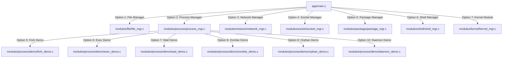

# Build System Architecture

This document describes the compilation and linkage architecture of the **Linux System Manager** project, detailing the refactoring of the Process Manager module from a temporary single-translation-unit strategy to a clean, standard multi-object build strategy.

---

## 1. Overview
Historically, the Process Manager resolved internal lifecycle dependencies by directly including demonstration C files inline at the bottom of its main source file. To support clean code boundaries, separate compilation, and standard symbol linkage, this system has been refactored to compile each demonstration module independently and link them during the archiving stage.

---

## 2. Compilation Strategy Comparison

### Old Compilation Strategy (Single Translation Unit)
In the old strategy, [modules/process/process_mgr.c](file:///home/cuonghayho/Documents/ThamKhaoPRJLapTrinhNhan/PRJ/project/lap-trinh-nhan-linux-23/modules/process/process_mgr.c) directly included the `.c` files of all demonstrations. The parent Makefile compiled only a single object `process_mgr.o`, which inlined all the implementation code.

```text
  fork_demo.c --+
  exec_demo.c --+
  wait_demo.c --+ (#include)
  zombie_demo.c -+----> process_mgr.c ---> [Compiles] ---> process_mgr.o
  orphan_demo.c -+
  daemon_demo.c -+
```

* **Pros**: Simple compilation with single file command; avoided header and symbol linkage management.
* **Cons**: Violated modularity boundaries; led to redundant build instructions locally; forced full module recompilation on any small change to a demonstration; caused duplicate symbol compiler concerns if the demo files were ever referenced in other files.

### New Compilation Strategy (Multi-Object Linkage)
In the new strategy, all direct `#include "demo/*.c"` lines are removed. Every C file is treated as an independent translation unit and compiled into its own object file. The objects are packaged into the static library `libmodules.a` or linked explicitly at the target stage.

```text
  process_mgr.c -------> [Compiles] -------> process_mgr.o --+
  fork_demo.c ---------> [Compiles] -------> fork_demo.o ----+
  exec_demo.c ---------> [Compiles] -------> exec_demo.o ----+
  wait_demo.c ---------> [Compiles] -------> wait_demo.o ----+ (Archived / Linked)
  zombie_demo.c -------> [Compiles] -------> zombie_demo.o --+----> libmodules.a / process_test
  orphan_demo.c -------> [Compiles] -------> orphan_demo.o --+
  daemon_demo.c -------> [Compiles] -------> daemon_demo.o --+
```

* **Pros**: Preserves file boundaries; speeds up compile times using incremental builds; allows independent testing; complies with C linkage standards.
* **Cons**: Requires explicit linkage configuration in Makefiles.

---

## 3. Makefile Configurations

### Parent Makefile (`modules/Makefile`)
The static library archive `libmodules.a` now lists every individual object file in its object list:
```makefile
OBJS = file/file_mgr.o \
       process/process_mgr.o \
       process/demo/fork_demo.o \
       process/demo/exec_demo.o \
       process/demo/wait_demo.o \
       process/demo/zombie_demo.o \
       process/demo/orphan_demo.o \
       process/demo/daemon_demo.o \
       ...
```

### Root Makefile (`Makefile`)
The diagnostic process test target explicitly links each individual process object to build `process_test`:
```makefile
test-process: modules-lib
	gcc -Wall -Wextra -g -Iinclude -pthread tests/process_test.c \
		modules/process/process_mgr.o \
		modules/process/demo/fork_demo.o \
		modules/process/demo/exec_demo.o \
		modules/process/demo/wait_demo.o \
		modules/process/demo/zombie_demo.o \
		modules/process/demo/orphan_demo.o \
		modules/process/demo/daemon_demo.o \
		app/logger.c -o tests/process_test
```

### Application Linkage
The main executable `sysmgr` is linked using:
```makefile
LDFLAGS = -L../modules -lmodules
```
Because `libmodules.a` contains all the independently compiled demo objects, `sysmgr` automatically obtains all dependencies at link time without modifications to `app/Makefile`.

---

## 4. Module Integration Diagram

The following diagram illustrates how the core application dispatches menu requests to the integrated modules and their underlying sub-demonstrations:



---

## 5. Project Release Status (Version v0.8.0)

The project has achieved clean scope integration.
*   **Logger**: Centrally records application-wide states using low-level POSIX I/O.
*   **File Manager**: Integrated system file loop operations.
*   **Process Manager**: Features 100% operational TUI linkages, with native signal initialization and signal restoration.
*   **Shell Manager**: Safe program/script execution, environment management, cron task explanations, task scheduler database, and time configuration displays.
*   **Kernel Module**: Integrated `/proc/sysmgr` user space integration interface.
```
