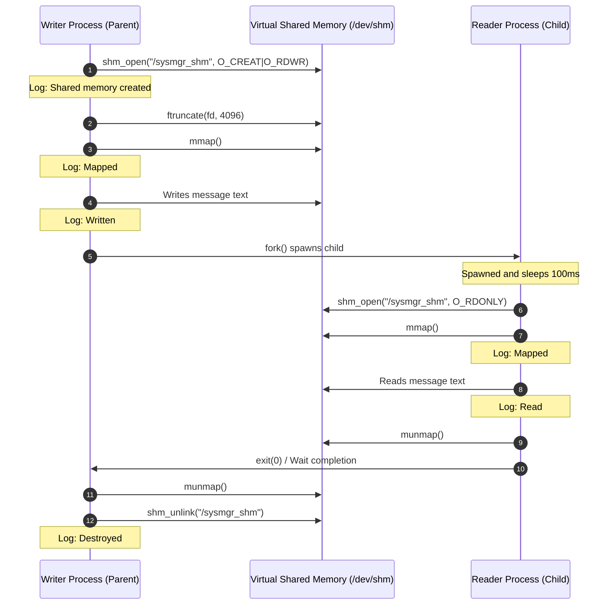
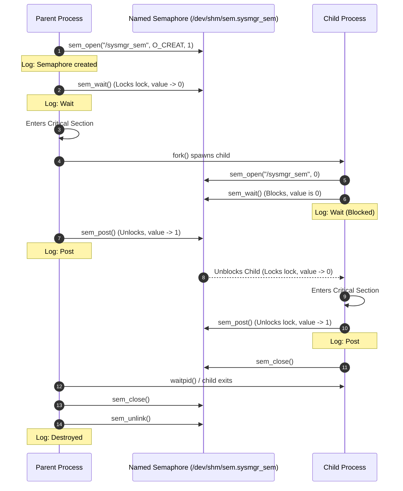
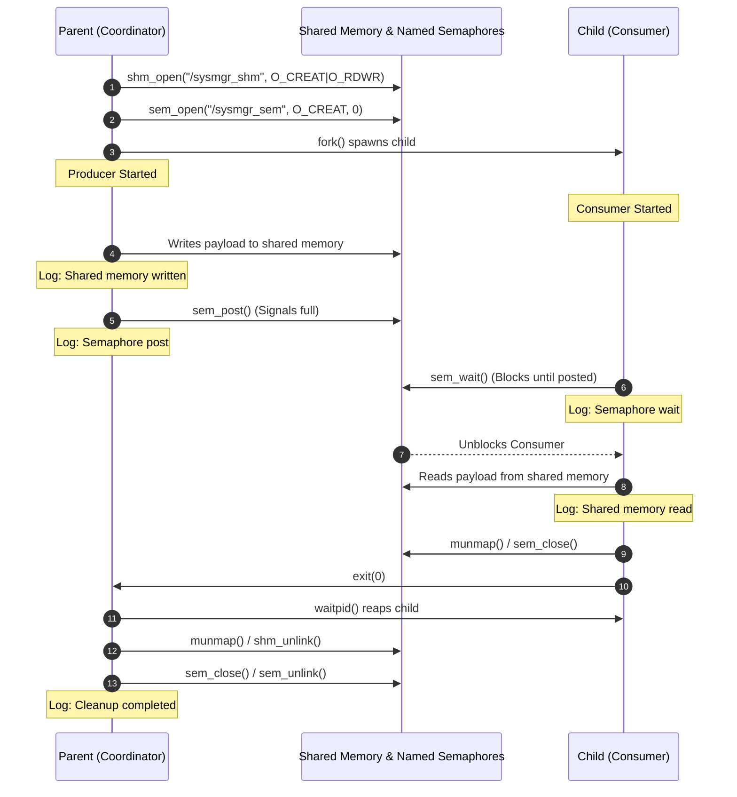

# POSIX Shared Memory IPC Developer Guide

This document describes POSIX Shared Memory, memory mapping using `mmap()`, execution flows, and compares shared memory with pipe-based communication.

---

## 1. POSIX Shared Memory API Overview

POSIX shared memory provides a mechanism for sharing a region of memory among independent processes. Unlike legacy System V shared memory, POSIX shared memory utilizes files and file descriptors in the virtual file system (typically mapped under `/dev/shm`).

### Main Functions

*   **`shm_open()`**: Creates or opens a POSIX shared memory object.
    ```c
    int fd = shm_open(const char *name, int oflag, mode_t mode);
    ```
    *   `name`: Starts with a forward slash (e.g., `/sysmgr_shm`).
    *   `oflag`: Combination of `O_CREAT` (create if doesn't exist), `O_RDWR` (read-write), etc.
    *   `mode`: Permissions (e.g., `0666`).
*   **`ftruncate()`**: Sets the size of the shared memory object in bytes.
    ```c
    int ftruncate(int fd, off_t length);
    ```
*   **`shm_unlink()`**: Removes the shared memory object name. Once all processes unmap the region, the memory is released.
    ```c
    int shm_unlink(const char *name);
    ```

---

## 2. Memory Mapping (`mmap` & `munmap`)

Once a shared memory object descriptor is opened and sized, processes map it into their virtual address space.

*   **`mmap()`**: Maps the shared memory file descriptor into the process's virtual memory space.
    ```c
    void *ptr = mmap(NULL, size_t length, int prot, int flags, int fd, off_t offset);
    ```
    *   `prot`: Memory protections, e.g., `PROT_READ | PROT_WRITE`.
    *   `flags`: Mapping flags. Must be `MAP_SHARED` for shared memory IPC.
    *   `fd`: File descriptor returned by `shm_open()`.
*   **`munmap()`**: Deletes the mapping for the specified address range.
    ```c
    int munmap(void *addr, size_t length);
    ```

---

## 3. Execution Flow Diagram

The sequence below illustrates a coordinate transaction between a **Writer** process and a **Reader** process:



---

## 4. Shared Memory vs. Pipes

| Metric | POSIX Shared Memory | Pipes (Named / Anonymous) |
| :--- | :--- | :--- |
| **Data Transfer Mechanism** | Direct memory access (no kernel buffer copy). | Kernel circular buffer (data is copied from user space to kernel, then back). |
| **Performance** | Extremely high bandwidth, low latency. | Slower, overhead of read/write system calls. |
| **Synchronization** | Manual synchronization required (e.g., semaphores or mutexes). | Implicitly synchronized via blocking I/O (blocking read/write). |
| **Lifecycle** | Persists in the system until unlinked (`shm_unlink()`) or reboot. | Destroyed when all file descriptors are closed (pipe/FIFO closed). |
| **Usage Pattern** | Best for large payloads or high-frequency memory reads/writes. | Best for simple streaming, commands piping, or sequential streams. |

---

## 5. POSIX Named Semaphores and Synchronization

To access shared resources safely without race conditions, processes use synchronization primitives. POSIX Named Semaphores are system-wide counters stored as files under `/dev/shm` (prefixed with `sem.`).

### Key Named Semaphore APIs

*   **`sem_open()`**: Creates or opens a named semaphore.
    ```c
    sem_t *sem = sem_open(const char *name, int oflag, mode_t mode, unsigned int value);
    ```
    *   `value`: Initial counter value (typically `1` for mutual exclusion).
*   **`sem_wait()`**: Decrements (locks) the semaphore counter. If the value is `0`, the calling process blocks until it becomes greater than `0`.
*   **`sem_post()`**: Increments (unlocks) the semaphore counter, waking up any blocked processes.
*   **`sem_close()`**: Closes the semaphore descriptor for the calling process.
*   **`sem_unlink()`**: Destroys the named semaphore object from the system.

### Race Conditions and Critical Sections

A **critical section** is a code block that accesses shared resources. If multiple processes execute this block simultaneously without synchronization, a **race condition** occurs—where the final output depends on process scheduling order. 

Named Semaphores act as a binary lock (value = 1) to guarantee **Mutual Exclusion (Mutex)**, ensuring only one process can enter the critical section at any given time.

### Semaphore Coordination Flow Diagram



---

## 6. Producer-Consumer Architecture and Synchronization

In a complete IPC synchronization scenario, a **Producer** process generates data and a **Consumer** process reads it. Because they operate asynchronously in separate address spaces, they must use a combination of **Shared Memory** (for data transfer) and **Named Semaphores** (for synchronization control).

### Race Condition Prevention
Without synchronization, the Consumer might attempt to read the shared memory before the Producer has written to it, or while the Producer is mid-write, leading to corrupted or missing data (race conditions). 

By using a named semaphore initialized to `0` (e.g. `/sysmgr_sem` full signal):
1. The **Consumer** blocks on `sem_wait()`.
2. The **Producer** safely writes the complete message into the shared memory.
3. The **Producer** calls `sem_post()`, incrementing the semaphore to `1`.
4. The **Consumer** is unblocked, guaranteeing it only reads fully written data.

### Producer-Consumer Flow Diagram



---

## 7. Comparative Analysis: Pipes vs Shared Memory vs Sockets

| Metric | Pipes (FIFO / Anonymous) | POSIX Shared Memory | Sockets (POSIX TCP/UDP) |
| :--- | :--- | :--- | :--- |
| **Data Transfer Mechanism** | Kernel circular buffer. Copies data from user space to kernel, then kernel to user space. | Direct memory mapping into process address space. Zero kernel buffer copies. | Network protocol stack (IP, TCP/UDP packets). Overhead of packet wrappers. |
| **Throughput & Speed** | Moderate. Limited by kernel buffer size and read/write system calls. | Extremely High. Limited only by memory bus speed. | Low to Moderate. Limited by network stack overhead. |
| **Synchronization** | Implicit (blocking read/write system calls). | Explicit manual synchronization required (semaphores, mutexes). | Implicit (blocking socket I/O calls). |
| **Scope** | Related processes (anonymous) or local filesystem processes (FIFO). | Local processes on the same host machine. | Network-wide. Supports communication across different hosts. |
| **Usage Suitability** | Stream-based data pipeline (e.g. `cat file | grep`). | Large datasets, high-frequency low-latency updates (e.g. frame buffer). | Distributed services, network clients/servers, API endpoints. |
