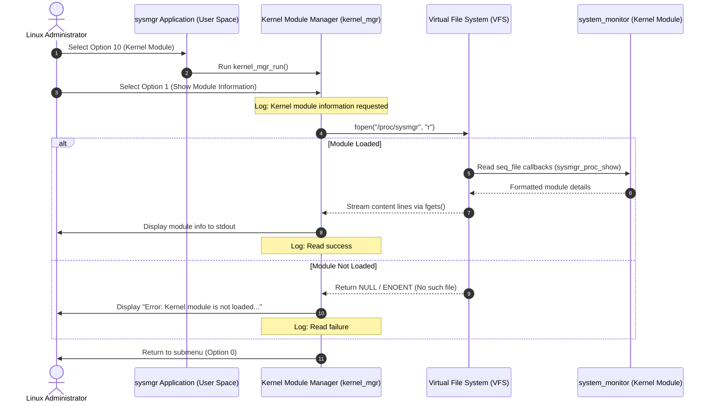

# Linux Kernel Module Development and Lifecycle Guide

This document describes the lifecycle, APIs, compilation, loading, and verification processes of a Linux Kernel Module (LKM).

---

## 1. Kernel Module Lifecycle

A loadable kernel module (LKM) undergoes several state transitions managed by the Linux kernel:

```
    [Source Code: system_monitor.c]
                  | (make)
                  v
       [Object Binary LKM: .ko]
                  |
                  v (insmod / module_init)
             [LKM loaded] ---> Executes initialization logic & printk()
                  |
                  v (Running in kernel space)
          [Kernel execution]
                  |
                  v (rmmod / module_exit)
            [LKM unloaded] ---> Executes cleanup logic, releases resources & printk()
```

1.  **Compilation**: C code is compiled against target kernel headers using Kbuild to produce a `.ko` (kernel object) file.
2.  **Loading**: The `insmod` tool loads the module into kernel space, triggering the entry function registered via `module_init()`.
3.  **Active**: The module runs with ring 0 privileges inside kernel space.
4.  **Unloading**: The `rmmod` tool unloads the module, triggering the cleanup function registered via `module_exit()`.
5.  **Cleaned**: The module memory and symbols are removed from the running kernel.

---

## 2. Essential Kernel APIs and Macros

Unlike user-space programs that use `main()` and link with glibc, kernel modules rely on direct kernel sub-systems and macros:

### `module_init()`
*   **Purpose**: Designates the entry function executed when the module is inserted.
*   **Prototype**:
    ```c
    static int __init my_init_function(void);
    module_init(my_init_function);
    ```
*   **Notes**: The `__init` macro tells the kernel that the function is only used during initialization, freeing its memory after execution.

### `module_exit()`
*   **Purpose**: Designates the cleanup function executed when the module is removed.
*   **Prototype**:
    ```c
    static void __exit my_exit_function(void);
    module_exit(my_exit_function);
    ```
*   **Notes**: The `__exit` macro tells the kernel that this code can be omitted if the kernel does not support module unloading.

### `printk()`
*   **Purpose**: Kernel-space logging (writes to the kernel circular buffer).
*   **Usage**:
    ```c
    printk(KERN_INFO "system_monitor: LKM loaded successfully.\n");
    ```
*   **Notes**: Standard library functions (like `printf`) are unavailable in kernel space because LKMs do not link with glibc. Log levels (like `KERN_INFO`, `KERN_WARNING`, `KERN_ERR`) control verbosity and routing.

---

## 3. Metadata Specification

Every LKM declares licensing and descriptors, which can be viewed via `modinfo`:

*   **`MODULE_LICENSE()`**: Defines module license terms (e.g., `MODULE_LICENSE("GPL")`). Essential to avoid tainting the running kernel.
*   **`MODULE_AUTHOR()`**: Mnemonic string identifying developer ownership.
*   **`MODULE_DESCRIPTION()`**: Brief description explaining module purpose.
*   **`MODULE_VERSION()`**: SemVer release version of the module.

---

## 4. Build Process and Makefile

Kernel modules compile using the kernel's Kbuild system. The top-level [kernel/Makefile](file:///kernel/Makefile) delegates commands to [kernel/system_monitor/Makefile](file:///kernel/system_monitor/Makefile) which leverages kernel header directories:

```makefile
KDIR = /lib/modules/$(shell uname -r)/build

build:
	make -C $(KDIR) M=$(shell pwd) modules

clean:
	make -C $(KDIR) M=$(shell pwd) clean
```

*   **`-C $(KDIR)`**: Temporarily switches working directory to the kernel headers build directory.
*   **`M=$(shell pwd)`**: Passes the directory containing module source files back to Kbuild to perform compilation.

---

## 5. Loading, Unloading, and Verification

### Load Module
Loads the `.ko` binary into kernel space:
```bash
sudo insmod kernel/system_monitor/system_monitor.ko
```

### Check Loaded Status
Verify that the kernel has registered the module:
```bash
lsmod | grep system_monitor
```

### View Kernel Messages
Inspect startup logs written by `printk()`:
```bash
dmesg | tail -n 10
```

### Unload Module
Removes the LKM and frees memory resources:
```bash
sudo rmmod system_monitor
```
Verify unloading by checking `dmesg` again to ensure the shutdown printk trace appears.

---

## 6. The `/proc` Filesystem and `seq_file` API

To enable user-space programs to query kernel-level LKM details without invoking system calls or custom device hooks, this module implements a read-only `/proc` entry under `/proc/sysmgr`.

### Execution Flow: User Space $\rightarrow$ Kernel Space

```
+---------------------------------------+
|  User Space: cat /proc/sysmgr         |
+---------------------------------------+
                   | (Triggers read() syscall)
                   v
+---------------------------------------+
|  VFS (Virtual File System)            |
+---------------------------------------+
                   | (Dispatches to proc_ops)
                   v
+---------------------------------------+
|  seq_read() / sysmgr_proc_show()      |
|  (Kernel space / LKM logic)           |
+---------------------------------------+
                   | (Retrieves Jiffies, uptime, metadata)
                   v
+---------------------------------------+
|  seq_printf() formats data            |
+---------------------------------------+
                   | (Returns payload back to VFS)
                   v
+---------------------------------------+
|  Terminal prints formatted data       |
+---------------------------------------+
```

1.  **Virtual File System (VFS)**: When a user-space utility runs `cat /proc/sysmgr`, the OS translates it into a standard `read()` system call directed to the virtual `/proc` directory.
2.  **`seq_file` Interface**: In the kernel, raw file read requests can be difficult to manage because output might span multiple blocks. The `seq_file` API provides helper routines to sequentially format text blocks.
    *   **`single_open()`**: Opens the file descriptor and binds a format helper (`sysmgr_proc_show()`).
    *   **`seq_read()`**: Handles sequential page copying of data to the user space buffer.
    *   **`seq_printf()`**: Standard print formatter writing safe seq strings directly into the seq kernel buffers.
3.  **`proc_ops` Registration**: In modern kernels (Linux 5.6+), we register these operations using `struct proc_ops` to hook the VFS entry:
    ```c
    static const struct proc_ops sysmgr_proc_ops = {
        .proc_open    = sysmgr_proc_open,
        .proc_read    = seq_read,
        .proc_lseek   = seq_lseek,
        .proc_release = single_release,
    };
    ```
4.  **Creation and Cleanup**:
    *   **`proc_create("sysmgr", 0444, NULL, &sysmgr_proc_ops)`** creates the file descriptor inside `/proc` upon module load.
    *   **`remove_proc_entry("sysmgr", NULL)`** cleans it up during module unload to avoid dangling virtual file paths and kernel memory leaks.

---

## 7. User Space Integration and Application Flow

To allow administrators to query module information directly from the main application, this module has been integrated into the user-space terminal interface under Option 10.

### Application Flow & Architecture Diagram



### Flow Execution Breakdown
1. **Interactive Submenu**: The application displays the Kernel Module Menu.
2. **Accessing Virtual Entry**: The user requests module details, prompting the application to open the virtual `/proc/sysmgr` file using standard library inputs (`fopen`, `fgets`).
3. **Graceful Failure**: If the kernel module is not loaded, the operating system throws an `ENOENT` (No such file or directory) error. The application handles this gracefully, logs the `Read failure` alert, and informs the user rather than crashing.
4. **VFS Direct Read**: If loaded, VFS calls LKM `seq_file` callbacks, formatting statistics that are output to the terminal, and logging `Read success`.

