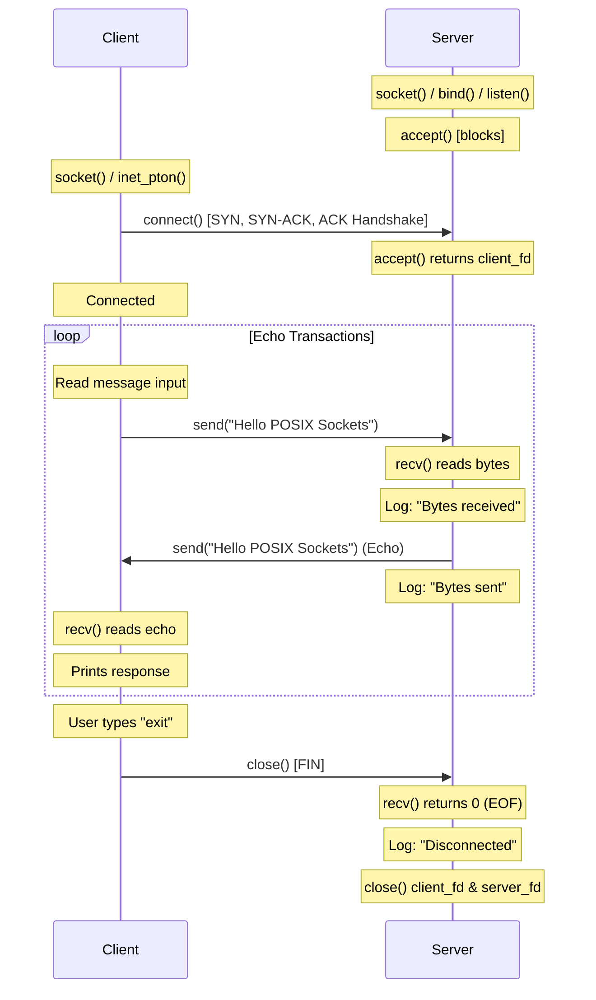

# Socket Manager Module

This document describes the design, API specs, lifecycle rules, execution flows, and sequence diagrams of the **Socket Manager** module.

---

## 1. TCP State Transitions

TCP connections transition through various states tracked by the Linux kernel network stack. The primary states demonstrated in our TCP Echo module are:

*   **CLOSED**: The socket is not in use or active.
*   **LISTEN**: (Server) The socket has bound to a local port and is actively waiting for client connection requests.
*   **ESTABLISHED**: (Server & Client) The three-way handshake is complete; data transfer can proceed via `send()` and `recv()`.
*   **FIN_WAIT_1 / FIN_WAIT_2**: (Initiator of Close) The active closer sends a FIN packet and waits for the peer's ACK/FIN.
*   **CLOSE_WAIT**: (Receiver of Close) The passive closer receives a FIN, sends an ACK, and waits for its application to close the socket.
*   **LAST_ACK**: (Receiver of Close) The passive closer sends its own FIN and waits for the final ACK.
*   **TIME_WAIT**: (Initiator of Close) The active closer waits for double the Maximum Segment Life (2 MSL) to ensure clean packet retirement in the network fabric.

---

## 2. Socket Lifecycle

A standard TCP socket moves through the following phases:

```
Server Socket:                                   Client Socket:
  socket()                                         socket()
     |                                                |
  bind()                                              |
     |                                                v
  listen() <------------------------------------ connect() (3-Way Handshake)
     |                                                |
  accept() (Blocks until connection)                  |
     |                                                |
     +=================== ESTABLISHED ================+
     |                                                |
   recv()  <--- [Data Request: "Hello"] ------------- send()
     |                                                |
   send()  ---> [Echo Response: "Hello"] -----------> recv()
     v                                                v
   close() (Active Close) <------------------------ close() (Passive Close)
```

---

## 3. POSIX socket APIs utilized

1.  **`socket`**: Allocates a socket descriptor representing an endpoint.
    ```c
    int socket(int domain, int type, int protocol);
    ```
2.  **`bind`**: Assigns a local IP address and port number to the socket.
    ```c
    int bind(int sockfd, const struct sockaddr *addr, socklen_t addrlen);
    ```
3.  **`listen`**: Marks the socket as passive, ready to receive incoming connections.
    ```c
    int listen(int sockfd, int backlog);
    ```
4.  **`accept`**: Blocks until a client connects, returning a new file descriptor for that connection.
    ```c
    int accept(int sockfd, struct sockaddr *addr, socklen_t *addrlen);
    ```
5.  **`connect`**: Connects a client socket descriptor to a target server IP and port.
    ```c
    int connect(int sockfd, const struct sockaddr *addr, socklen_t addrlen);
    ```
6.  **`send`**: Transmits buffer payloads over the connected socket.
    ```c
    ssize_t send(int sockfd, const void *buf, size_t len, int flags);
    ```
7.  **`recv`**: Receives data payloads from the socket descriptor into local buffers.
    ```c
    ssize_t recv(int sockfd, void *buf, size_t len, int flags);
    ```
8.  **`close`**: Releases the file descriptor and initiates connection teardown.
    ```c
    int close(int fd);
    ```
9.  **`inet_pton` / `inet_ntop`**: Converts binary network representations to text IPs and vice-versa.

---

## 4. Execution Sequence Diagram

The diagram below details the transaction interactions between client and server:


