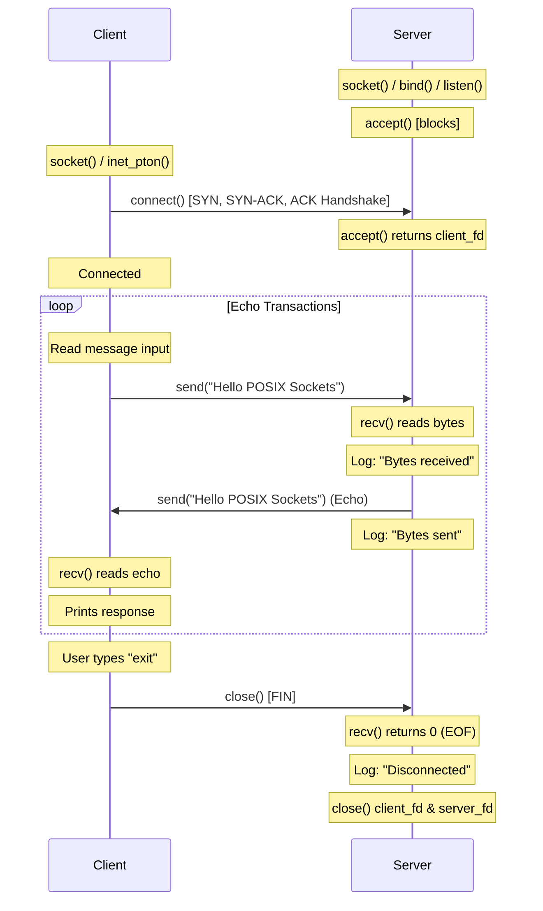

# Socket Manager Module

This document describes the design, API specs, lifecycle rules, execution flows, and sequence diagrams of the **Socket Manager** module.

---

## 1. TCP State Transitions

TCP connections transition through various states tracked by the Linux kernel network stack. The primary states demonstrated in our TCP Echo module are:

*   **CLOSED**: The socket is not in use or active.
*   **LISTEN**: (Server) The socket has bound to a local port and is actively waiting for client connection requests.
*   **ESTABLISHED**: (Server & Client) The three-way handshake is complete; data transfer can proceed via `send()` and `recv()`.
*   **FIN_WAIT_1 / FIN_WAIT_2**: (Initiator of Close) The active closer sends a FIN packet and waits for the peer's ACK/FIN.
*   **CLOSE_WAIT**: (Receiver of Close) The passive closer receives a FIN, sends an ACK, and waits for its application to close the socket.
*   **LAST_ACK**: (Receiver of Close) The passive closer sends its own FIN and waits for the final ACK.
*   **TIME_WAIT**: (Initiator of Close) The active closer waits for double the Maximum Segment Life (2 MSL) to ensure clean packet retirement in the network fabric.

---

## 2. Socket Lifecycle

A standard TCP socket moves through the following phases:

```
Server Socket:                                   Client Socket:
  socket()                                         socket()
     |                                                |
  bind()                                              |
     |                                                v
  listen() <------------------------------------ connect() (3-Way Handshake)
     |                                                |
  accept() (Blocks until connection)                  |
     |                                                |
     +=================== ESTABLISHED ================+
     |                                                |
   recv()  <--- [Data Request: "Hello"] ------------- send()
     |                                                |
   send()  ---> [Echo Response: "Hello"] -----------> recv()
     v                                                v
   close() (Active Close) <------------------------ close() (Passive Close)
```

---

## 3. POSIX socket APIs utilized

1.  **`socket`**: Allocates a socket descriptor representing an endpoint.
    ```c
    int socket(int domain, int type, int protocol);
    ```
2.  **`bind`**: Assigns a local IP address and port number to the socket.
    ```c
    int bind(int sockfd, const struct sockaddr *addr, socklen_t addrlen);
    ```
3.  **`listen`**: Marks the socket as passive, ready to receive incoming connections.
    ```c
    int listen(int sockfd, int backlog);
    ```
4.  **`accept`**: Blocks until a client connects, returning a new file descriptor for that connection.
    ```c
    int accept(int sockfd, struct sockaddr *addr, socklen_t *addrlen);
    ```
5.  **`connect`**: Connects a client socket descriptor to a target server IP and port.
    ```c
    int connect(int sockfd, const struct sockaddr *addr, socklen_t addrlen);
    ```
6.  **`send`**: Transmits buffer payloads over the connected socket.
    ```c
    ssize_t send(int sockfd, const void *buf, size_t len, int flags);
    ```
7.  **`recv`**: Receives data payloads from the socket descriptor into local buffers.
    ```c
    ssize_t recv(int sockfd, void *buf, size_t len, int flags);
    ```
8.  **`close`**: Releases the file descriptor and initiates connection teardown.
    ```c
    int close(int fd);
    ```
9.  **`inet_pton` / `inet_ntop`**: Converts binary network representations to text IPs and vice-versa.

---

## 4. Execution Sequence Diagram

The diagram below details the transaction interactions between client and server:



---

## 5. Thread Model and Session Architecture

To handle multiple simultaneous client connections, the Socket Manager uses a multi-threaded architecture separated into three distinct responsibility layers: **Server**, **Session**, and **Protocol**.

### Session Architecture Layout

```
[Server Layer] (socket, bind, listen)
      |
      v
[Accept Loop] (accept blocks for incoming clients)
      |
      +---> client_fd 1 ---> pthread_create() ---> [Session Thread 1] ---> session_handle_protocol()
      |
      +---> client_fd 2 ---> pthread_create() ---> [Session Thread 2] ---> session_handle_protocol()
```

1.  **Server Layer**:
    *   Initializes the listener socket and binds to the specified port using `bind()`.
    *   Enters a blocking loop calling `accept()`.
    *   For each accepted client connection, it allocates a new `session_t` memory context and spawns a POSIX thread using `pthread_create()`.
    *   Immediately invokes `pthread_detach()` on the thread ID. This registers the thread in a detached state, guaranteeing that the thread's memory resources (stack size, control blocks) are immediately recycled by the kernel upon thread termination, eliminating any potential thread resource leaks.
2.  **Session Layer**:
    *   Acting as the thread entry function (`session_worker()`), it extracts client connection details (IP, Port) via `inet_ntop()`.
    *   Logs thread instantiation parameters and manages call wrappers.
    *   Fires the protocol logic by passing the connection socket descriptor.
    *   Cleans up descriptors via `close()`, frees allocated context buffers, logs thread exit events, and exits cleanly via `pthread_exit()`.
3.  **Protocol Layer**:
    *   Handles data transfer operations on client sockets (`session_handle_protocol()`).
    *   Executes blocking `recv()` and `send()` loops to echo data back to the client.
    *   Is completely decoupled from connection accepting, memory allocations, or threading logic.

### Connection Lifecycle State Machine

```
[accept()] 
    |
    v
[Thread Spawned] ---> Log: "Thread created"
    |
    v
[Echo Loop] <---> recv() / send() (Concurrently active for all clients)
    |
    v (recv() returns 0 or error)
[Clean Disconnect]
    |
    v
[Close Socket Descriptor] ---> Log: "Disconnect"
    |
    v
[Free Context Memory] ---> Log: "Thread exited"
```

